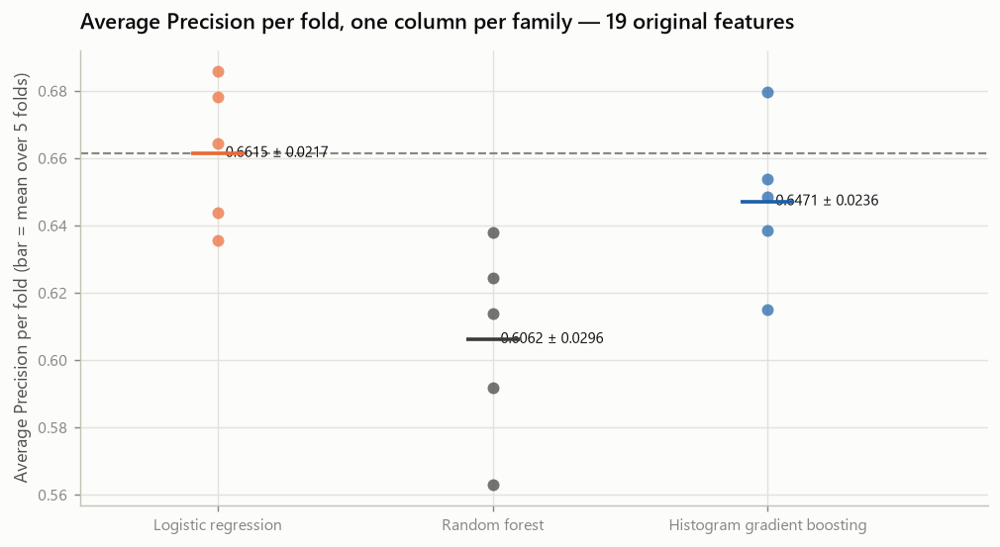

# Capa

> **AVISO DE ESTADO — DOCUMENTO EM RASCUNHO (DRAFT).**
> Este relatório contém campos de capa e links de entrega que dependem de ação
> humana externa e ainda **não** foram preenchidos. Enquanto os marcadores
> `[[EXTERNAL_INPUT_REQUIRED: …]]` existirem neste arquivo, nenhuma renderização
> dele pode ser tratada como versão final de entrega.

---

<div align="center">

## Predição de Churn em Telecomunicações

### Um sistema reprodutível de aprendizado supervisionado, do dado bruto ao monitoramento

**Instituição:** `[[EXTERNAL_INPUT_REQUIRED: nome da instituição de ensino]]`

**Curso / Programa:** `[[EXTERNAL_INPUT_REQUIRED: nome do curso de pós-graduação]]`

**Disciplina:** `[[EXTERNAL_INPUT_REQUIRED: nome da disciplina]]`

**Professor(a) responsável:** `[[EXTERNAL_INPUT_REQUIRED: nome do(a) docente]]`

**Autor:** Vinicius Gomes

**Cidade:** `[[EXTERNAL_INPUT_REQUIRED: cidade]]`

**Data de entrega:** `[[EXTERNAL_INPUT_REQUIRED: data da entrega]]`

</div>

---

> **Nota sobre os campos pendentes.** Os marcadores acima não são omissões de
> redação. Nenhum metadado acadêmico — instituição, curso, disciplina, docente,
> cidade ou data — consta em qualquer arquivo deste repositório, e este documento
> não inventa informação que não possa ser verificada. O único campo comprovado é a
> autoria, registrada em `pyproject.toml` e no histórico de commits.

---

# Introdução

Este trabalho constrói um sistema de predição de churn para uma operadora de
telecomunicações. O objetivo declarado desde o início não foi treinar um
classificador, e sim produzir algo que resista a inspeção:

> um sistema reprodutível de predição de churn, validado sob um protocolo que
> protege o conjunto de teste, com limiar de decisão analisado, previsões explicadas
> exatamente, inferência empacotada e monitoramento desenhado.

A diferença entre esses dois objetivos aparece em cada decisão do relatório. Um
notebook que atinge boa acurácia responde "o modelo acertou?". Um sistema de
engenharia de ML precisa responder também "como sei que essa medida vale?", "o que o
modelo usou para decidir?" e "como eu saberia que ele parou de funcionar?".

O trabalho foi conduzido em quinze fases, cada uma encerrada em commit próprio, com
resultados gravados em artefatos determinísticos e verificáveis. Todo número deste
relatório provém de um experimento efetivamente executado pelo código do repositório
e pode ser rastreado até um arquivo versionado — o mapeamento está na seção
*Rastreabilidade*.

### O que este relatório afirma, e o que não afirma

**Afirma:** que o sistema identifica clientes em risco com qualidade de ordenação
substancialmente superior ao acaso, sob um protocolo experimental que não foi
contaminado pelo conjunto de teste.

**Não afirma:** que o sistema reduz churn. Essa é uma pergunta causal, e responder a
ela exigiria um experimento de intervenção — campanha aleatorizada, grupo de
controle, medição de *uplift* — que não foi conduzido. Predizer quem sairá e reduzir
quantos saem são resultados diferentes, e este trabalho mede apenas o primeiro.

---

# Descrição do problema

### O problema de negócio

Em telecomunicações a receita é recorrente: ela não vem da venda, vem da
permanência. A aquisição de um cliente novo custa consistentemente mais do que a
retenção de um existente, o que torna a pergunta operacional concreta e urgente:

> quais clientes estão em risco de sair **enquanto ainda é possível agir**?

Uma lista de clientes perdidos tem valor analítico. Uma lista de clientes em risco
tem valor operacional. O sistema precisa produzir a segunda.

### O problema estatístico

Classificação binária supervisionada.

| Elemento | Definição |
|---|---|
| Classe positiva | `Churn = Yes` — o cliente encerrou o relacionamento |
| Classe negativa | `Churn = No` — o cliente permaneceu |
| Saída primária | probabilidade de churn, contínua em `[0, 1]` |
| Saída secundária | decisão binária, obtida aplicando um limiar justificado ao score |
| Unidade de análise | um cliente |

A saída primária ser a **probabilidade**, e não a classe, é uma decisão de projeto.
Uma operação de retenção não pergunta "quem vai sair?" — ela pergunta "com quem eu
falo primeiro, dada a capacidade que tenho?". Priorizar exige ordenar, e ordenar
exige um score contínuo. A conversão em decisão binária é uma segunda etapa,
separada, analisada na seção *Resultados experimentais*.

### Por que a acurácia não pode ser o critério

A base é desbalanceada: **26,54 %** dos clientes saíram. Um classificador trivial que
responde "ninguém sai" para toda a carteira acerta **73,46 %** dos casos — e não
encontra um único cliente em risco.

Acurácia, isolada, não distingue esse modelo inútil de um modelo útil. O critério
primário deste trabalho é, portanto, **Average Precision** (área sob a curva
Precision-Recall), que mede qualidade de ordenação na classe minoritária, com
**ROC-AUC** como métrica secundária. Acurácia é reportada, mas como métrica
**auxiliar**, nunca como manchete.

### As perguntas que o sistema precisa responder

1. Quem está em risco?
2. Quais fatores estão associados à previsão, globalmente?
3. Por que **esta** previsão individual saiu como saiu?
4. Qual limiar de decisão é apropriado, e o que ele custa?
5. Como o modelo seria monitorado depois de implantado?

---

# Dataset utilizado

### Origem e versão

| Campo | Valor |
|---|---|
| Nome | Telco Customer Churn |
| Origem canônica | Kaggle — `blastchar/telco-customer-churn` |
| Origem de reprodução pública | repositório GitHub da IBM, acessível por HTTPS sem autenticação |
| Natureza | dado de exemplo publicado pela IBM |
| Arquivo | `WA_Fn-UseC_-Telco-Customer-Churn.csv` |
| SHA-256 da representação canônica do projeto (`CRLF`) | `88be4b93fbe0cc83421af1c503794c97c342eca914c1576db7c276e61d61358a` |
| SHA-256 dos bytes servidos pelo mirror público (`LF`) | `16320c9c1ec72448db59aa0a26a0b95401046bef5d02fd3aeb906448e3055e91` |
| Linhas | 7043 |
| Colunas | 21 |

O arquivo bruto é **versionado no repositório e nunca editado à mão**. Toda
transformação acontece em código, o que torna qualquer resultado reproduzível a
partir dos bytes originais.

### Duas identidades, e por que o relatório distingue as duas

A página do Kaggle exige autenticação, o que impediria a execução do notebook em um
ambiente limpo sem credenciais. O notebook acadêmico usa por isso o repositório
público da própria IBM.

O mirror público **não** entrega os mesmos bytes que o projeto congelou, e o relatório
não afirma que entrega. Ele distribui o mesmo dataset com representação `LF`, enquanto
o arquivo congelado no projeto utiliza `CRLF`. O notebook registra o hash dos bytes
baixados e, separadamente, normaliza **exclusivamente** a representação de quebras de
linha antes de comparar com o SHA-256 congelado do projeto.

| Identidade | O que é | Valor |
|---|---|---|
| `downloaded_bytes_sha256` | os bytes exatamente como servidos pelo mirror; propriedade do mirror, não do projeto | `16320c9c…3055e91` |
| `canonicalized_dataset_sha256` | o mesmo conteúdo reserializado na forma canônica do projeto | `88be4b93…1d61358a` |

Apenas o segundo é comparado com a constante congelada, e é ele que precisa bater.

**A regra de canonicalização, por extenso.** O fluxo de bytes é dividido em linhas
lógicas nos terminadores presentes (`CRLF`, `CR` isolado ou `LF` isolado) e
reserializado com `CRLF`. Nada mais é tocado: sem remoção de espaços, sem reordenação
de linhas ou colunas, sem conversão de valores, sem normalização de números, sem
alteração de aspas e sem mudança semântica de codificação. A diferença de tamanho é de
exatamente **7 044 bytes — um por linha lógica**.

**Nenhuma diferença de dados está sendo escondida pela transformação.** O notebook
prova isso: removidos todos os terminadores de linha, os dois fluxos de bytes são
idênticos, e a execução aborta se não forem. Uma segunda verificação, independente do
hash, confirma 7 043 linhas e as 21 colunas esperadas na ordem esperada — de modo que
"normalizar até o hash bater" seja distinguível de massagear outro dataset até que ele
passasse na verificação.

### Estrutura

Uma linha por cliente. Uma coluna identificadora (`customerID`, excluída da
modelagem por não ser preditor), 19 preditores e a variável-alvo.

| Grupo | Quantidade | Colunas |
|---|---|---|
| Numéricos | 3 | `tenure`, `MonthlyCharges`, `TotalCharges` |
| Categóricos | 16 | demografia, serviços contratados, contrato, faturamento, pagamento |
| Alvo | 1 | `Churn` ∈ {`No`, `Yes`} |

### Distribuição do alvo

| Classe | Contagem | Proporção |
|---|---|---|
| `No` (permaneceu) | 5 174 | 73,46 % |
| `Yes` (saiu) | 1 869 | 26,54 % |


Razão entre classes de 2,77 : 1. Desbalanceamento moderado — suficiente para
inviabilizar a acurácia como critério, insuficiente para exigir reamostragem.

### Qualidade dos dados

Verificações executadas sobre o arquivo bruto:

| Verificação | Resultado |
|---|---|
| Linhas duplicadas | 0 |
| Identificadores duplicados | 0 |
| Valores nulos declarados | 0 |
| Domínio do alvo | exatamente `{No, Yes}` |
| Cardinalidade das categóricas | 2 a 4 níveis; nenhuma de alta cardinalidade |

Há **um** problema real, e ele é instrutivo.

### O caso de `TotalCharges`

`TotalCharges` chega tipada como **texto**, não como número, porque **11 células
contêm apenas espaço em branco**. Um `read_csv` ingênuo produz uma coluna de objetos
e qualquer operação numérica falha silenciosamente ou explode.

Essas 11 linhas não são dados faltantes no sentido usual. **Todas têm `tenure = 0`**:
são clientes que ainda não completaram um ciclo de faturamento, de modo que o total
acumulado ainda não existe. O valor correto é zero — e zero, aqui, é um fato sobre o
cliente, não uma imputação.

Daí a regra congelada do projeto:

| Situação | Tratamento | Justificativa |
|---|---|---|
| Branco **e** `tenure = 0` | **zero estrutural** | não houve faturamento; zero é o valor verdadeiro |
| Branco **e** `tenure > 0` | **erro — rejeita** | um cliente com histórico tem de ter total; imputar inventaria histórico |
| Texto não numérico | **erro — rejeita** | não é interpretável |

A segunda linha é a metodologicamente importante. A regra **não** é "preencher branco
com zero"; é "preencher com zero **onde zero é justificável**" e falhar alto onde não
é. Esse mesmo transformador roda dentro da API de produção: uma imputação silenciosa
ali esconderia corrupção de dados a montante.

### Dependências estruturais

Sete relações mecânicas ligam colunas do dataset. Elas não são ruído de codificação —
mudam a leitura de qualquer explicação e são tratadas explicitamente na seção
*Explicabilidade do modelo*.

```
InternetService = No   ⟺   OnlineSecurity   = "No internet service"
                           OnlineBackup     = "No internet service"
                           DeviceProtection = "No internet service"
                           TechSupport      = "No internet service"
                           StreamingTV      = "No internet service"
                           StreamingMovies  = "No internet service"

PhoneService    = No   ⟺   MultipleLines    = "No phone service"
```

As equivalências foram verificadas nas 7043 linhas, em ambas as direções: 1 526
clientes sem internet e 682 sem telefone, sem uma única exceção.

### Um sinal exploratório relevante


O tipo de contrato separa fortemente: contratos mensais churnam a taxa muito
superior à de contratos anuais e bienais. Isso é **associação**, não causa — o tipo
de contrato também é escolhido por clientes que já pretendem ficar pouco tempo. O
modelo pode usar o sinal; o relatório não pode chamá-lo de causa.

---

# Metodologia adotada

### Princípio organizador

O trabalho segue um protocolo experimental fixado **antes** dos resultados, e a
disciplina central é uma só:

> Nenhuma decisão pode ser tomada olhando para o conjunto de teste.

Isso não é formalidade acadêmica. Um conjunto de teste fornece estimativa não
enviesada **apenas enquanto** nenhuma escolha tiver sido feita observando-o. Depois
que alguém olha o resultado e volta para ajustar qualquer coisa, a estimativa deixa
de valer — e nenhuma métrica denuncia isso.

### A divisão, e o que ela protege

| Parâmetro | Valor |
|---|---|
| `test_size` | `0.20` |
| `stratify` | pela coluna `Churn` |
| `random_state` | `42` |
| Pool de treino | 5 634 linhas |
| Holdout | 1 409 linhas |
| SHA-256 dos IDs de treino | `a553196dd46b672f6344867707144fbf56a8abe14b338a225662c7208a1450dd` |
| SHA-256 dos IDs do holdout | `1ad8aefb7e34776a78d76765d2465c630a41b3813b1d7d96d0d1b03d049776f6` |

**Estratificado** porque a classe positiva é minoritária: uma partição aleatória
simples poderia deslocar a prevalência entre os lados. **Semente fixa** porque a
partição precisa ser idêntica em qualquer máquina, em qualquer execução.

A partição é **função pura** dos bytes brutos mais a configuração, então é
regenerada em vez de armazenada, e os digests dos identificadores provam que a
regeneração produziu exatamente o mesmo conjunto de linhas.

### Prevenção de vazamento

Todo passo com estado vive **dentro** de um `Pipeline` do scikit-learn, ajustado
somente nos dados de treino de cada fold:

| Passo | Tem estado? | O que aprende |
|---|---|---|
| `TotalChargesCleaner` | não | nada — a regra é determinística |
| `StandardScaler` | sim | média e desvio das 3 numéricas |
| `OneHotEncoder` | sim | os níveis das 16 categóricas |
| `LogisticRegression` | sim | 46 coeficientes + intercepto |

Como os três passos com estado estão no mesmo `Pipeline`, a validação cruzada
reajusta **todos** eles a cada fold. A proteção é estrutural: não depende de o
programador lembrar de fazer certo.

### Protocolo de comparação

`StratifiedKFold(n_splits=5, shuffle=True, random_state=42)`, sobre o pool de treino,
**compartilhada por todos os modelos**. As diferenças são portanto **pareadas** — os
modelos são avaliados nas mesmas linhas, nos mesmos folds.

Toda regra de elegibilidade foi **fixada antes de observar resultados** e exige:

1. delta médio pareado positivo na métrica de decisão; **e**
2. melhora em pelo menos **4 dos 5 folds**.

O critério de consistência existe para impedir uma armadilha específica: uma
vantagem média grande produzida por um ganho enorme em um único fold, com perdas nos
demais. Isso é variância, não superioridade.

> **Nenhum teste de significância foi executado.** Cinco folds não sustentam um, e as
> classificações usadas — PROMISSOR, INCONCLUSIVO, NÃO SUSTENTADO, ELEGÍVEL,
> NÃO ELEGÍVEL — são heurísticas de engenharia sobre direção e consistência, não
> inferência estatística. Nenhum p-valor é reportado neste trabalho.

### A ordem das decisões finais

A ordem importa e foi fixada:

```
calibração  →  limiar  →  congelamento  →  holdout  →  análise de erro
```

A calibração vem **antes** do limiar porque reescreve as probabilidades sobre as
quais o limiar age. Um limiar escolhido primeiro pertenceria a um score que deixaria
de existir. Ambas as decisões foram tomadas **exclusivamente no pool de treino**.

---

# Pipeline de Machine Learning

### Arquitetura

```
CSV bruto (7043 × 21)
      │
      ├─ verificação SHA-256 ──────────────► aborta se divergir
      │
      ▼
divisão estratificada (seed 42)
      │
      ├──────────────────────────────► HOLDOUT (1409)  ░ lacrado até a avaliação final
      ▼
POOL DE TREINO (5634)
      │
      ▼
┌─────────────────────────────────────────────────┐
│ Pipeline                                        │
│   1. TotalChargesCleaner   (sem estado)         │
│   2. ColumnTransformer                          │
│        ├─ StandardScaler    → 3 numéricas       │
│        └─ OneHotEncoder     → 16 categóricas    │
│           handle_unknown="ignore"               │
│   3. LogisticRegression(C=1.0, lbfgs)           │
└─────────────────────────────────────────────────┘
      │  19 features de entrada → 46 colunas transformadas
      ▼
probabilidade de churn ∈ [0, 1]
      │
      ▼
decisão:  probabilidade ≥ 0,3272694566222328  →  sinalizar
```

### Decisões de pré-processamento, e por quê

**`StandardScaler` nas numéricas.** A regressão logística com penalização L2 é
sensível à escala: sem padronizar, a penalização atinge desigualmente coeficientes de
features em unidades diferentes (meses, reais mensais, reais acumulados). A
padronização torna a penalização comparável entre features.

**`OneHotEncoder(handle_unknown="ignore")` nas categóricas.** O `ignore` é uma
decisão operacional deliberada, não um padrão aceito por inércia. Uma categoria nunca
vista em treino — um plano novo, um meio de pagamento novo — vira um bloco de zeros e
contribui **exatamente nada**, em vez de derrubar a predição. O serviço continua
respondendo, e o monitoramento conta o evento.

**`customerID` excluído.** É identificador, não preditor. Mantê-lo permitiria ao
modelo memorizar linhas individuais.

### Engenharia de atributos

Esta seção precisa ser lida com precisão, porque é fácil interpretá-la errado.

**Engenharia de atributos foi executada.** Cinco grupos de features foram formulados a
partir de hipóteses substantivas e avaliados sob o protocolo congelado, com deltas
pareados por fold contra a linha de base. O que **não** aconteceu foi a *adoção* de
qualquer um deles no modelo final.

| | Grupo | Hipótese | Δ AP pareado | Folds melhores | Classificação |
|---|---|---|---|---|---|
| **E1** | `protective_services` | a contagem de serviços de proteção carrega sinal que os dummies não expressam como inclinação | −0,0000 | 2/5 | **NÃO SUSTENTADO** |
| **E2** | `automatic_payment` | o eixo manual/automático estima o sinal de pagamento mais estavelmente | +0,0001 | 3/5 | **INCONCLUSIVO** |
| **E3** | `contract_tenure` | a interação contrato × tenure capta risco que nenhum dos dois isolado expressa | +0,0017 | 4/5 | **PROMISSOR** |
| **E4** | `historical_average_charge` | cobrança média histórica separa cliente caro de cliente antigo | −0,0015 | 1/5 | **NÃO SUSTENTADO** |
| **E5** | `charge_intensity` | cobrança relativa à mediana da faixa capta desalinhamento de preço | −0,0005 | 2/5 | **NÃO SUSTENTADO** |

**E1 é o caso mais instrutivo.** A contagem de serviços protetores é uma **soma
determinística de indicadores que o modelo já recebe codificados**. Ela não
acrescenta informação — apenas uma parametrização mais grosseira de informação já
presente. O resultado nulo é o resultado correto, e tê-lo **medido** é o que permite
afirmá-lo em vez de supô-lo.

**E3 foi promissor e mesmo assim não foi adotado.** Melhorou em 4 de 5 folds, com
ganho médio de +0,0017 de Average Precision — direção consistente, magnitude pequena.
O custo é concreto: duas features a mais, 48 colunas em vez de 46, e uma interação a
explicar em cada explicação individual. O ganho não paga esse custo. E3 foi mantido
como **análise de sensibilidade** — carregado para a comparação de modelos como
conjunto alternativo de features, para verificar que a escolha do modelo não dependia
da representação — mas ficou fora do pipeline final.

O critério, declarado antes dos experimentos:

> a engenharia de atributos foi orientada por hipóteses, e a adoção exigia benefício
> demonstrado suficiente para justificar a complexidade adicionada.

**O modelo final usa, portanto, as 19 features originais.**

---

# Resultados experimentais

## Baselines

Um baseline não é formalidade: ele separa o que é mérito do modelo do que é estrutura
do problema.

| Modelo | Average Precision | ROC-AUC | F1 | Recall | Precisão | Acurácia |
|---|---|---|---|---|---|---|
| Classe majoritária (`DummyClassifier`) | 0,2654 | 0,5000 | **0,0000** | 0,0000 | 0,0000 | 0,7346 |
| Aleatório estratificado | 0,2686 | 0,5065 | 0,2762 | 0,2776 | 0,2748 | 0,6139 |
| **Regressão logística** | **0,6615** | **0,8461** | 0,5924 | 0,5438 | 0,6521 | 0,8019 |

*Validação cruzada 5-fold no pool de treino; limiar diagnóstico 0,5.*

O classificador de classe majoritária alcança **73,46 % de acurácia com F1 igual a
zero**. É a demonstração empírica, e não retórica, de que acurácia isolada não mede
utilidade neste problema.

A logística eleva o Average Precision de **0,2654** (a prevalência, que é o AP de um
classificador sem informação) para **0,6615**. Esse é o ganho real: capacidade de
**ordenar** clientes por risco.

## Comparação de modelos

Três famílias, cada uma com hipótese explícita — não uma varredura de dezenas de
algoritmos.

| | Família | Hipótese |
|---|---|---|
| **M0** | Regressão logística | log-odds aditivo nas features codificadas; é a **referência**, não candidata |
| **M1** | Random forest | árvores profundas decorrelacionadas capturam interações e efeitos não monótonos que uma inclinação aditiva não expressa |
| **M2** | Histogram gradient boosting | árvores rasas ajustadas ao gradiente atacam os erros que um modelo linear deixa |

| Experimento | Average Precision (média ± dp) | ROC-AUC (média ± dp) |
|---|---|---|
| **M0** Regressão logística | **0,661493 ± 0,021661** | **0,846149 ± 0,014045** |
| M1 Random forest | 0,606181 ± 0,029565 | 0,817956 ± 0,012940 |
| M2 Histogram gradient boosting | 0,647137 ± 0,023553 | 0,836448 ± 0,006090 |



Nenhuma família baseada em árvores supera a logística na métrica primária. Isso é
menos surpreendente do que parece: depois da codificação one-hot, a maior parte do
sinal deste problema é aproximadamente **aditiva em log-odds** — tenure baixo,
contrato mensal, fibra óptica, cheque eletrônico. Não há estrutura de interação rica
que justifique capacidade extra, e capacidade sem sinal para explicar vira variância.

## Ajuste de hiperparâmetros

Validação cruzada **aninhada**: laço externo de 5 folds estima o desempenho do
*procedimento*; dentro de cada fold de treino, laço interno de 4 folds escolhe os
hiperparâmetros. A escolha nunca observa as linhas em que é avaliada.

| | Procedimento | AP externo (média ± dp) | Δ pareado vs. T0 | Folds melhores |
|---|---|---|---|---|
| **T0** | Logística congelada (`C = 1,0`, sem tuning) | 0,661493 ± 0,021661 | — | — |
| T1 | Logística com `C` buscado | 0,661298 ± 0,021128 | −0,000195 | 2/5 |
| T2 | Histogram gradient boosting ajustado | **0,665335** ± 0,027058 | **+0,003842** | 3/5 |

**T2 obteve o maior AP médio e mesmo assim não foi adotado.** Ele vence em 3 folds e
perde em 2 — a vantagem média vem de ganho grande em poucos folds, não de
superioridade consistente. A regra de elegibilidade, fixada antes dos resultados,
exigia 4 de 5.

Adotá-lo seria escolher pelo maior número em vez de por evidência de que ele é de
fato melhor. Aplica-se o padrão pré-registrado: **mantém-se o modelo mais simples**.
Esta é, provavelmente, a decisão de engenharia mais importante do trabalho.

## Política de calibração

Igualmente importante enunciar com precisão: **calibração foi experimentada.** Dois
métodos foram testados contra o modelo não calibrado, com Brier score como métrica de
decisão primária e log loss como secundária, sob a mesma validação cruzada.

| | Método | Brier | Log loss | Δ AP | Folds em que o Brier melhora |
|---|---|---|---|---|---|
| **C0** | Não calibrado | **0,135064** | 0,416680 | — | referência |
| C1 | Sigmoid (Platt) | 0,135081 | **0,416597** | +0,00000 | **1/5** |
| C2 | Isotônica | 0,135388 | 0,428612 | −0,015135 | 2/5 |


Nenhum método cumpriu o protocolo de adoção. O sigmoid praticamente não altera nada —
coerente com o fato de que a regressão logística já produz probabilidades
razoavelmente calibradas por construção. A isotônica piora tudo, inclusive a
ordenação (AP cai em **5 de 5 folds**), sinal clássico de sobreajuste com esta
quantidade de dados.

**Resultado: `calibration_policy = NONE`.**

A consequência precisa ser dita: os scores são **posições de ordenação**, não
frequências calibradas. Uma probabilidade de 0,42 não deve ser lida como "42 % destes
clientes sairão".

## Limiar de decisão

`predict()` usa 0,5 por padrão. Esse número vem da implementação, não do problema. Em
um problema desbalanceado com custos assimétricos, aceitá-lo sem exame é aceitar uma
decisão que ninguém tomou.

A assimetria é concreta:

* um **falso negativo** é um cliente em risco que a operação nunca contatou — a
  oportunidade de retenção foi perdida;
* um **falso positivo** é um cliente estável que recebeu contato — custa esforço e,
  eventualmente, um desconto desnecessário.

**Política adotada: maximização de F1**, aplicada às probabilidades *out-of-fold* do
pool de treino. O procedimento foi validado de forma aninhada — em cada fold externo o
limiar era escolhido apenas nos dados de treino daquele fold e avaliado nos de
validação.

| Critério de elegibilidade | Resultado |
|---|---|
| Δ médio pareado de F1 contra o padrão 0,5 | **+0,040905** |
| Folds com melhora estrita | **5 / 5** |
| Situação | **ELEGÍVEL** |

Aplicado uma última vez ao pool de treino inteiro, fixa-se:

| | |
|---|---|
| **Limiar final** | **`0,3272694566222328`** |
| **Política** | `F1_MAXIMIZATION` |
| **Regra de decisão** | `probabilidade ≥ limiar` |


### O que a mudança de limiar realmente faz

| | Padrão 0,5 | Congelado 0,327 |
|---|---|---|
| Recall | 0,5438 | **0,7431** |
| Precisão | 0,6521 | **0,5591** |
| F1 | 0,5924 | **0,6381** |
| Taxa de clientes sinalizados | ~22 % | **~35 %** |

*Métricas out-of-fold no pool de treino — são as métricas que **selecionaram** o
limiar, portanto otimistas, e **não** são desempenho final.*

O modelo passa a encontrar cerca de três quartos dos clientes que sairão, em vez de
pouco mais da metade. O preço é que quase metade dos sinalizados não iria sair, e a
operação precisa de capacidade para contatar 35 % da carteira em vez de 22 %.

> **Este não é "o limiar ótimo para o negócio".** É o limiar que a política declarada
> seleciona com os dados disponíveis. A decisão correta dependeria do custo de uma
> campanha de retenção, do valor de um cliente retido e da capacidade operacional —
> três números que este trabalho **não possui**. Nenhum deles foi inventado para
> produzir uma justificativa mais elegante.

## Avaliação final no holdout

O holdout foi aberto **exatamente uma vez**, depois de todas as decisões estarem
congeladas.

```
evaluations_performed   = 1
selection_after_holdout = False
holdout_reopened        = False
```

| Métrica | Valor | IC 95 % | Referência sem informação |
|---|---|---|---|
| **Average Precision** | **0,6337** | [0,5777 – 0,6864] | 0,2654 |
| **ROC-AUC** | **0,8420** | [0,8183 – 0,8633] | 0,5000 |
| **Recall** | **0,7219** | [0,6760 – 0,7652] | — |
| **Precisão** | **0,5378** | [0,4937 – 0,5791] | — |
| **F1** | **0,6164** | [0,5762 – 0,6534] | — |
| Acurácia *(auxiliar)* | 0,7615 | — | 0,7346 |
| Especificidade *(auxiliar)* | 0,7758 | — | — |
| Acurácia balanceada *(auxiliar)* | 0,7489 | — | — |

*Holdout: 1 409 clientes — 374 saíram, 1 035 permaneceram (prevalência 0,2654).
Intervalos por bootstrap percentil, 2 000 reamostragens, semente 42.*


### Matriz de confusão

|  | Previsto: permanece | Previsto: sai |
|---|---|---|
| **Real: permaneceu** | 803 | 232 |
| **Real: saiu** | 104 | **270** |


Dos 374 clientes que efetivamente saíram, **270 foram identificados** e 104 passaram
despercebidos. Dos 502 clientes sinalizados, 270 de fato saíram.

---

# Análise das métricas

### Como ler cada número

**Average Precision = 0,6337.** Precisão média ao longo de toda a curva
Precision-Recall. A referência sem informação é a prevalência, 0,2654 — o modelo
alcança **2,4 vezes** esse valor. É a comparação que mais importa neste trabalho.

**ROC-AUC = 0,8420.** Probabilidade de o modelo ordenar um cliente que saiu acima de
um que permaneceu, tomados ao acaso.

> **Isto não é "84 % de acerto".** Confundir ROC-AUC com acurácia é o erro de leitura
> mais comum em relatórios de churn, e este relatório não o comete.

**Recall = 0,7219.** O modelo encontra 72 % dos clientes que efetivamente saíram. É a
métrica mais próxima do valor operacional: cada ponto de recall é um cliente em risco
que entra na lista de contato.

**Precisão = 0,5378.** Pouco mais da metade dos sinalizados de fato saiu. É a métrica
que a operação sente como custo: quase metade dos contatos vai para quem ficaria de
qualquer forma.

**F1 = 0,6164.** Média harmônica de precisão e recall no ponto de operação congelado.
É a métrica que a política de limiar maximizou — logo, é o número que o procedimento
foi projetado para otimizar, e deve ser lido com essa consciência.

**Acurácia = 0,7615 — e por que ela quase não informa.** A classe majoritária entrega
0,7346 de graça. O ganho de 2,7 pontos percentuais descreve mal um modelo que
identifica 72 % dos churners. Por isso a acurácia é reportada como **auxiliar**, nunca
como manchete.

### Intervalos de confiança

Bootstrap percentil com 2 000 reamostragens do holdout (semente 42). O modelo **não**
é reajustado a cada reamostragem, e o limiar **não** é reescolhido: os intervalos
descrevem a incerteza da estimativa sobre esta população, não a variabilidade de todo
o procedimento de modelagem. Essa distinção é importante — o intervalo é mais estreito
do que seria se todo o pipeline fosse reexecutado.

### Generalização: desenvolvimento contra holdout

| Métrica | Desenvolvimento (CV) | Holdout | Diferença |
|---|---|---|---|
| Average Precision | 0,661493 | 0,633702 | **−0,027791** |
| ROC-AUC | 0,846149 | 0,842034 | **−0,004115** |

A queda é pequena e na direção esperada. Estimativas de validação cruzada no pool que
participou de todas as escolhas tendem a ser levemente otimistas; ver o holdout
ligeiramente abaixo é o comportamento normal de um procedimento que não sobreajustou.

> Isto é uma **descrição**, não um teste. Nenhuma hipótese foi formulada sobre essa
> diferença, nenhum p-valor foi calculado e nenhum limite de aprovação foi definido
> antes de observá-la.

### A limitação que não pode ser omitida — exposição do analista

O holdout foi protegido corretamente **a partir do momento da divisão**: nenhum
ajuste, seleção, busca de hiperparâmetro ou escolha de limiar o tocou. O pipeline
garante isso estruturalmente.

Mas a análise exploratória inicial deste projeto foi conduzida sobre as **7043 linhas
completas**, antes de o holdout ser formalmente separado. As hipóteses que orientaram
o trabalho — que contrato importa, que tenure domina, que fibra se associa a mais
churn — foram formadas observando dados que incluíam as linhas que depois se tornaram
o conjunto de teste.

Portanto:

> **A estimativa final pode carregar um viés otimista que não é quantificável aqui.**

Não há como medir esse viés com os dados existentes: seria preciso um segundo
conjunto de teste, coletado posteriormente e nunca observado. Ele não existe.

O que se pode afirmar com precisão:

* **vazamento algorítmico não ocorreu** — nenhuma estatística foi ajustada no holdout;
* **vazamento de conhecimento do analista ocorreu**, em grau desconhecido;
* o efeito é provavelmente pequeno — as hipóteses exploratórias eram sobre estrutura
  geral do problema, não sobre linhas individuais — mas "provavelmente pequeno" é uma
  avaliação, não uma medida.

Registrar isso custa precisão aparente e devolve confiabilidade. Um relatório que
omite essa limitação afirma mais do que possui.

---

# Explicabilidade do modelo

## Estratégia: por que não SHAP

SHAP, LIME e importância por permutação existem para sondar modelos cuja superfície de
resposta é **desconhecida**. Este modelo é conhecido em forma fechada:

```
logit(P) = β₀ + Σ contribuição_f          (f = 1 … 19 features brutas)
P        = σ(logit)
```

Cada contribuição é o termo aditivo daquela feature bruta no preditor linear — a soma
dos coeficientes das colunas one-hot que ela ocupa, multiplicados pelos valores
transformados. A decomposição é **exata**, não uma aproximação.

Usar um estimador por amostragem aqui adicionaria uma dependência, uma semente
aleatória e um erro de aproximação em troca de uma resposta **pior** a uma pergunta já
respondida exatamente. Não usar SHAP não é limitação deste trabalho — é a escolha
correta para esta classe de modelo.

A identidade é verificada, não assumida: sobre as 5 634 linhas do pool de treino, o
erro máximo de reconstrução do logit é **0,0** e o erro máximo de probabilidade é
**1,1 × 10⁻¹⁶**, contra tolerância de 1 × 10⁻¹².

## Explicabilidade global

O ranking abaixo ordena as features pela **dispersão empírica da contribuição** no
pool de treino: o desvio-padrão do termo que aquela feature adiciona ao logit ao longo
dos 5 634 clientes.

| # | Feature | Tipo | Dispersão (log-odds) | IQR |
|---|---|---|---|---|
| 1 | `tenure` | numérica | **1,2552** | 2,3503 |
| 2 | `MonthlyCharges` | numérica | 0,6012 | 1,0840 |
| 3 | `InternetService` | categórica | 0,5882 | 1,2917 |
| 4 | `Contract` | categórica | 0,5636 | 0,7012 |
| 5 | `TotalCharges` | numérica | 0,5326 | 0,8022 |
| 6 | `StreamingMovies` | categórica | 0,2220 | 0,4202 |
| 7 | `StreamingTV` | categórica | 0,2215 | 0,4195 |
| 8 | `OnlineSecurity` | categórica | 0,1971 | 0,3267 |
| 9 | `PaperlessBilling` | categórica | 0,1833 | 0,3729 |
| 10 | `MultipleLines` | categórica | 0,1827 | 0,3848 |
| … | … | … | … | … |
| 17 | `gender` | categórica | 0,0109 | 0,0219 |
| 18 | `Partner` | categórica | 0,0107 | 0,0215 |
| 19 | `PhoneService` | categórica | 0,0082 | 0,0000 |


**`tenure` domina** com folga — dispersão cerca de duas vezes a da segunda colocada.
É a única feature que varia continuamente de 0 a 72 meses e cujo coeficiente é grande,
de modo que move o score ao longo de toda a carteira.

**`MonthlyCharges`, `InternetService`, `Contract` e `TotalCharges`** formam o segundo
bloco. `InternetService` e `Contract` aparecem alto apesar de terem apenas três níveis
cada: poucos níveis com coeficientes distantes produzem muita dispersão.

**`gender`, `Partner` e `PhoneService` são praticamente inertes** — dispersão abaixo de
0,012 log-odds. O modelo aprendeu que essas features quase não movem o score.

### O que esse ranking não é

| Não é | Por quê |
|---|---|
| Importância **causal** | nada aqui identifica um efeito; não há intervenção nem contrafactual |
| Importância de **negócio** | nada aqui pondera valor de cliente ou custo de ação |
| Propriedade **estável** do problema | depende dos coeficientes ajustados, do pré-processamento ajustado, da composição do pool de treino e da correlação entre features |

> **Advertência de parametrização.** A codificação one-hot é redundante com o
> intercepto: existem infinitas combinações (intercepto, coeficientes) que produzem
> exatamente as mesmas probabilidades. O coeficiente de um *nível individual* é
> portanto propriedade do ajuste, não quantidade estável. A contribuição **agregada
> por feature bruta** — o que este ranking usa — é bem mais robusta, mas ainda depende
> da representação escolhida.

## Dependências estruturais: sete colunas, um único fato

Quando um cliente não tem internet, **seis colunas mudam juntas, mecanicamente**. E
`PhoneService = No` implica `MultipleLines = "No phone service"`.

Essas não são sete evidências independentes sobre o cliente. São **um fato** — "este
cliente não tem internet" — codificado em sete colunas.

**Por que isso importa.** Uma explicação local que liste sete linhas separadas, cada
uma com sua contribuição, sugere sete razões distintas quando existe uma. O leitor
conclui que o modelo considerou muitos aspectos, quando considerou um aspecto sete
vezes.

**Tratamento adotado:** as features acopladas são apresentadas como **um bloco
agregado**, cujo valor é a **soma exata** das contribuições de seus membros. Somar é
legítimo precisamente porque as contribuições são termos aditivos do mesmo logit — o
bloco continua particionando o logit exatamente, sem resíduo.

Este é um diferencial técnico do trabalho: a maior parte das análises deste dataset
trata as sete colunas como sinais independentes.

## Explicabilidade local

A explicação individual usa a mesma identidade, aplicada a uma linha. O exemplo é
**sintético e declarado antes de qualquer previsão** — escolher retrospectivamente um
cliente do holdout cuja explicação ficasse convincente seria selecionar um resultado
depois de observá-lo, exatamente o que o protocolo evita em todas as outras etapas.

**Perfil sintético A** — cliente novo, fibra óptica, contrato mensal, cheque
eletrônico, `tenure = 2`, `MonthlyCharges = 84,50`:

```
probabilidade de churn : alta, acima do limiar congelado
limiar                 : 0,3272694566222328   (regra: probabilidade ≥ limiar)
decisão                : SINALIZAR

identidade verificada  : intercepto + Σ contribuições = logit
erro no logit          : ≤ 1 × 10⁻¹²
```

As maiores contribuições concentram-se em `tenure` (curto), `Contract`
(`Month-to-month`), `InternetService` (`Fiber optic`) e `PaymentMethod`
(`Electronic check`).

**Perfil sintético B** — cliente antigo, sem internet, contrato bienal, débito
automático, `tenure = 58`. Aqui o bloco estrutural aparece: as sete colunas ligadas a
"sem internet" são agregadas em **uma única linha**, com valor igual à soma exata das
contribuições individuais.

### O que uma contribuição é — e o que não é

Uma contribuição é o termo aditivo daquela feature no preditor linear: quantos
log-odds o valor daquela feature somou ao score, **nesta parametrização ajustada** e
**para este cliente**.

Ela **não** é:

* um **efeito causal** — nada diz que mudar a feature mudaria o comportamento;
* um **contrafactual** — não é "se o contrato fosse anual, a probabilidade seria X";
* uma **recomendação** — "ofereça contrato anual" não segue de "contrato mensal
  contribuiu +0,7 log-odds".

A formulação que o sistema exibe, e que este relatório repete:

> As contribuições explicam o **cálculo do modelo** para esta entrada. Não são efeitos
> causais nem recomendações de mudança de comportamento do cliente.

---

# Estratégia de monitoramento

Um modelo congelado não se degrada sozinho — **o mundo em volta dele muda**. O desenho
cobre oito frentes, do que é detectável imediatamente ao que só é detectável com
rótulos.

## 1. Qualidade de dados e esquema

Contadores por janela: requisições, registros, registros bem-sucedidos, esquema
inválido, valor de feature inválido, categoria não vista, violação estrutural.

O contrato de features é verificado a cada requisição. Ausência de coluna, tipo
inesperado ou valor em branco onde nenhuma regra permite são **rejeitados**, não
imputados silenciosamente. A regra de `TotalCharges` vive aqui: branco com
`tenure > 0` é erro, e permanece erro em produção.

## 2. Categorias não vistas

O encoder foi ajustado com `handle_unknown="ignore"`, então uma categoria nova **não
derruba a predição** — vira um bloco de zeros e contribui nada.

Mas contribuir nada é uma decisão silenciosa: o modelo está pontuando um cliente
usando *menos informação do que aparenta*. A taxa de categorias não vistas é portanto
monitorada explicitamente, com rastreamento de valores distintos **limitado a 1 024
por feature** para que a memória não cresça sem limite.

## 3. Consistência estrutural

As **sete regras** são verificadas a cada requisição. Um registro com
`InternetService = No` mas `OnlineSecurity = No` (em vez de `No internet service`) é
estruturalmente inconsistente: algum sistema a montante mudou.

As regras são **observadas, não impostas** — o registro ainda é pontuado. Impor
transformaria um sinal de monitoramento em uma falha de predição.

## 4. Drift das features

| Tipo | Métrica | Aviso | Crítico |
|---|---|---|---|
| Numérica | **PSI** — Population Stability Index | 0,10 | 0,25 |
| Categórica | **TVD** — Total Variation Distance | 0,10 | 0,25 |
| Fora da faixa de referência | proporção | 0,01 | 0,05 |
| Taxa de categoria não vista | proporção | 0,01 | 0,05 |

```
PSI = Σᵢ (aᵢ − eᵢ) · ln(aᵢ / eᵢ)          TVD = ½ · Σ_c |p_a(c) − p_e(c)|
```

O perfil de referência foi construído **do pool de treino**, nunca do holdout, e está
versionado com digest fixado em código.

## 5. Drift de predição

PSI sobre a distribuição de scores, mais a **taxa de positivos previstos** e sua
variação (aviso 0,05; crítico 0,10). Este é frequentemente o sinal que se move
primeiro: mudanças em várias features podem se compensar individualmente e ainda assim
deslocar o score agregado.

## 6. O ponto metodológico que não pode ser omitido

> **PSI e TVD não são testes estatísticos.** São **distâncias descritivas** entre
> distribuições. Nenhum p-valor é calculado; nenhuma hipótese é testada.
>
> Os limiares 0,10 / 0,25 constituem uma **política operacional de monitoramento**
> (`OPERATIONAL_MONITORING_POLICY`), escolhida heuristicamente **antes de existir
> qualquer dado de produção**. Não são níveis de significância, não foram estimados
> dos dados, e **cruzar um deles não é evidência de degradação do modelo**. É um
> pedido de investigação.

Cuidado adicional: janelas com menos de **100 registros** não emitem veredito. Uma
distância calculada sobre poucas observações é ruído com aparência de sinal.

## 7. Desempenho — apenas quando os rótulos chegam

Nenhuma métrica de desempenho (acurácia, recall, precisão, F1, ROC-AUC, AP, matriz de
confusão) é computada em produção nesta fase, **porque não existe verdade de campo em
produção**. Churn só é observável após uma janela de confirmação — tipicamente semanas
ou meses.

Calcular "acurácia em produção" sem rótulos exigiria inventá-los. O desenho **declara
essa ausência** em vez de mascará-la. Quando os rótulos chegarem, as mesmas métricas do
holdout passam a ser calculáveis sobre coortes datadas.

## 8. Privacidade

O monitoramento agrega. Nenhum payload de requisição é persistido, nenhum
identificador de cliente é armazenado, e os contadores são por janela. O objetivo é
observar a **distribuição**, não os indivíduos.

## Critérios de investigação e retreinamento

**Este trabalho deliberadamente não prescreve "retreinar todo mês".** Uma cadência
fixa sem evidência é ritual: retreina quando nada mudou e não retreina quando algo
muda na semana errada.

**Não implementa retreinamento automático.** Um sistema que se retreina sozinho pode
absorver corrupção de dados a montante como se fosse aprendizado, e substituir um
modelo validado por um não validado sem que ninguém decida.

A escada de decisão:

```
drift detectado (PSI/TVD acima do limiar)
        │
        ▼
INVESTIGAÇÃO — o dado mudou, ou o mundo mudou?
               bug a montante? campanha? mudança de mix?
        │
        ├──► causa técnica ─────► corrigir a origem. NÃO retreinar.
        │
        ▼
rótulos disponíveis para a coorte afetada
        │
        ▼
DIAGNÓSTICO — o desempenho caiu de fato, medido com rótulos reais?
        │
        ├──► não corroborado ───► continuar observando. NÃO retreinar.
        │
        ▼
degradação persistente e relevante
        │
        ▼
CANDIDATO A RETREINAMENTO
        │
        ▼
PROTOCOLO COMPLETO DE VALIDAÇÃO
  novo split · nova comparação · nova política de calibração
  novo limiar · novo holdout intocado · novo congelamento
        │
        ▼
promoção somente se o candidato passar
```

**Drift sozinho nunca justifica retreinamento.** Justifica uma *investigação*. A
distinção separa um sistema que responde a evidência de um que responde a alarmes.

E o passo final não é negociável: um modelo candidato passa pelo **mesmo protocolo
inteiro**, incluindo um holdout novo e intocado. Um modelo promovido sem isso não tem
estimativa de desempenho válida, por melhor que pareça.

---

# Demonstração da solução

O repositório inclui um produto funcional que embala o modelo congelado.

| Recurso | Função |
|---|---|
| `POST /api/v1/predict` | pontua um cliente; devolve probabilidade, decisão, limiar |
| `POST /api/v1/predict/batch` | pontuação em lote, com limite de tamanho |
| `POST /api/v1/explain` | pontua **e** decompõe exatamente, com as contribuições |
| `GET /api/v1/model` | metadados do modelo congelado e do contrato de features |
| `GET /api/v1/portfolio` | métricas do holdout versionadas, com o caveat de exposição junto |
| `GET /api/v1/monitoring` | estado agregado de qualidade e drift da janela |
| `/demo` | página com formulário das 19 features, score, decisão, explicação local |

A demonstração é **opt-in**: desligada por padrão, para que uma implantação que
queira apenas a API permaneça idêntica à que foi validada. As métricas exibidas são
derivadas offline dos artefatos versionados e verificadas por digest fixado em código;
metadados adulterados impedem o serviço de subir, em vez de exibir números não
rastreáveis.

> **O que a interface é, e o que não é.** Ela demonstra que o modelo foi empacotado e
> é servível. Ela **não é evidência de que o modelo está correto**. Essa evidência vem
> inteiramente do protocolo experimental — da partição protegida, da comparação
> pareada, do limiar escolhido sem tocar no teste e da única avaliação do holdout. Uma
> tela bem construída com um modelo mal validado continua sendo um modelo mal validado.

---

# Limitações

**1. Exposição do analista.** A análise exploratória precedeu a proteção formal do
holdout. A estimativa final pode carregar viés otimista não quantificável.

**2. Probabilidades não calibradas.** `calibration_policy = NONE`. Os scores são
posições de ordenação, não frequências. "0,42" não significa "42 % de chance".

**3. Nenhum custo real de negócio.** O limiar vem de uma política declarada, não de
otimização de custo esperado. Sem custo de campanha, valor de cliente e capacidade
operacional, o limiar ótimo de negócio não pode ser calculado — e não foi inventado.

**4. Nenhuma evidência causal.** Todo resultado é associativo. Contribuições explicam
o cálculo do modelo, não o comportamento do cliente.

**5. Nenhuma evidência de que o sistema reduz churn.** Isso exigiria um experimento de
intervenção com grupo de controle e medição de uplift. Não foi conduzido.

**6. Um único dataset, um único recorte temporal.** O Telco Customer Churn é um
retrato estático, sem dimensão temporal explícita. Não há validação temporal, e nada
garante que os padrões se sustentem em outra operadora ou em outro período.

**7. Suposição de distribuição fixa.** Todo o trabalho assume que a população de
produção se parece com a de treino — exatamente a suposição que o monitoramento existe
para vigiar.

---

# Reprodutibilidade

### Âncoras verificáveis

| Item | Valor |
|---|---|
| SHA-256 do dataset bruto, na representação canônica do projeto | `88be4b93fbe0cc83421af1c503794c97c342eca914c1576db7c276e61d61358a` |
| SHA-256 dos IDs de treino | `a553196dd46b672f6344867707144fbf56a8abe14b338a225662c7208a1450dd` |
| SHA-256 dos IDs do holdout | `1ad8aefb7e34776a78d76765d2465c630a41b3813b1d7d96d0d1b03d049776f6` |
| SHA-256 do pipeline persistido | `574fde36c6e2e991de7c3dfdab21981dc41eae2810d003ecbfb179dd504dc3d8` |
| Impressão digital do modelo | `a57568e18ec0333e1c85b590f98e75da93ebbfafff063860ec5daf4e460d939f` |
| Commit de congelamento | `9d1db4962769093a617f1db2db66354536acffb3` |
| Semente global | `42` |
| Python | `3.12` |

### Como reproduzir

**No repositório:**

```bash
uv sync
uv run python scripts/build_split.py --verify
uv run python scripts/freeze_model.py --verify
uv run python scripts/evaluate_holdout.py --verify
uv run pytest
```

Cada script `--verify` reconstrói seu artefato em memória e o compara **byte a byte**
com o arquivo versionado. Todos devem retornar código de saída 0.

**No Google Colab:** abrir `notebooks/02_academic_delivery.ipynb` e executar
*Runtime → Run all*. O notebook é auto-contido: baixa os dados de fonte pública sem
credenciais, verifica o SHA-256, reproduz a partição, o pré-processamento, os
baselines, a comparação de modelos, o limiar e a avaliação do holdout — comparando cada
número com o artefato versionado correspondente.

### Sobre a fonte dos dados no notebook

Repositório público da IBM no GitHub, acessível por HTTPS **sem autenticação**
(HTTP 200, sem cabeçalho de autorização). O notebook calcula o digest dos bytes
recebidos, reserializa apenas as quebras de linha, calcula o digest canônico e só
então compara com a constante congelada. Divergência aborta a execução.

### Fronteira entre repositório e notebook

| | |
|---|---|
| **Repositório de engenharia** | fonte da verdade de produção: pipeline persistido, API, suíte de testes, monitoramento, registros determinísticos |
| **Notebook acadêmico** | reprodução auto-contida do protocolo congelado, sem dependência do checkout local |

Ambos produzem os mesmos números.

---

# Rastreabilidade

Cada afirmação quantitativa deste relatório provém de um artefato versionado.

| Afirmação | Artefato de origem | Caminho no JSON |
|---|---|---|
| 7043 linhas, 21 colunas | `reports/data_understanding.md` | seção de estrutura |
| Prevalência 0,2654 | `reports/split_manifest.json` | derivado de `n_rows_*` |
| 11 células em branco em `TotalCharges` | `reports/data_understanding.md` | seção de qualidade |
| Divisão 5634 / 1409 | `reports/split_manifest.json` | `n_rows_training`, `n_rows_holdout` |
| Digests dos identificadores | `reports/split_manifest.json` | `training_ids_sha256`, `holdout_ids_sha256` |
| Métricas dos baselines | `reports/experiments/baseline_results.json` | `models[].mean` |
| Comparação de modelos | `reports/experiments/model_comparison_results.json` | `main_comparison[].mean` |
| Engenharia de atributos | `reports/experiments/feature_engineering_results.json` | `experiments[].classification`, `rationale` |
| Tuning aninhado | `reports/experiments/tuning_results.json` | `procedures[].mean`, `eligibility`, `selection` |
| Calibração | `reports/experiments/calibration_results.json` | `policies[].mean`, `eligibility`, `selection` |
| Limiar e trade-off | `reports/experiments/threshold_results.json` | `selection`, `eligibility` |
| Política de decisão congelada | `reports/decision_policy.json` | `threshold`, `calibration`, `decision_rule` |
| Métricas do holdout | `reports/experiments/holdout_results.json` | `metrics`, `confusion_matrix` |
| Intervalos de confiança | `reports/experiments/holdout_results.json` | `confidence_intervals`, `bootstrap` |
| Comparação CV → holdout | `reports/experiments/holdout_results.json` | `comparison_with_development.checks` |
| Ranking de dispersão | `reports/experiments/model_interpretation_results.json` | `contribution_dispersion.ranking` |
| Intercepto e reconstrução | `reports/experiments/model_interpretation_results.json` | `model.intercept`, `reconstruction` |
| Regras estruturais | `reports/experiments/monitoring_results.json` | `monitoring_scope.structural_rules` |
| Métricas e limiares de drift | `reports/experiments/monitoring_results.json` | `metrics`, `alert_policy` |
| Rotas e contrato da API | `reports/experiments/serving_results.json` | `inference_chain`, `feature_contract` |
| Metadados do produto | `reports/portfolio/portfolio_metadata.json` | `evaluation`, `policy` |

### Figuras reutilizadas

As figuras deste relatório são **referenciadas diretamente** dos diretórios
versionados, sem cópia — não há duplicação de bytes e nenhuma imagem foi alterada.

| Figura | Caminho | SHA-256 |
|---|---|---|
| Distribuição do alvo | `reports/figures/eda/01_target_distribution.png` | `6601d8c6…d1d54384` |
| Churn por contrato | `reports/figures/eda/04_churn_rate_by_contract.png` | `b959c5e8…1a8461e26c` |
| Comparação de modelos | `reports/figures/model_comparison/01_cv_average_precision_comparison.png` | `b7f52111…18291cb524` |
| Trade-off de limiar | `reports/figures/threshold/01_precision_recall_vs_threshold.png` | `3e5b3164…3daa42b0ea` |
| Precision-Recall (holdout) | `reports/figures/holdout/01_precision_recall_curve.png` | `3f4a023f…ec1c599968` |
| Matriz de confusão | `reports/figures/holdout/03_confusion_matrix.png` | `6fce46d0…eecb761ed6` |
| Dispersão da contribuição | `reports/figures/interpretability/03_raw_feature_contribution_dispersion.png` | `6e91c0e7…d43bef9a` |
| Diagrama de confiabilidade | `reports/figures/calibration/01_reliability_diagram.png` | `1b3e1139…4da46a2216f` |

---

# Conclusão

### O modelo final

**Regressão logística** (`C = 1,0`, `solver = lbfgs`, sem `class_weight`) sobre as
**19 features originais**, com `StandardScaler` nas 3 numéricas e `OneHotEncoder` nas
16 categóricas — 46 colunas transformadas —, **sem calibração**, com limiar de decisão
**0,3272694566222328** e regra `probabilidade ≥ limiar`.

### Por que este modelo foi escolhido

Ele **venceu na métrica primária** (Average Precision) contra random forest e
histogram gradient boosting sob validação cruzada pareada. Nenhum procedimento de
tuning cumpriu a regra de elegibilidade fixada antes dos resultados. Nenhum método de
calibração melhorou o Brier score de forma consistente.

Quando nenhum candidato justifica a substituição, o padrão pré-registrado é **manter o
modelo mais simples** — não adotar o de maior pontuação. O boosting ajustado teve AP
médio superior e mesmo assim não foi promovido, porque vencia em apenas 3 de 5 folds.

Há um benefício adicional que a simplicidade compra: a decisão da logística é
**decomponível exatamente**. Cada previsão vem acompanhada da identidade
`intercepto + Σ contribuições = logit`, verificada a 10⁻¹² em toda explicação servida.

### Principais métricas

No holdout de **1 409 clientes**, aberto **uma única vez**:

| | |
|---|---|
| **Average Precision** | **0,6337** (IC 95 % 0,578 – 0,686) — contra 0,2654 sem informação |
| **ROC-AUC** | **0,8420** (IC 95 % 0,818 – 0,863) |
| **Recall** | **0,7219** |
| **Precisão** | **0,5378** |
| **F1** | **0,6164** |
| Acurácia *(auxiliar)* | 0,7615 — classe majoritária entrega 0,7346 |

### O efeito do limiar

Baixar de 0,50 para 0,327 eleva o recall de ~0,54 para **~0,74** e reduz a precisão de
~0,65 para **~0,56**, sinalizando ~35 % da carteira em vez de ~22 %. É uma troca
deliberada: mais clientes em risco encontrados, ao custo de mais contatos
desnecessários e mais capacidade operacional exigida.

### O que a explicabilidade mostrou

`tenure` domina a variação do score, seguido de `MonthlyCharges`, `InternetService`,
`Contract` e `TotalCharges`. `gender`, `Partner` e `PhoneService` são praticamente
inertes. As sete dependências estruturais foram identificadas e agregadas, de modo que
"este cliente não tem internet" apareça como **um fato**, e não como sete evidências
independentes.

### Como a solução seria operada

Monitoramento de qualidade de dados, categorias não vistas, consistência estrutural,
drift de features (PSI/TVD) e drift de predição, com desempenho medido **apenas quando
rótulos chegarem**. Drift dispara **investigação**, nunca retreinamento automático; um
modelo candidato repete o protocolo completo antes de qualquer promoção.

### A afirmação final

**Este trabalho demonstra:** um sistema reprodutível de predição de churn, validado
sob um protocolo que protege o conjunto de teste, com limiar analisado, previsões
explicadas exatamente, inferência empacotada e monitoramento desenhado.

**Este trabalho não demonstra:** que o sistema reduz churn. Essa é uma pergunta causal
que exigiria um experimento de intervenção. O que foi demonstrado é capacidade de
**identificar** clientes em risco — o que a operação fizer com essa lista mediria outro
resultado, e exigiria outro estudo.

---

# Links da entrega

> **Estado: pendente de ação humana externa.** Nenhum link abaixo pode ser preenchido
> por geração automática. Os campos permanecem explicitamente vazios até que o autor
> execute as ações correspondentes e forneça as URLs reais.

| Item | Estado | Valor |
|---|---|---|
| Notebook executado no Google Colab | **PENDENTE** | `[[EXTERNAL_INPUT_REQUIRED: link compartilhado do Colab]]` |
| PDF do notebook executado (exportado do Colab) | **PENDENTE** | `[[EXTERNAL_INPUT_REQUIRED: arquivo exportado]]` |
| Vídeo de apresentação | **PENDENTE** | `[[EXTERNAL_INPUT_REQUIRED: link do vídeo em plataforma de livre acesso]]` |
| Repositório do projeto | **NÃO PÚBLICO** | o remoto configurado (`Novachrono117/ML-Crunch`) responde HTTP 404 sem autenticação, e o commit atual não está publicado nele. `[[EXTERNAL_INPUT_REQUIRED: tornar público e publicar, ou informar outra URL]]` |

O procedimento exato para produzir cada um está em `academic/colab_instructions.md` e
`reports/academic/submission_checklist.md`.
