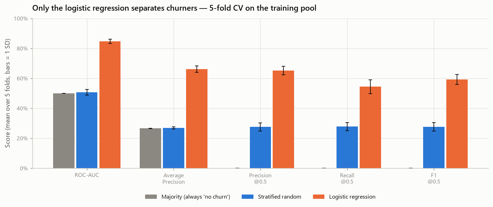
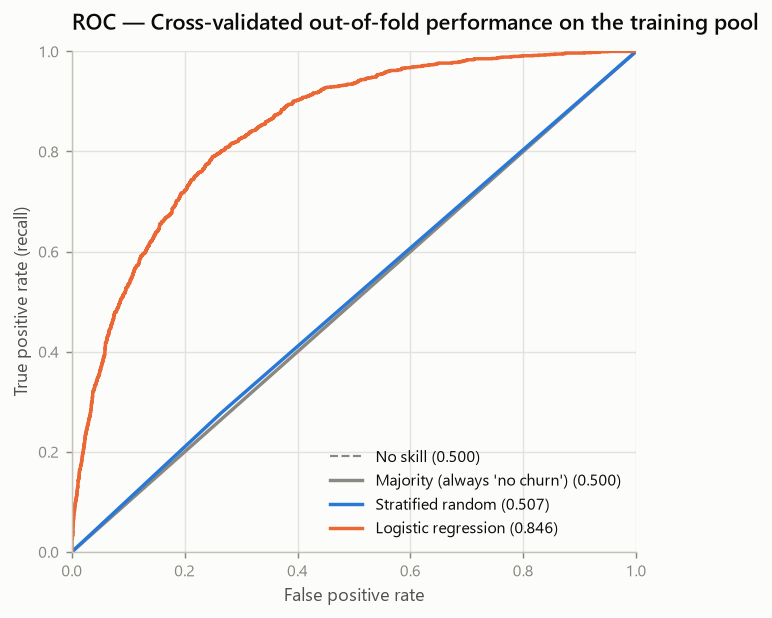
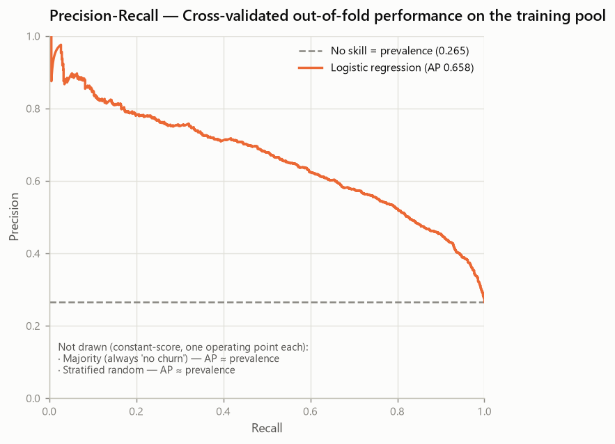
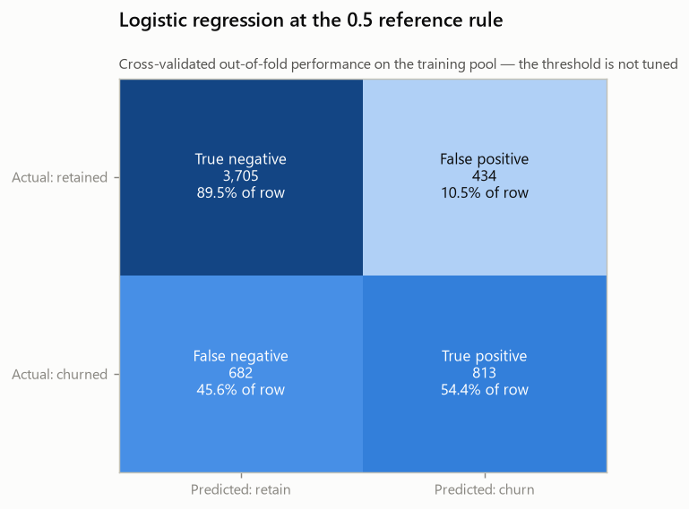

# Baseline Report — Telco Customer Churn (Phase 5)

- Generated on: 2026-08-10
- Generated by: `scripts/run_baselines.py`
- Machine-readable record: `reports/experiments/baseline_results.json`
- Raw SHA-256: `88be4b93fbe0cc83421af1c503794c97c342eca914c1576db7c276e61d61358a`
- Training partition fingerprint: `a553196dd46b672f6344867707144fbf56a8abe14b338a225662c7208a1450dd`

> **Every number in this report is cross-validated on the training pool.**
> There is no holdout metric here, and there will be none before Phase 9. Curves
> and confusion matrices are out-of-fold predictions on the same
> 5,634 training rows — never call them test results.

---

## 1. Objective

Measure how much predictive signal the **19 original
features** carry under the leakage-safe protocol frozen in Phase 4, and fix the
references every later phase has to beat:

1. a majority classifier — the floor;
2. a stratified random classifier — the no-skill reference;
3. an untuned logistic regression — the trainable baseline.

Nothing here is a candidate model. No feature was engineered, no hyperparameter
searched, no threshold moved, no imbalance technique applied.

## 2. Experimental protocol

| Element | Value |
| --- | --- |
| Data | Frozen Phase 4 training pool, 5,634 rows |
| Features | 19 original (3 numeric, 16 categorical) |
| Engineered features | none |
| Cross-validation | `StratifiedKFold(n_splits=5, shuffle=True, random_state=42)` |
| Shared folds | True — the comparison is paired |
| Decision rule | 0.5 (operational reference, not tuned) |
| Seed | 42 (`configs/base.toml`) |
| scikit-learn | 1.9.0 |

**Preprocessing is refitted inside every fold.** Each model is a complete
pipeline — `TotalChargesCleaner` → `ColumnTransformer` → classifier — cloned
fresh for each fold. The scaler's mean and standard deviation, the encoder's
category lists and the classifier's coefficients are all estimated on the
training fold alone; the validation fold is only transformed and predicted. No
`fit_transform` was ever called on the whole training pool before splitting,
which would have leaked every validation fold into every other fold.

All three models consume the identical `StratifiedKFold` partition, so a
difference between them cannot be an artefact of one drawing an easier split.

## 3. Holdout protection

The 5,634 training rows are the entire universe of this
phase. The 1,409 protected rows were not loaded:
`load_training_pool()` discards them before returning, and the loader that would
read them is called nowhere in this repository. The only facts about that
partition that exist anywhere are the structural metadata already published in
`reports/split_manifest.json` — row count and identifier fingerprint — which
this phase did not change.

An automated audit enforces this: a test parses every Phase 5 module and the
baseline script with `ast` and fails if any of them so much as *names* the
protected loader or reads that partition. It inspects code, not prose, so this
paragraph does not trip it.

## 4. Models

| Name | Estimator | Effective configuration |
| --- | --- | --- |
| `majority` | `DummyClassifier` | `strategy="most_frequent"` |
| `stratified_random` | `DummyClassifier` | `strategy="stratified"`, `random_state=42` |
| `logistic_regression` | `LogisticRegression` | `C=1.0`, `penalty='l2'`, `class_weight=None`, `solver='lbfgs'`, `max_iter=100` |

The two dummies carry the same preprocessing block even though they ignore the
features entirely. That is deliberate: the comparison is between protocols, and
giving one model a different pipeline shape would introduce a difference that
has nothing to do with the model.

`class_weight=None` and `C=1.0` are scikit-learn defaults, kept on purpose. This
is the reference point, not a candidate; making either of them a decision is
Phase 8's job. No `random_state` is passed to the logistic regression because
lbfgs is deterministic and does not consume one — supplying it would suggest a
source of randomness that does not exist.

**Convergence.** The logistic regression converged in every fold (at most 47 lbfgs iterations against a `max_iter` of 100). Convergence warnings are
captured explicitly per fold and recorded in the JSON artefact; none was
suppressed.

## 5. Metrics

**Threshold-independent** — how well the model *ranks* customers by risk:

- **ROC-AUC** (`roc_auc_score`);
- **Average Precision** (`average_precision_score`). Reported under that name
  and never as "PR-AUC": AP is a weighted sum of precisions at each threshold,
  while a trapezoidal PR-AUC interpolates between operating points and is
  optimistically biased. Naming it removes the ambiguity.

**Threshold-dependent** — what happens when the ranking becomes a decision at
the 0.5 reference rule: Precision, Recall, F1.

**Accuracy is auxiliary.** It is computed and shown, but it ranks the majority
baseline first and was not used to select or promote anything. Where the
majority baseline predicts no positives at all, precision is undefined (0/0) and
is reported as `0.0` — a model that never fires has no precision to speak of.

### Metric hierarchy for the phases that follow

Recorded here and, as structured data, in `metric_protocol` inside the JSON
artefact, so Phase 6 reads the protocol instead of re-deciding it:

| Role | Metric |
| --- | --- |
| **Primary development metric** | **Average Precision** |
| Secondary ranking metric | ROC-AUC |
| Diagnostic at the 0.5 rule | Precision, Recall, F1 |
| Auxiliary only | Accuracy |

**Why Average Precision leads.** The positive class is the minority and the task
is to discriminate churners. AP is computed entirely on positive-class
retrieval, so it degrades visibly when a model finds fewer churners. ROC-AUC is
dominated by the abundant negatives and moves less for the same loss of
churn-finding ability — which is why a model can look strong on ROC-AUC while
being mediocre at the thing the project exists to do. ROC-AUC stays as the
secondary view because it is prevalence-independent and therefore comparable
across samples.

**No single metric decides anything.** A metric hierarchy orders attention; it
does not replace judgement about trade-offs, added complexity and
interpretability. A later feature or model **does not have to improve every
metric at once** — a candidate that lifts AP while leaving ROC-AUC flat can still
be the right choice, and one that lifts both by a hair while doubling the
complexity may not be.

**The threshold is not optimised**, so the diagnostic trio is read as a
description of the 0.5 operating point, not as a
performance ceiling.

## 6. Positive-class prevalence reference

Positive prevalence in the **training pool**: **0.2654**
(26.54%).

This number exists only to make Average Precision readable. A ranking with no
signal converges to an AP equal to the positive prevalence, so an AP of
0.265 means "no better than chance", not "bad but non-zero". An AP
must always be read as a distance above this floor, never as an absolute score.
The equivalent floor for ROC-AUC is 0.500 and does not depend on prevalence —
which is exactly why the two metrics disagree about how impressive a model is on
imbalanced data.

No prevalence from the holdout was computed or used.

## 7. Cross-validation results

Mean ± sample standard deviation over the 5 folds:

| Model | ROC-AUC | Average Precision | Precision @0.5 | Recall @0.5 | F1 @0.5 | Accuracy @0.5 |
| --- | --- | --- | --- | --- | --- | --- |
| `majority` | 0.5000 ± 0.0000 | 0.2654 ± 0.0001 | 0.0000 ± 0.0000 | 0.0000 ± 0.0000 | 0.0000 ± 0.0000 | 0.7346 ± 0.0001 |
| `stratified_random` | 0.5065 ± 0.0191 | 0.2686 ± 0.0079 | 0.2748 ± 0.0277 | 0.2776 ± 0.0280 | 0.2762 ± 0.0278 | 0.6139 ± 0.0149 |
| `logistic_regression` | 0.8461 ± 0.0140 | 0.6615 ± 0.0217 | 0.6521 ± 0.0286 | 0.5438 ± 0.0457 | 0.5924 ± 0.0333 | 0.8019 ± 0.0132 |



*Cross-validated metrics per model, with fold-to-fold spread*

Per-fold ROC-AUC:

| Model | Fold 1 | Fold 2 | Fold 3 | Fold 4 | Fold 5 | Mean ± SD |
| --- | --- | --- | --- | --- | --- | --- |
| `majority` | 0.5000 | 0.5000 | 0.5000 | 0.5000 | 0.5000 | **0.5000** ± 0.0000 |
| `stratified_random` | 0.5316 | 0.5134 | 0.5111 | 0.4815 | 0.4950 | **0.5065** ± 0.0191 |
| `logistic_regression` | 0.8479 | 0.8251 | 0.8419 | 0.8629 | 0.8530 | **0.8461** ± 0.0140 |

Per-fold Average Precision:

| Model | Fold 1 | Fold 2 | Fold 3 | Fold 4 | Fold 5 | Mean ± SD |
| --- | --- | --- | --- | --- | --- | --- |
| `majority` | 0.2653 | 0.2653 | 0.2653 | 0.2653 | 0.2655 | **0.2654** ± 0.0001 |
| `stratified_random` | 0.2798 | 0.2709 | 0.2699 | 0.2588 | 0.2636 | **0.2686** ± 0.0079 |
| `logistic_regression` | 0.6437 | 0.6355 | 0.6859 | 0.6782 | 0.6643 | **0.6615** ± 0.0217 |

Per-fold Recall at 0.5:

| Model | Fold 1 | Fold 2 | Fold 3 | Fold 4 | Fold 5 | Mean ± SD |
| --- | --- | --- | --- | --- | --- | --- |
| `majority` | 0.0000 | 0.0000 | 0.0000 | 0.0000 | 0.0000 | **0.0000** ± 0.0000 |
| `stratified_random` | 0.3144 | 0.2876 | 0.2843 | 0.2408 | 0.2609 | **0.2776** ± 0.0280 |
| `logistic_regression` | 0.5351 | 0.5017 | 0.5318 | 0.6221 | 0.5284 | **0.5438** ± 0.0457 |

### What the standard deviations do and do not mean

They describe how performance **varies across partitions** — the logistic
regression's recall ranges from 0.5017 to 0.6221 across the
five folds, so a single fold's number is not a stable estimate on its own.

They are **not** a margin of error for the difference between two models, and
must not be used as a bar a future gain has to clear. The two quantities answer
different questions: a between-fold SD measures dispersion of one model's
performance over different data, while a comparison of two models on the *same*
folds is a paired measurement in which the fold-to-fold difficulty that drives
most of that dispersion cancels out. A candidate can be consistently better than
the baseline by less than the baseline's own SD.

**Protocol for later phases.** Compare on the identical folds, per fold:

```text
delta_AP_fold = AP_candidate_fold - AP_baseline_fold
```

and judge the candidate on the **consistency and magnitude** of those deltas —
whether the difference points the same way in every fold, and how large it is.
No such comparison is performed here: this phase produces the reference values,
nothing more. No significance test was run either.

## 8. Out-of-fold results

Each of the 5,634 training rows received exactly one
prediction, produced by a model that never saw that row during fitting. Metrics
recomputed over the pooled out-of-fold predictions:

| Model | ROC-AUC | Average Precision | Precision @0.5 | Recall @0.5 | F1 @0.5 | Accuracy @0.5 |
| --- | --- | --- | --- | --- | --- | --- |
| `majority` | 0.5000 | 0.2654 | 0.0000 | 0.0000 | 0.0000 | 0.7346 |
| `stratified_random` | 0.5065 | 0.2680 | 0.2748 | 0.2776 | 0.2762 | 0.6140 |
| `logistic_regression` | 0.8456 | 0.6584 | 0.6520 | 0.5438 | 0.5930 | 0.8019 |

These are **cross-validated out-of-fold performance on the training pool**. They
are not test metrics and must never be relabelled as such.



*ROC curves from out-of-fold predictions on the training pool*



*Precision-recall from out-of-fold predictions*

The two dummies are **not drawn** as PR curves. Each assigns the same score to
every customer, so each has a single achievable operating point; joining the two
points `precision_recall_curve` returns would draw a long straight segment that
reads as a series of trade-offs that do not exist — and would make the majority
baseline appear to beat random over most of the range. The dashed prevalence
line already carries what they contribute. Their ROC curves *are* shown above,
because the diagonal is genuinely what a constant score produces there.

## 9. Dummy baseline interpretation

**Majority** (`majority`) — predicts "no churn" for everyone.

- Accuracy 0.7346: it "gets 73.5% right"
  while finding zero churners. This is the concrete reason accuracy is
  disqualified as a selection metric in this project.
- ROC-AUC 0.5000: a constant score cannot rank anything.
- Average Precision 0.2654, i.e. the prevalence.
- Recall 0.0000 and F1 0.0000: it never fires.

**Stratified random** (`stratified_random`) — guesses at the prevalence
observed in each training fold.

- ROC-AUC 0.5065 ± 0.0191 and Average
  Precision 0.2686 ± 0.0079
  confirm the two no-skill floors empirically rather than by assertion.
- Precision 0.2748 ≈ the prevalence: of the customers it
  flags, roughly the base rate actually churn — which is what "no information"
  looks like.
- Recall 0.2776 ≈ the prevalence as well, because it fires on
  a random ~27% of everyone.

Together they establish that any ROC-AUC near 0.5 or any AP near
0.265 is worthless regardless of how the accuracy reads.

## 10. Logistic Regression baseline

Untuned, on the 19 original features:

| Metric | Cross-validated | Distance above the no-skill floor |
| --- | --- | --- |
| ROC-AUC | 0.8461 ± 0.0140 | +0.3461 over 0.500 |
| Average Precision | 0.6615 ± 0.0217 | +0.3961 over 0.2654 |
| Precision @0.5 | 0.6521 ± 0.0286 | +0.3867 over 0.2654 |
| Recall @0.5 | 0.5438 ± 0.0457 | — |
| F1 @0.5 | 0.5924 ± 0.0333 | — |

**OBSERVATION.** A plain linear model on the raw features already ranks
substantially better than chance on both threshold-independent metrics. The
signal the EDA described — contract type, tenure, internet tier, payment method
— is largely linearly accessible; it does not require a complex model to be
picked up.

**OBSERVATION.** Ranking quality and decision quality diverge. ROC-AUC
0.846 sounds strong, yet at the 0.5 rule recall is only
0.544. Both describe the same model: it orders customers
well, but the default cut-off sits far out on that ordering, so most churners
fall below it. This gap is the entire reason Phase 9 exists.

**This is a floor, not a result.** Its value is as a reference point for the
engineered features of Phase 6 and the models of Phase 7. Those comparisons are
governed by the protocol in section 5 and the paired method in section 7: a
candidate is judged on the consistency and magnitude of its per-fold deltas
against these numbers, with **Average Precision as the primary development
metric**, ROC-AUC secondary, and complexity and interpretability weighed
alongside. It does not have to improve every metric simultaneously, and the
numbers above are not a bar defined by any standard deviation.

## 11. Error and trade-off interpretation at 0.5

Out-of-fold confusion matrix for the logistic regression:



*Out-of-fold confusion matrix at the 0.5 reference rule*

| | Predicted retain | Predicted churn |
| --- | --- | --- |
| **Actual retained** | 3,705 | 434 |
| **Actual churned** | 682 | 813 |

Read operationally, at this rule and on this data:

- of the 1,495 customers who churned, the model flags
  813 and misses 682;
- of the 1,247 customers it flags, 813 genuinely
  churned and 434 would have stayed.

The asymmetry is structural, not a defect of the model. A default 0.5 cut-off on
an imbalanced problem is conservative about firing: it trades recall for
precision. Whether that trade is the right one **cannot be decided here** — it
depends on the cost of a retention offer, the cost of losing a customer and the
capacity of whoever acts on the list. The dataset contains none of those
numbers, so no business claim is made, no cost scenario is invented and the
threshold is left exactly where it is.

## 12. Limitations

- **No holdout estimate exists.** Every number is training-pool cross-validation.
  Cross-validated performance is an optimistic-leaning estimate of generalisation,
  and the honest measurement waits for Phase 9.
- **The 0.5 rule is arbitrary** for this problem. It was not chosen by looking at
  metrics, and it is not a business decision.
- **Untuned logistic regression is not "the linear model's ceiling".** Regularisation
  strength, penalty and class weighting are untouched; a tuned version may differ.
- **No significance testing.** With five folds, the reported standard deviations
  describe variability but do not support a formal claim that one model beats
  another.
- **The analyst-exposure limitation from Phase 3 still applies.** The exploratory
  hypotheses that shaped this protocol were formed with the complete dataset in
  view, holdout rows included. The final estimate may carry optimistic bias that
  cannot be quantified with the data available.
- **Snapshot classification, not forecasting.** The dataset has no time dimension,
  so nothing here validates prospective churn prediction over a horizon.

## 13. Decisions explicitly deferred

| Decision | Phase |
| --- | --- |
| Engineered features from the EDA candidate list | 6 |
| Model comparison beyond a linear baseline | 7 |
| Class-imbalance handling (weights, resampling) | 7 |
| Hyperparameter tuning, including `C` and penalty | 8 |
| Decision threshold, calibration, cost framing, error analysis | 9 |
| Holdout evaluation | 9 |
| Global and local explainability | 10 |

Nothing in this phase constrains those decisions except by providing the number
they must beat.

## 14. Recommended next experiment

Phase 6 — feature engineering — with the EDA's hypothesis-driven candidates:
protective-service count, tenure × contract, charge intensity relative to the
internet tier, `TotalCharges / tenure`, and the automatic-payment flag.

Each must be evaluated **against the logistic-regression baseline recorded
here**, on the same folds and with the same pipeline, using **paired per-fold
differences**:

```text
delta_AP_fold = AP_candidate_fold - AP_baseline_fold
```

The decision rests on whether those deltas point the same way across folds and
how large they are, read under the metric hierarchy of section 5 —
`average_precision` primary,
`roc_auc` secondary — and weighed against the
complexity and loss of interpretability the feature introduces. A candidate does
not need to improve every metric at once.
