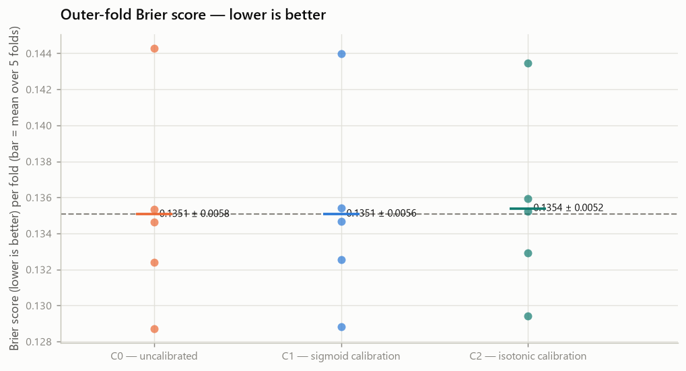
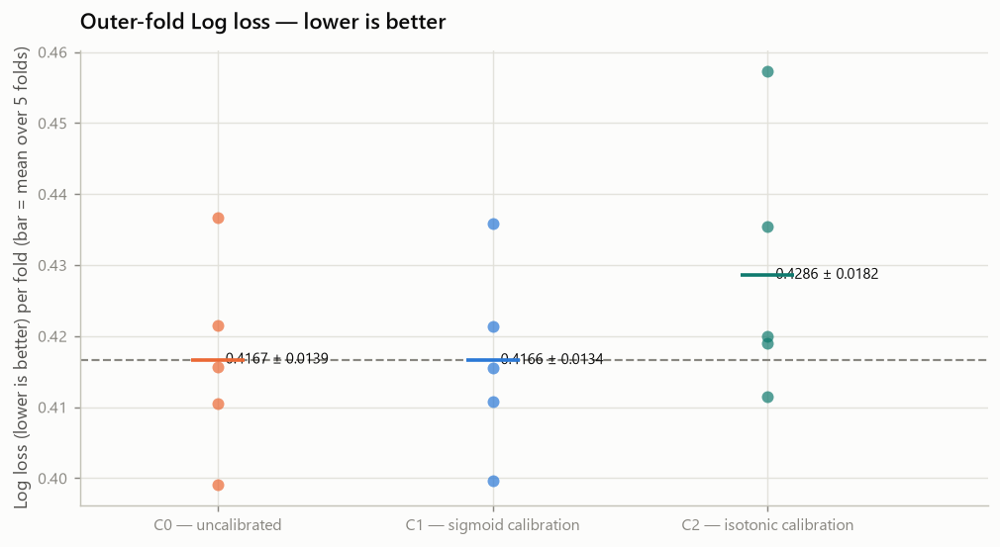
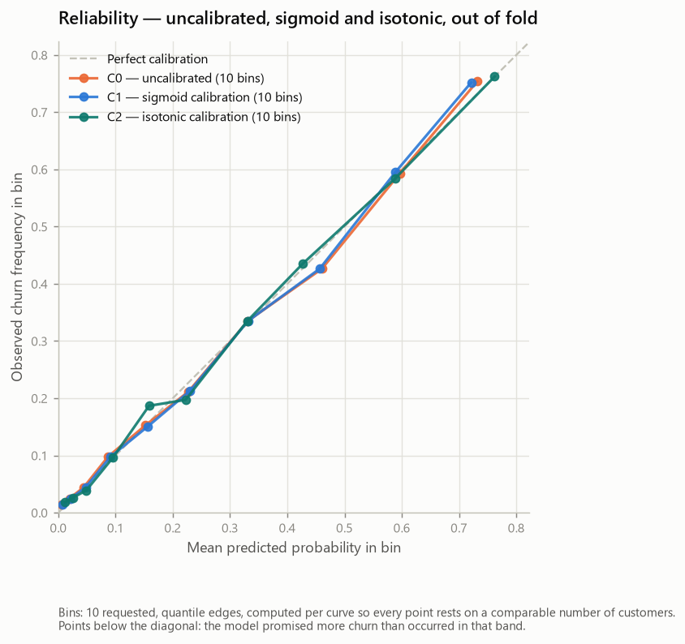
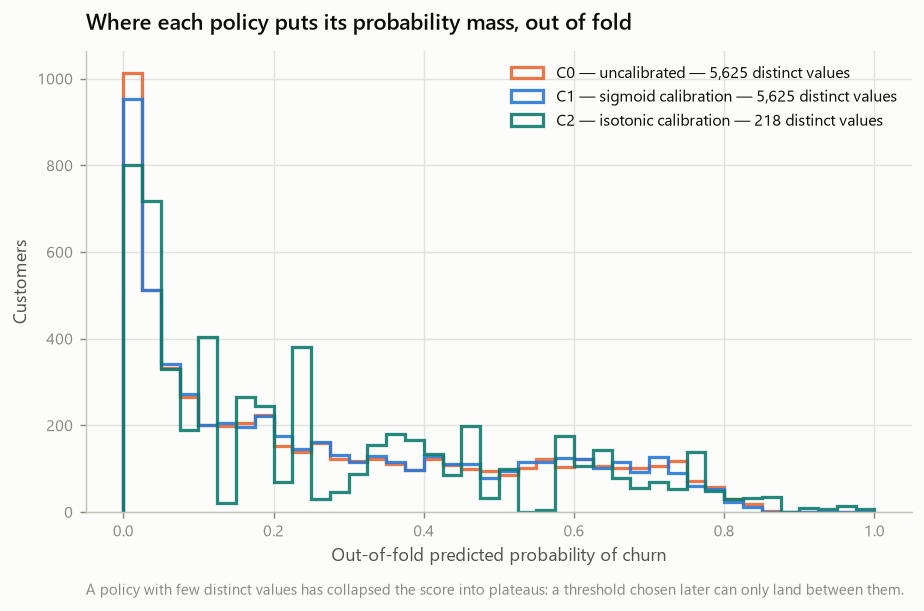

# Calibration Gate — Telco Customer Churn (Phase 9A)

- Generated by: `scripts/run_calibration.py`
- Machine-readable record: `reports/experiments/calibration_results.json`
- Raw SHA-256: `88be4b93fbe0cc83421af1c503794c97c342eca914c1576db7c276e61d61358a`
- Training partition fingerprint: `a553196dd46b672f6344867707144fbf56a8abe14b338a225662c7208a1450dd`

> **This report carries no generation date.** It is a pure function of its
> inputs, so re-running the generator on an unchanged repository reproduces it
> byte for byte and any diff is a real change. Git records when it was produced.

> **Every number here is cross-validated on the training pool.** No holdout row
> was loaded, transformed, calibrated, predicted or measured. There is still no
> test result in this repository.

---

## 1. Objective

One question:

> **Do the probabilities produced by the frozen logistic regression need an
> explicit calibration layer?**

This phase measures **probability quality**. It does not select a threshold, it
does not reopen model selection, and it does not compute a single
threshold-dependent metric.

The distinction matters because a model can rank customers perfectly and still
be systematically wrong about *how likely* churn is. Average Precision and
ROC-AUC are invariant to any monotone transformation of the score; Brier score
and log loss are not. Every earlier phase in this project measured ranking. This
one measures whether a 0.7 means 70%.

## 2. Frozen candidate

| Property | Value |
| --- | --- |
| Estimator | `LogisticRegression` |
| Builder | `churn.modeling.tuning.build_modern_logistic` |
| Selected in | `phase8b-nested-hyperparameter-tuning` |
| Hyperparameters | `C=1.0`, `class_weight=None`, `l1_ratio=0.0`, `max_iter=100`, `solver=lbfgs` |
| Reopened here | False |
| Features | 19 original (3 numeric, 16 categorical) |
| Engineered | none |
| Preprocessing | prepare_features (contract validation and canonical column order) → TotalChargesCleaner → StandardScaler on the 3 numeric features → OneHotEncoder(handle_unknown='ignore') on the 16 categorical features |
| Transformed columns | 46 |
| `class_weight` | `None` |
| Seed | 42 |
| scikit-learn | 1.9.0 |

Nothing in that table was chosen here. It is the output of Phase 8B, carried in
unchanged, and the tests assert it against the Phase 8B factory rather than
against a restatement of it.

| Upstream artefact | SHA-256 |
| --- | --- |
| `reports/split_manifest.json` | `834eb1313536c49e…` |
| `reports/experiments/baseline_results.json` | `2bd6eb992a4ed235…` |
| `reports/experiments/feature_engineering_results.json` | `bd8a3f03df405f7b…` |
| `reports/experiments/model_comparison_results.json` | `648aca646146e6bc…` |
| `reports/experiments/hgb_representation_results.json` | `794bd1bde4a78240…` |
| `reports/experiments/tuning_results.json` | `d9d245e22fc89320…` |

Digests of the artefacts this phase is anchored to. A reference by name says
which file was meant; a digest says which bytes were read.

## 3. Why calibration precedes threshold selection

A calibrator rewrites the probabilities. A threshold is a cut on them.

If the threshold were chosen first, adopting a calibrator afterwards would move
every probability underneath it, and the chosen cut would belong to a score that
no longer exists — 0.42 on raw scores and 0.42 on calibrated scores are
different operating points, selecting different customers, with different recall
and different precision. The threshold has to be chosen on **exactly the score
that will be used in production and later on the holdout**, so the calibration
policy has to be frozen before it.

That order is not a preference. It was fixed in section 20 of
`reports/tuning_report.md` and in `selection.phase9_sequence` of the Phase 8B
record before any Phase 9 work began: **A** calibration gate, **B** threshold
policy, **C** freeze, **D** the first and only holdout evaluation, **E** post-hoc
descriptive error analysis. This report is step A.

## 4. Protected holdout

The 5,634 training rows are the entire universe of this
phase. `load_holdout()` is not called anywhere in the Phase 9A code, and an AST
audit fails the build if it appears. No holdout row took part in a fit, a
calibration, a metric, a plot, a reliability diagram or the choice of method.

## 5. Evaluation protocol

| Level | Splitter | Role |
| --- | --- | --- |
| Outer | `StratifiedKFold(n_splits=5, shuffle=True, random_state=42)` | evaluates the calibration policy; never fits a calibrator |
| Inner | `StratifiedKFold(n_splits=4, shuffle=True, random_state=42)` | fits the calibrator, inside one outer training fold |

The outer partition is the identical one used by Phases 5 to 8B, so every paired
delta here is a per-fold difference on the same folds every earlier number was
computed on.

**Cross-fitted, or it measures nothing.** A calibrator fitted on the scores its
own base estimator produced in-sample sees an optimistically distorted score
distribution — the model is overconfident on rows it was trained on — and learns
to correct a distortion that does not exist out of sample. So no row is ever
used to fit the estimator that scores it, to fit the calibrator that transforms
that score, and to evaluate the result:

```text
for each outer fold (the frozen 5-fold partition):
    inside the outer TRAIN only:
        inner 4-fold -> a cross-validated score for every outer-train row
        fit the calibrator on those out-of-sample scores
        refit the base pipeline on the WHOLE outer train
    predict the outer VALIDATION fold exactly once
```

The **complete pipeline** goes inside the calibrator, not just the classifier, so
the cleaner, the scaler and the encoder are refitted inside every inner
calibration fold.

**`ensemble=False`, and that choice is what makes this experiment
answer the question asked.** It is pinned rather than left at the `"auto"`
default, so a future change of that default cannot silently alter the protocol.
The value matters:

- with `ensemble=False`, the inner folds are used **only** to produce
  out-of-sample scores for the calibrator, and the estimator that finally
  predicts is refitted on the entire outer training fold — the same rows C0 is
  fitted on. The arms then differ by the calibration layer **alone**;
- with `ensemble=True`, the calibrator keeps one (estimator, calibrator) pair per
  inner fold and averages four models each fitted on three quarters of the fold.
  That is a variance-reduction technique with its own effect on the Brier score,
  and a delta measured that way could not be attributed to calibration rather
  than to model averaging.

This phase exists to isolate the calibration layer, so `ensemble=False` is the
protocol and the only results reported here.

### Gate: the uncalibrated reference has not drifted

C0 is the frozen pipeline on the frozen outer folds — which is exactly what
Phase 8B's T0 was. The ranking metrics must therefore come out identical, and the
run aborts if they do not: a calibration delta measured against a drifted
reference would mean nothing.

| Experiment | Reproduces | Artefact | Tolerance | Largest difference | Reproduced |
| --- | --- | --- | --- | --- | --- |
| C0 | `procedures[T0]` | `reports/experiments/tuning_results.json` | 1e-09 | 0.0e+00 | **True** |

### Metrics, and which of them decide

| Group | Metrics | Role |
| --- | --- | --- |
| Probability quality | `brier_score`, `log_loss`, `expected_calibration_error` | **decides** — Brier and log loss |
| Ranking guardrails | `average_precision`, `roc_auc` | watches only |
| Threshold-dependent | none — not computed | absent by design |

Brier score and log loss are **losses**: a negative delta is an improvement. That
is the opposite of every earlier phase in this project, so the paired comparison
carries an explicit direction flag rather than relying on a reader to remember.

**What those two losses are, and what they are not.** Both are *proper scoring
rules*: they are minimised by the true probabilities, which is why they can be
trusted to rank probabilistic quality. They are **not** measures of calibration
in isolation. Each decomposes into a calibration term and a
refinement/discrimination term, so a movement in either can come from
probabilities that became sharper rather than better aligned. No conclusion in
this report rests on Brier or log loss alone: the decision reads them **together
with** the reliability diagram, the ranking guardrails and the fold-to-fold
consistency of the effect.

A calibrator is never adopted because a ranking metric improved. The guardrails
exist to catch the opposite case — a calibrator that damaged the ranking. What
each method is expected to do to the ranking is stated in advance:

- **C1 — sigmoid**: Sigmoid calibration applied to the score of a single estimator is a strictly monotone transformation, so barring numerical or pathological effects it should not materially change the ranking. Average Precision and ROC-AUC for C1 against C0 are therefore checked as an implementation guardrail: a material change would indicate something other than calibration happened and would have to be investigated before the run is accepted. Small numerical differences are legitimate and are reported rather than asserted away.
- **C2 — isotonic**: Isotonic calibration is monotone but NOT strictly increasing: it can map several distinct scores onto one plateau, introducing tied probabilities and reducing ranking resolution. Average Precision and ROC-AUC may therefore differ from the uncalibrated reference. Any such difference is reported as a trade-off of the probabilistic representation, not as a calibration error, and the count of distinct out-of-fold probabilities is recorded so the magnitude of the collapse is visible.

Precision, recall, F1 and accuracy were not computed at all. They need a
threshold, this phase does not choose one, and a metric that is never computed
cannot accidentally decide anything.

### Expected Calibration Error

There is no canonical ECE — implementations differ in binning, weighting and
empty-bin handling — so the one used here is stated in full:

```text
ECE = sum over non-empty bins b of (n_b / N) * |mean(predicted probability in b) - mean(observed label in b)|
```

| Property | Value |
| --- | --- |
| Bins | 10 |
| Strategy | `quantile` |
| Empty bins | excluded; an empty bin carries weight 0 and contributes nothing |
| Duplicate edges | duplicate quantile edges are collapsed, so the effective number of bins can be smaller than n_bins when the score distribution has ties |

There is no canonical ECE. Implementations differ in binning, weighting and empty-bin handling, so this number is comparable within this report and must not be compared to an ECE from elsewhere without checking its definition. It is a supporting diagnostic and decided nothing on its own.

**ECE is sensitive to how many rows back each bin, so the per-fold and pooled
figures in this report are not comparable with each other.** A per-fold ECE
splits roughly 1,126 validation rows
into 10 quantile bins — about
112 customers per bin —
and the sampling noise in each bin's observed frequency inflates the average gap,
because ECE averages **absolute** differences and noise cannot cancel. The pooled
out-of-fold ECE in section 16 divides 5,634 rows into the
same number of bins, so each gap rests on roughly
563 customers and the same model scores a
visibly lower ECE. Both numbers are correct; reading the difference between them
as a calibration effect would not be. This is a further reason ECE decides
nothing here.

## 6-8. The three policies

| Experiment | Method | What it is |
| --- | --- | --- |
| C0 | `none` | the frozen pipeline, its own probabilities, no transformation |
| C1 | `sigmoid` | Platt scaling: a two-parameter logistic fit mapping score to probability. Strictly monotone, and rigid by construction — a limitation and a protection |
| C2 | `isotonic` | a free monotone step function. More flexible, and therefore more able to track the particular calibration split it was fitted on. Monotone but not strictly increasing, so it can create ties |

**Whether a logistic regression needs calibration is an empirical question, and
this phase is the experiment that answers it — for this dataset and this
protocol only.** A logistic regression can produce adequately calibrated
probabilities: it has a probabilistic structure and is fitted on log loss.
But that is a tendency, not a guarantee. Regularisation shrinks coefficients and
can compress probabilities towards the base rate; a misspecified model — omitted
interactions, a wrong functional form, unmodelled heterogeneity — can be
miscalibrated in specific regions of the score range; and the characteristics of
a particular dataset can produce miscalibration on their own. Nothing here is
concluded from the family. The conclusion is whatever the measurements below
support, scoped to this dataset and this protocol.

**Isotonic is more flexible, and that is not automatically an advantage.** A
sigmoid fit has two parameters; isotonic fits a free monotone step function. The
training pool holds 5,634 rows, but no calibrator is fitted
on all of them — each one sees a single inner fold of a single outer training
fold, roughly a fifth of a fifth of the data. Flexibility that pays off on a
large sample can track the particular split it was given on a smaller one. That
is an empirical question, and section 12 answers it rather than assuming it.

| Experiment | Policy | Brier score | Log loss | ECE | Average Precision | ROC-AUC |
| --- | --- | --- | --- | --- | --- | --- |
| C0 | Uncalibrated logistic regression | 0.1351 ± 0.0058 | 0.4167 ± 0.0139 | 0.0315 ± 0.0074 | 0.6615 ± 0.0217 | 0.8461 ± 0.0140 |
| C1 | Sigmoid-calibrated logistic regression | 0.1351 ± 0.0056 | 0.4166 ± 0.0134 | 0.0313 ± 0.0065 | 0.6615 ± 0.0217 | 0.8461 ± 0.0140 |
| C2 | Isotonic-calibrated logistic regression | 0.1354 ± 0.0052 | 0.4286 ± 0.0182 | 0.0307 ± 0.0057 | 0.6464 ± 0.0210 | 0.8454 ± 0.0139 |



*Outer-fold Brier score, lower is better*



*Outer-fold log loss, lower is better*

## 9. Brier score

| Experiment | F1 | F2 | F3 | F4 | F5 | Mean ± SD |
| --- | --- | --- | --- | --- | --- | --- |
| C0 | 0.1346 | 0.1443 | 0.1353 | 0.1287 | 0.1324 | **0.1351** ± 0.0058 |
| C1 | 0.1347 | 0.1440 | 0.1354 | 0.1288 | 0.1325 | **0.1351** ± 0.0056 |
| C2 | 0.1359 | 0.1434 | 0.1352 | 0.1294 | 0.1329 | **0.1354** ± 0.0052 |

The Brier score is the mean squared error of the probability. It is bounded, it
is a proper scoring rule, and it decomposes into calibration and refinement —
which is why it can improve when the probabilities are corrected even though the
ranking is untouched.

## 10. Log loss

| Experiment | F1 | F2 | F3 | F4 | F5 | Mean ± SD |
| --- | --- | --- | --- | --- | --- | --- |
| C0 | 0.4156 | 0.4367 | 0.4215 | 0.3990 | 0.4105 | **0.4167** ± 0.0139 |
| C1 | 0.4155 | 0.4358 | 0.4213 | 0.3996 | 0.4108 | **0.4166** ± 0.0134 |
| C2 | 0.4190 | 0.4354 | 0.4199 | 0.4573 | 0.4115 | **0.4286** ± 0.0182 |

Log loss is also proper, and unbounded. It punishes a confident mistake far
harder than Brier does, so the two disagree when a calibrator helps the bulk of
the distribution while hurting its tail. The eligibility rule treats that
disagreement as **inconclusive** rather than picking the metric that agrees.

## 11. Ranking guardrails

| Experiment | F1 | F2 | F3 | F4 | F5 | Mean ± SD |
| --- | --- | --- | --- | --- | --- | --- |
| C0 | 0.6437 | 0.6355 | 0.6859 | 0.6782 | 0.6643 | **0.6615** ± 0.0217 |
| C1 | 0.6437 | 0.6355 | 0.6859 | 0.6782 | 0.6643 | **0.6615** ± 0.0217 |
| C2 | 0.6288 | 0.6205 | 0.6643 | 0.6677 | 0.6505 | **0.6464** ± 0.0210 |

| Experiment | F1 | F2 | F3 | F4 | F5 | Mean ± SD |
| --- | --- | --- | --- | --- | --- | --- |
| C0 | 0.8479 | 0.8251 | 0.8419 | 0.8629 | 0.8530 | **0.8461** ± 0.0140 |
| C1 | 0.8479 | 0.8251 | 0.8419 | 0.8629 | 0.8530 | **0.8461** ± 0.0140 |
| C2 | 0.8450 | 0.8254 | 0.8414 | 0.8632 | 0.8523 | **0.8454** ± 0.0139 |

Neither calibrator can reorder customers — both are monotone — but they are not
equally safe here, and the difference is structural.

**C1 (sigmoid)** is *strictly* monotone, so it preserves the ordering exactly.
Its AP and ROC-AUC against C0 are read as an **implementation guardrail**: a
material change would mean something other than calibration happened, and the run
would have to be investigated before being accepted. Small numerical differences
are legitimate and are reported rather than asserted away.

**C2 (isotonic)** is monotone but *not strictly increasing*: it maps many
distinct scores onto one plateau, and customers who had a strict ordering before
become tied afterwards. In this experiment it collapsed the out-of-fold score
from 5,625 distinct values to
218, and that **reduction in ranking resolution was
accompanied by a lower Average Precision**: mean delta -0.015135
against C0, worse in 5/5 outer folds.

That co-occurrence is what was measured. It is reported as a **trade-off of the
probabilistic representation** — fewer distinct probabilities to rank with — and
not as a calibration error, and no claim is made here about the internal tie
handling of the metric.

These rows are read as "the ranking survived", never as "calibration helped".

## 12. Paired outer-fold results

| Comparison | Metric | Direction | F1 | F2 | F3 | F4 | F5 | Mean | SD | Improved | Tied | Worsened |
| --- | --- | --- | --- | --- | --- | --- | --- | --- | --- | --- | --- | --- |
| C1 vs C0 | Brier score | lower better | +0.0001 | -0.0003 | +0.0001 | +0.0001 | +0.0001 | **+0.0000** | 0.0002 | 1 | 0 | 4 |
| C1 vs C0 | Log loss | lower better | -0.0001 | -0.0009 | -0.0002 | +0.0005 | +0.0002 | **-0.0001** | 0.0006 | 3 | 0 | 2 |
| C1 vs C0 | ECE | lower better | -0.0010 | -0.0023 | -0.0011 | +0.0024 | +0.0011 | **-0.0002** | 0.0019 | 3 | 0 | 2 |
| C1 vs C0 | Average Precision | higher better | +0.0000 | +0.0000 | +0.0000 | +0.0000 | +0.0000 | **+0.0000** | 0.0000 | 0 | 5 | 0 |
| C1 vs C0 | ROC-AUC | higher better | +0.0000 | +0.0000 | +0.0000 | +0.0000 | +0.0000 | **+0.0000** | 0.0000 | 0 | 5 | 0 |
| C2 vs C0 | Brier score | lower better | +0.0013 | -0.0008 | -0.0001 | +0.0007 | +0.0005 | **+0.0003** | 0.0008 | 2 | 0 | 3 |
| C2 vs C0 | Log loss | lower better | +0.0034 | -0.0014 | -0.0016 | +0.0583 | +0.0009 | **+0.0119** | 0.0260 | 2 | 0 | 3 |
| C2 vs C0 | ECE | lower better | +0.0107 | -0.0057 | -0.0003 | -0.0012 | -0.0073 | **-0.0008** | 0.0071 | 4 | 0 | 1 |
| C2 vs C0 | Average Precision | higher better | -0.0149 | -0.0149 | -0.0216 | -0.0105 | -0.0138 | **-0.0151** | 0.0040 | 0 | 0 | 5 |
| C2 vs C0 | ROC-AUC | higher better | -0.0029 | +0.0003 | -0.0005 | +0.0003 | -0.0007 | **-0.0007** | 0.0013 | 2 | 0 | 3 |
| C2 vs C1 | Brier score | lower better | +0.0013 | -0.0005 | -0.0002 | +0.0006 | +0.0004 | **+0.0003** | 0.0007 | 2 | 0 | 3 |
| C2 vs C1 | Log loss | lower better | +0.0035 | -0.0004 | -0.0014 | +0.0577 | +0.0007 | **+0.0120** | 0.0256 | 2 | 0 | 3 |
| C2 vs C1 | ECE | lower better | +0.0117 | -0.0034 | +0.0008 | -0.0037 | -0.0084 | **-0.0006** | 0.0076 | 3 | 0 | 2 |
| C2 vs C1 | Average Precision | higher better | -0.0149 | -0.0149 | -0.0216 | -0.0105 | -0.0138 | **-0.0151** | 0.0040 | 0 | 0 | 5 |
| C2 vs C1 | ROC-AUC | higher better | -0.0029 | +0.0003 | -0.0005 | +0.0003 | -0.0007 | **-0.0007** | 0.0013 | 2 | 0 | 3 |

Improved, tied and worsened are three separate counts and do not have to sum the
way a two-way split would. "Improved" respects each metric's direction: for the
three losses it counts negative deltas.

The between-fold standard deviation is **not** a bar these deltas must clear. It
describes how one policy varies across partitions, not the uncertainty of a
difference between two policies measured on the same partitions. Five folds
cannot support a significance test and none was run.

## 13. Reliability diagrams



*Reliability of the three policies, out of fold*



*Out-of-fold probability distribution and granularity*

The diagonal is perfect calibration. A point **below** it means the policy
promised more churn than occurred in that band. Bins are
10 `quantile`
edges, declared before any diagram was drawn — bins chosen after seeing which
curve looks best would be a presentation decision, not a measurement.

The distinct-value counts in the second figure are not decoration. A step
function collapses a continuous score into plateaus, and a threshold chosen in
Phase 9B can only land between them.

## 14. Calibration selection rule

The rule, fixed before any Phase 9A number was read:

1. A calibration method is ELIGIBLE_CALIBRATION when: (1) its mean paired delta Brier is < 0; (2) Brier improves in at least 4 of the 5 outer folds; (3) its mean paired delta log loss is <= 0; and (4) Average Precision does not deteriorate relevantly and consistently.
2. Condition 4 uses the project's standard consistency test and no magnitude cutoff: AP counts as deteriorated when its mean delta is negative AND it worsens in at least 4 of the 5 outer folds.
3. If conditions 1 and 2 hold but 3 fails, the two probability losses disagree materially and the method is INCONCLUSIVE_CALIBRATION, not adopted.
4. If no method is eligible, the calibration policy is NONE and the uncalibrated logistic regression is carried forward.
5. If exactly one method is eligible, it is selected.
6. If both are eligible, compare them directly on the same folds: first Brier, then log loss; a method with a mean delta in its favour winning at least 4 of the 5 outer folds is selected.
7. Otherwise the pre-registered default applies: sigmoid, for lower flexibility and lower overfitting risk. Stability and complexity are reported but are not turned into a numeric cutoff.

No minimum-gain cutoff exists anywhere in it (`minimum_gain_cutoff`:
None). Every branch is exercised by tests on synthetic
inputs, so the branch the real numbers took is not the only one anybody checked.

| Experiment | Method | Mean ΔBrier | Folds Brier improved | Mean ΔLog loss | Mean ΔAP | Status |
| --- | --- | --- | --- | --- | --- | --- |
| C1 | `sigmoid` | +0.00002 | 1/5 | -0.00008 | +0.00000 | **NOT_ELIGIBLE_CALIBRATION** |
| C2 | `isotonic` | +0.00032 | 2/5 | +0.01193 | -0.01513 | **NOT_ELIGIBLE_CALIBRATION** |

- **C1 (sigmoid)** — mean delta Brier +0.00002 improving in 1/5 folds; mean delta log loss -0.00008 improving in 3/5; mean delta AP +0.00000 worsening in 0/5. The Brier score does not improve consistently, which is the primary condition, so calibration is not adopted.
- **C2 (isotonic)** — mean delta Brier +0.00032 improving in 2/5 folds; mean delta log loss +0.01193 improving in 2/5; mean delta AP -0.01513 worsening in 5/5. The Brier score does not improve consistently, which is the primary condition, so calibration is not adopted.

## 15. Selected calibration policy

**Selected: NONE — no calibration layer.**

No calibration method cleared the eligibility rule, so no calibration layer is adopted and the frozen logistic regression keeps emitting its own probabilities. Adding a transformation has to be justified; the default when it is not is to keep the simpler object.

Fold-to-fold Brier stability: `C1` 0.00558, `C2` 0.00518.

## 16. Outer-OOF probability quality

Each of the 5,634 training rows received exactly one
probability, from a policy whose **entire fitting and calibration** ran without
that row:

| Experiment | Policy | Brier score | Log loss | ECE | Average Precision | ROC-AUC | Distinct values |
| --- | --- | --- | --- | --- | --- | --- | --- |
| C0 | Uncalibrated logistic regression | 0.1351 | 0.4167 | 0.0104 | 0.6584 | 0.8456 | 5,625 |
| C1 | Sigmoid-calibrated logistic regression | 0.1351 | 0.4166 | 0.0114 | 0.6585 | 0.8457 | 5,625 |
| C2 | Isotonic-calibrated logistic regression | 0.1354 | 0.4286 | 0.0084 | 0.6521 | 0.8434 | 218 |

These are cross-validated training-pool results. They are not test performance
and must never be relabelled as such. No per-customer probability was persisted.

## 17. Limitations

- **No holdout estimate.** Everything is training-pool cross-validation.
- **Five outer folds, no significance test.** The deltas and the eligibility
  labels describe direction and consistency, not statistical significance.
- **What was measured is the calibration *procedure***, not one fitted
  calibrator. Each outer fold fitted its own, and the policy carried forward is
  the procedure, not any particular one of them.
- **ECE is definition-dependent** and is reported as a supporting diagnostic. It
  decided nothing on its own.
- **Only two methods were evaluated.** Temperature scaling, beta calibration and
  anything else are out of scope by protocol, not by evidence.
- **Calibration was assessed on the whole population.** A model can be calibrated
  overall and miscalibrated inside a subgroup; that is a fairness-adjacent
  question this phase did not open.
- **`class_weight` stays `None` and remains deferred.** It changes the fit, so
  reopening it would reopen model selection.
- **No threshold was selected**, and no threshold-dependent metric exists here.
- **The analyst-exposure limitation from Phase 3 still applies.**
- **Snapshot classification, not forecasting.** The dataset has no time dimension.

## 18. Frozen probability policy for Phase 9B

| Property | Value |
| --- | --- |
| Estimator | `LogisticRegression` from `churn.modeling.tuning.build_modern_logistic` |
| Hyperparameters | `C=1.0`, `class_weight=None`, `l1_ratio=0.0`, `max_iter=100`, `solver=lbfgs` |
| Calibration policy | **NONE** — no calibration layer |
| Probability source | Uncalibrated logistic regression (C0) |
| Outer-OOF Brier | 0.1351 |
| Outer-OOF log loss | 0.4167 |
| Outer-OOF ECE | 0.0104 |
| Distinct probabilities | 5,625 |
| Threshold | not selected here. Phase 9B selects the threshold on the training pool, acting on the probability this phase froze |

Phase 9B receives the frozen estimator plus this calibration policy, and selects a threshold on exactly the probability the policy produces.

Phase 9B selects the decision threshold on the training pool, acting on exactly
this probability. The holdout stays untouched until the threshold is frozen too.

## 19. Warnings

No warning was raised during the run.

Nothing was suppressed. The modern logistic builder does not raise the historical
`penalty` removal warning.
