# Exploratory Data Analysis — Telco Customer Churn

- Analysis date: 2026-08-09
- Source file: `WA_Fn-UseC_-Telco-Customer-Churn.csv` (977,501 bytes)
- SHA-256: `88be4b93fbe0cc83421af1c503794c97c342eca914c1576db7c276e61d61358a`
- Generated by: `scripts/run_eda.py` — every figure below is computed from the raw
  file at run time; no result is typed by hand.

Findings are labeled **OBSERVATION** (measured in this sample), **HYPOTHESIS**
(plausible reading that still needs validation) and **CANDIDATE** (something to
test formally in a later phase). Nothing here establishes causation: the dataset
is observational, so every relationship is an association within this sample.

---

## 1. Objective

Answer, before any modeling decision is taken:

1. How frequent is churn, and what does that imply for evaluation?
2. Does the length of the relationship relate to churn, and how?
3. Which contract, service, billing and demographic characteristics separate
   churners from non-churners in this sample?
4. Which interactions are worth carrying forward as hypotheses?
5. What exactly is wrong with `TotalCharges`, and which treatments look viable?
6. Which engineered features are worth investigating in Phase 6?

## 2. Dataset context

Facts carried over from Phase 2 and re-verified at run time:

| Property | Value |
| --- | --- |
| Rows | 7,043 |
| Columns | 21 original + 2 EDA helper columns |
| Target | `Churn` (positive = `Yes`) |
| Complete duplicate rows | 0 |
| Identifier | `customerID`, unique in every row |
| Unreadable numeric cells | 11 whitespace-only in `TotalCharges` |

For this phase only, `TotalCharges` is coerced to numeric with blanks becoming
`NaN`. That is an in-memory convenience: no cleaned dataset is written, the raw
file is untouched, and the imputation decision stays open for Phase 4.

## 3. Target baseline

| Class | Customers | Share |
| --- | --- | --- |
| `No` (retained) | 5,174 | 73.46% |
| `Yes` (churned) | 1,869 | 26.54% |

Class ratio: **2.77 retained for each churner**.

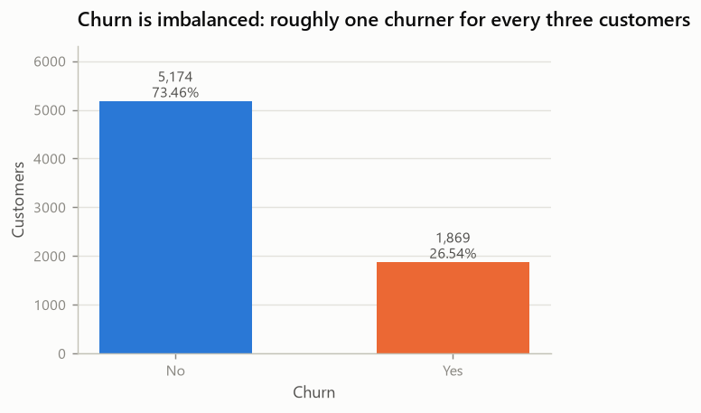

*Class sizes and shares of the target variable*

**OBSERVATION.** The positive class is the minority at 26.54%. A model
that predicts "no churn" for everyone reaches 73.46% accuracy while
finding zero churners.

**DECISION (deferred).** This fixes the evaluation frame rather than a technique:
accuracy is disqualified as a selection metric, PR-AUC and recall/precision at a
chosen threshold become the relevant views, and the split must be stratified. Any
class-weight or resampling choice belongs to Phase 7, not here.

## 4. Customer relationship and tenure

| Statistic | Retained | Churned |
| --- | --- | --- |
| Median tenure | 38 months | 10 months |
| Mean tenure | 37.6 | 18.0 |
| Q1 – Q3 | 15 – 61 | 2 – 29 |

Mann-Whitney U = 2,515,538, p = 2.42e-208,
rank-biserial = -0.480 (negative: churners rank lower).

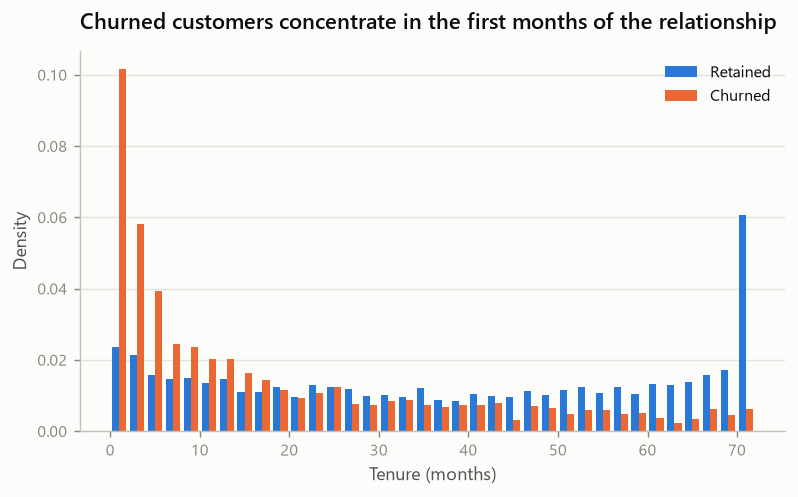

*Tenure distribution for churned and retained customers*

Descriptive tenure bands — cuts chosen to mirror the contract cycles the product
offers (0-6, 7-12, 13-24, 25-48, 49-72 months), **used for reading the tables
only**, with no modeling commitment:

| Tenure band | Customers | Churn rate |
| --- | --- | --- |
| `0-6` | 1,481 | 52.94% |
| `7-12` | 705 | 35.89% |
| `13-24` | 1,024 | 28.71% |
| `25-48` | 1,594 | 20.39% |
| `49-72` | 2,239 | 9.51% |

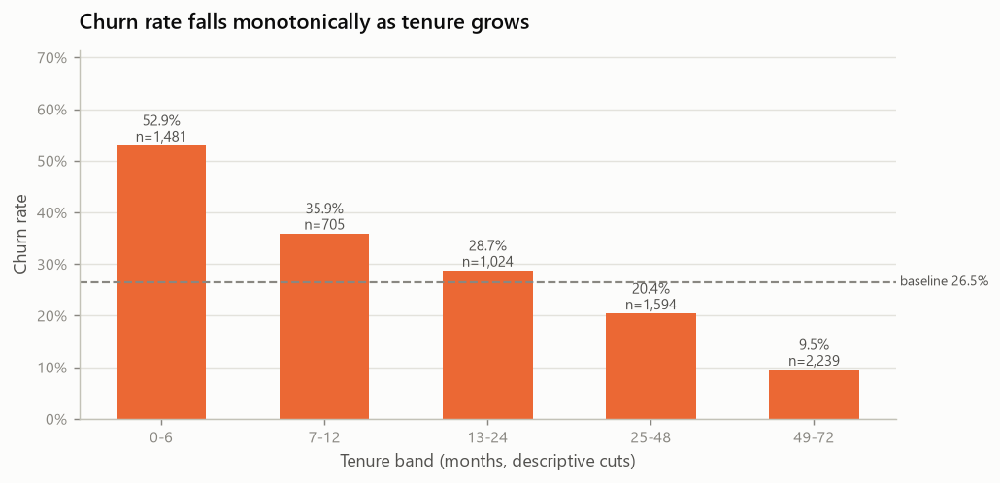

*Churn rate by descriptive tenure band*

**OBSERVATION.** Churn rate declines monotonically across the bands, from
52.9% in the first six
months to 9.5% after four
years. The effect size is the largest of any single numeric variable here.

**HYPOTHESIS.** Two mechanisms could produce this shape and the data cannot
separate them: customers may become progressively less likely to leave as the
relationship matures, or the early months may simply filter out a segment that
was never going to stay. Survivorship alone would produce the same curve.

## 5. Contracts

| Contract | Customers | Churn rate |
| --- | --- | --- |
| `Month-to-month` | 3,875 | 42.71% |
| `One year` | 1,473 | 11.27% |
| `Two year` | 1,695 | 2.83% |

Median tenure per contract: Month-to-month 12 months, One year 44 months, Two year 64 months.

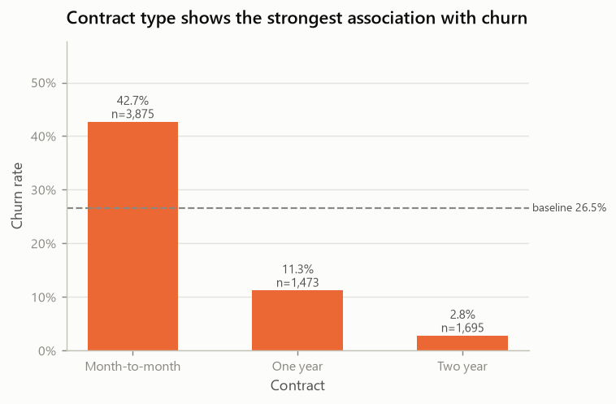

*Churn rate by contract type*

**OBSERVATION.** Month-to-month customers churn at
42.7% against
2.8% on two-year contracts —
the widest gap in the dataset. Month-to-month is
55.0% of the population but 88.6% of all
churners.

Contract types also differ sharply in tenure, so the two variables are entangled.
The interaction below is the check that matters:

| | 0-6 | 7-12 | 13-24 | 25-48 | 49-72 |
| --- | --- | --- | --- | --- | --- |
| **Month-to-month** | 55.2% (n=1,413) | 42.0% (n=581) | 37.7% (n=737) | 32.9% (n=802) | 26.0% (n=342) |
| **One year** | 10.3% (n=39) | 10.6% (n=85) | 8.1% (n=197) | 10.6% (n=518) | 12.9% (n=634) |
| **Two year** | 0.0% (n=29) | 0.0% (n=39) | 0.0% (n=90) | 2.2% (n=274) | 3.3% (n=1,263) |

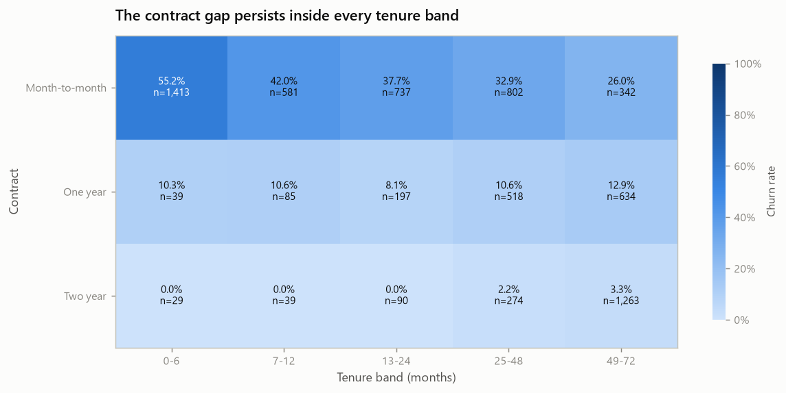

*Churn rate by contract type within each tenure band*

**OBSERVATION.** The gap survives conditioning. Even in the longest band, month-to-month customers churn at 26.0% against 3.3% on two-year contracts. Contract is therefore not merely a proxy for tenure.

**OBSERVATION.** New customers are heavily concentrated in month-to-month: 1,413 of the 1,481 customers in the 0–6 band. The zero-churn cells for two-year contracts in the early bands rest on very small groups (n=29 and n=39) and must not be read as evidence of a zero rate.

**HYPOTHESIS.** Commitment length and churn propensity are plausibly
co-determined: a long contract both restricts leaving and is chosen by customers
who already intend to stay. The dataset cannot distinguish the contractual
barrier from the self-selection.

## 6. Services

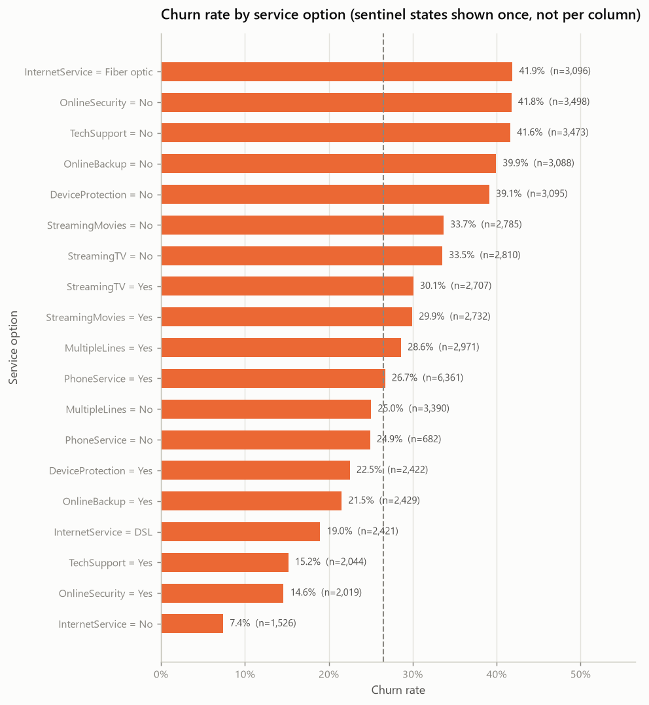

*Churn rate by service option, all services in one view*

Rates for the three services with the strongest association:

| Service option | Customers | Churn rate |
| --- | --- | --- |
| `InternetService = Fiber optic` | 3,096 | 41.89% |
| `OnlineSecurity = No` | 3,498 | 41.77% |
| `TechSupport = No` | 3,473 | 41.64% |
| `InternetService = DSL` | 2,421 | 18.96% |
| `TechSupport = Yes` | 2,044 | 15.17% |
| `OnlineSecurity = Yes` | 2,019 | 14.61% |
| `InternetService = No` | 1,526 | 7.40% |

**OBSERVATION.** `Fiber optic` subscribers churn at
41.9%,
well above `DSL` at
19.0%.

**OBSERVATION.** `No internet service` is a real product state, not missing data:
those 1,526 customers
show the lowest churn rate in the dataset
(7.4%). The
same applies to `No phone service` in `MultipleLines`. Treating either as `NaN`
would destroy information.

**OBSERVATION.** Protective services (`OnlineSecurity`, `OnlineBackup`,
`DeviceProtection`, `TechSupport`) all show markedly lower churn among holders,
while the two streaming services barely move the rate.

**HYPOTHESIS.** Protective services may act as switching friction or may simply
mark more engaged customers; streaming add-ons appear to be neutral entertainment
purchases that carry no retention signal.

## 7. Billing and payments

| Statistic | Retained | Churned |
| --- | --- | --- |
| Median monthly charges | 64.43 | 79.65 |
| Median total charges | 1683.60 | 703.55 |

`MonthlyCharges`: Mann-Whitney U = 6,003,126,
p = 3.31e-54, rank-biserial = 0.242.
`TotalCharges`: U = 3,360,665, p = 2e-84,
rank-biserial = -0.303.

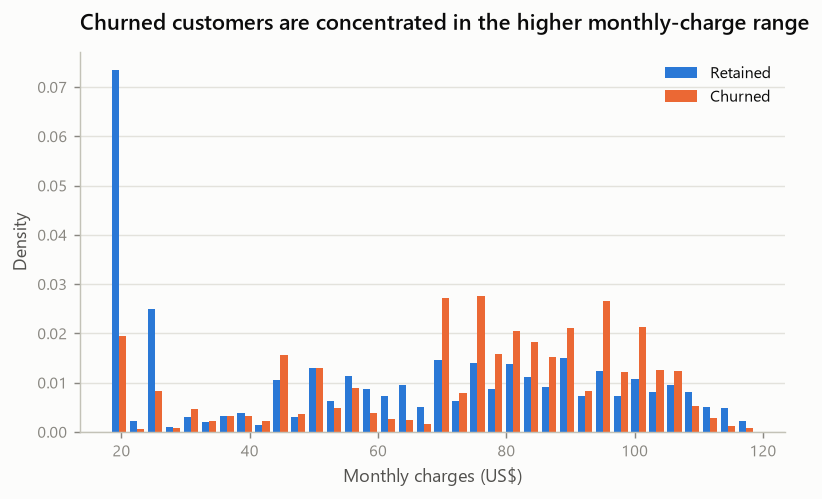

*Monthly charges distribution by churn status*

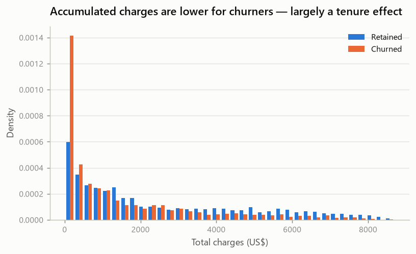

*Total charges distribution by churn status*

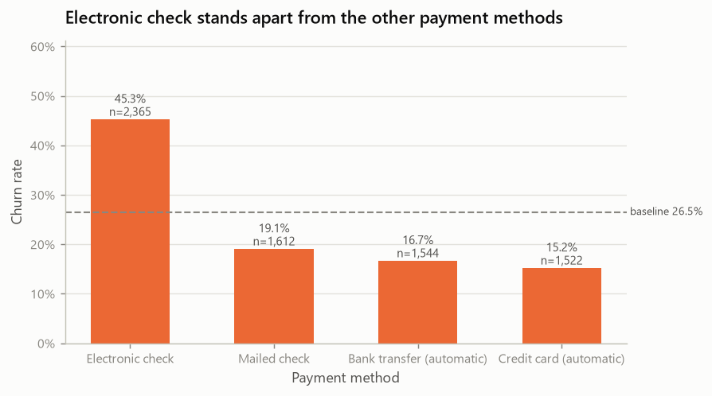

*Churn rate by payment method*

| | Month-to-month | One year | Two year |
| --- | --- | --- | --- |
| **Bank transfer (automatic)** | 34.1% (n=589) | 9.7% (n=391) | 3.4% (n=564) |
| **Credit card (automatic)** | 32.8% (n=543) | 10.3% (n=398) | 2.2% (n=581) |
| **Electronic check** | 53.7% (n=1,850) | 18.4% (n=347) | 7.7% (n=168) |
| **Mailed check** | 31.6% (n=893) | 6.8% (n=337) | 0.8% (n=382) |

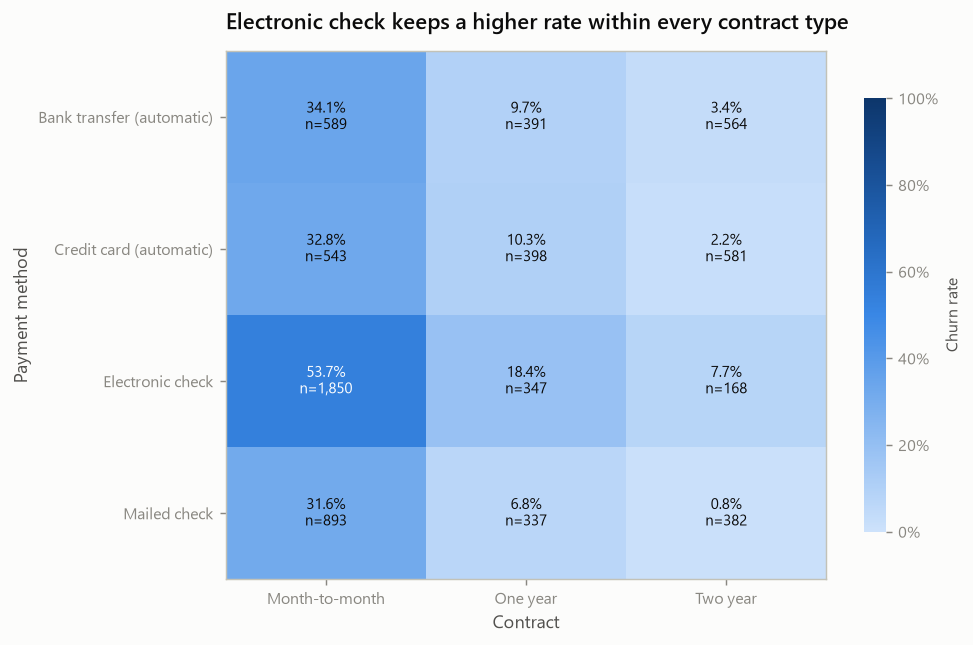

*Churn rate by payment method within contract type*

**OBSERVATION.** Churners pay more per month (median
79.65 against
64.43) but have accumulated less
(median 703.55 against
1683.60). The two point in opposite
directions because `TotalCharges` is dominated by tenure.

**OBSERVATION.** `Electronic check` churns at
45.3%
against 15.2%
for automatic credit card, and it accounts for 57.3% of all
churners. The gap persists inside every contract type, so it is not only a
by-product of electronic-check users being month-to-month.

**OBSERVATION — the marginal association reverses under conditioning.** Split by
internet tier, the median monthly charge of churners is **not** above that of
those who stay: DSL retained 59.75; DSL churned 49.25; Fiber optic retained 94.80; Fiber optic churned 87.55; No retained 20.15; No churned 20.00. The direction of the
`MonthlyCharges`–churn association at population level is therefore not preserved
inside the tiers.

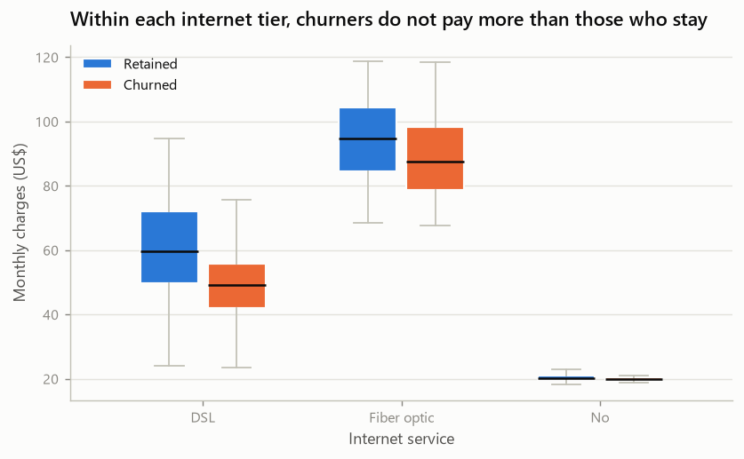

*Monthly charges by internet tier and churn status*

**What follows from that, and what does not.** The data do **not** support a
simple reading in which a higher `MonthlyCharges` on its own accounts for higher
churn: the marginal association changes once the service tier is held fixed.
Confounding by service type is a plausible explanation — churners are
over-represented in the expensive fiber tier (69.4% of
churners) — but this analysis cannot establish that it *is* the explanation, only
that the marginal comparison is not interpretable on its own.

**HYPOTHESIS.** Price sensitivity remains possible and is not ruled out here.
Separating it from tier composition would require controlling for the other
determinants of tier choice, or a design capable of supporting causal claims —
neither of which this observational snapshot provides. Manual payment methods and
the fiber tier may also proxy for a lower-commitment customer profile; that too is
an untested reading.

## 8. Customer profile

| Attribute | Customers | Churn rate |
| --- | --- | --- |
| `SeniorCitizen = 1` | 1,142 | 41.68% |
| `Partner = No` | 3,641 | 32.96% |
| `Dependents = No` | 4,933 | 31.28% |
| `gender = Female` | 3,488 | 26.92% |
| `gender = Male` | 3,555 | 26.16% |
| `SeniorCitizen = 0` | 5,901 | 23.61% |
| `Partner = Yes` | 3,402 | 19.66% |
| `Dependents = Yes` | 2,110 | 15.45% |

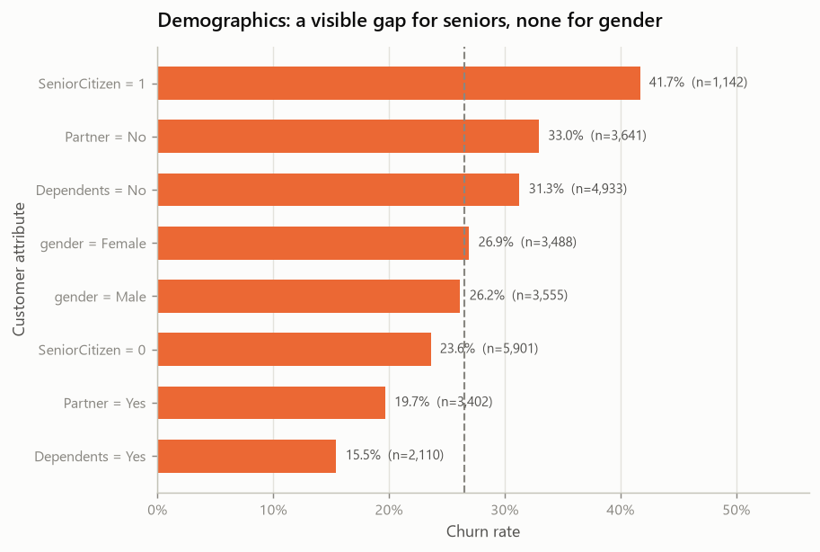

*Churn rate across demographic attributes*

**OBSERVATION.** `gender` shows essentially no association: Cramér's V =
0.009,
p = 0.47. This is a
result, not a gap in the analysis.

**OBSERVATION.** Senior citizens churn at
41.7% against
23.6%, but they
are only 16.2% of the
population. Customers without a partner or without dependents also churn more,
with weak effect sizes (0.150
and 0.164).

## 9. Interaction analysis

Only interactions with a stated prior were examined; no combinatorial search was
run.

1. **Contract × tenure × churn** (section 5) — the contract gap survives inside
   every tenure band.
2. **InternetService × MonthlyCharges × churn** (section 7) — the marginal charge
   gap does not survive conditioning on the tier, so the marginal association is
   not interpretable on its own.
3. **TechSupport × InternetService × churn**:

| | No | No internet service | Yes |
| --- | --- | --- | --- |
| **DSL** | 27.8% (n=1,243) | — | 9.7% (n=1,178) |
| **Fiber optic** | 49.4% (n=2,230) | — | 22.6% (n=866) |
| **No** | — | 7.4% (n=1,526) | — |

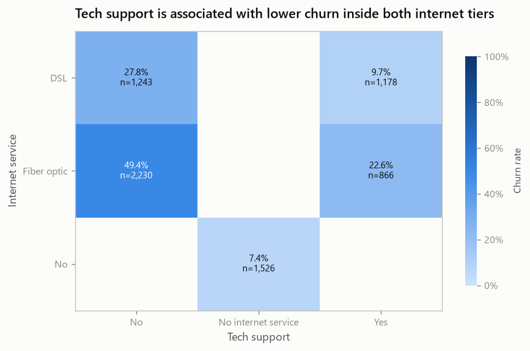

*Churn rate by tech support within each internet tier*

   **OBSERVATION.** Among fiber customers, churn is
   49.4% without tech support against 22.6% with
   it; for DSL, 27.8% against 9.7%. The association
   holds inside both tiers, so it is not just a fiber effect.

4. **PaymentMethod × Contract × churn** (section 7) — electronic check remains
   the highest-rate method within each contract type.

## 10. TotalCharges investigation

| Property | Value |
| --- | --- |
| Blank (whitespace-only) records | 11 |
| Of which `tenure == 0` | 11 |
| Total records with `tenure == 0` | 11 |
| Churn among the blank records | No: 11 |
| Contracts among the blank records | Two year: 10, One year: 1 |
| Monthly charges of the blank records | 19.70 – 80.85 |

**OBSERVATION.** The 11 blank records are exactly the
11 customers with `tenure == 0` — the sets coincide. All of them
are still active (`Churn = No`), and all hold
non-zero monthly charges.

**OBSERVATION.** The blanks are not spread across contract types: 10 on Two year, 1 on One year.

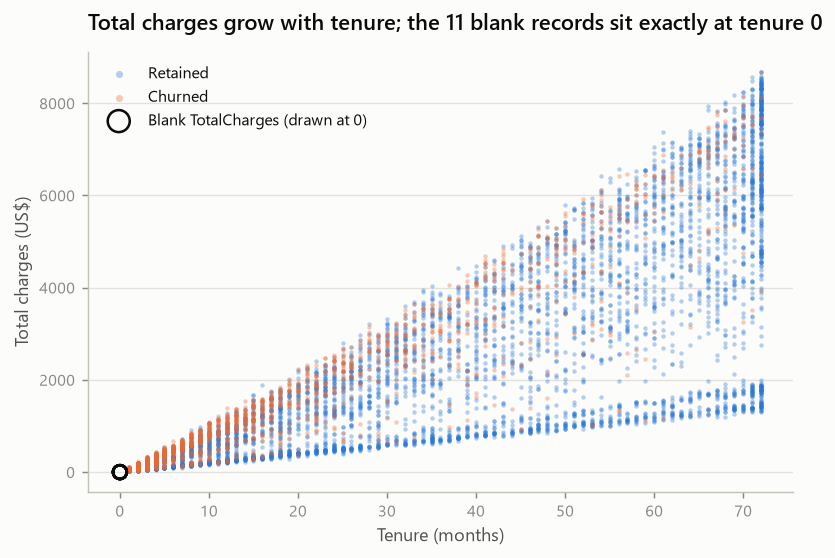

*Total charges against tenure, with the blank records marked*

Relationship between the three charge-related quantities, over the
7,032 records with tenure above zero:

| Measure | Value |
| --- | --- |
| Spearman `TotalCharges` ~ `tenure` | 0.8892 |
| Spearman `TotalCharges` ~ `tenure × MonthlyCharges` | 0.9996 |
| Ratio `TotalCharges / (tenure × MonthlyCharges)` — median | 1.0000 |
| Ratio — Q1 / Q3 | 0.9795 / 1.0196 |
| Ratio — min / max | 0.6894 / 1.5735 |

**OBSERVATION.** `TotalCharges` tracks `tenure × MonthlyCharges` very closely
(Spearman 0.9996) but is **not** equal to it: the ratio spans
0.69 to 1.57. That is what an
accumulated history looks like when the monthly price changed over the
relationship — `MonthlyCharges` is the current price, not the historical average.

**HYPOTHESIS.** A blank `TotalCharges` marks a customer who has been billed zero
times yet, rather than a recording error. The perfect overlap with `tenure == 0`
and the presence of a positive monthly charge both fit that reading.

**CANDIDATE treatments to evaluate in Phase 4** — none is chosen here:

| Option | Rationale | Risk |
| --- | --- | --- |
| Set to `0` | Consistent with "never billed"; keeps all 7,043 rows | Asserts a semantic that the data does not state |
| Drop the 11 rows | Simplest, removes 0.16% of the data | Removes the entire `tenure == 0` segment, which a production model will meet |
| Median/statistical imputation | Standard pipeline treatment | Nonsensical here: implies billing history where there is none |
| Drop the column | `TotalCharges` is nearly redundant with `tenure × MonthlyCharges` | Loses whatever genuine price history it carries |

Whatever is chosen must be fitted inside the pipeline, after the split.

## 11. Statistical evidence

Chi-square tests association; Cramér's V measures how strong it is. With
7,043 observations, p-values are almost all extreme, so **the ranking below
is by effect size**:

| Feature | Categories | Cramér's V | Effect | p-value |
| --- | --- | --- | --- | --- |
| `Contract` | 3 | 0.410 | strong | 5.86e-258 |
| `OnlineSecurity` | 3 | 0.347 | moderate | 2.66e-185 |
| `TechSupport` | 3 | 0.343 | moderate | 1.44e-180 |
| `InternetService` | 3 | 0.322 | moderate | 9.57e-160 |
| `PaymentMethod` | 4 | 0.303 | moderate | 3.68e-140 |
| `OnlineBackup` | 3 | 0.292 | moderate | 2.08e-131 |
| `DeviceProtection` | 3 | 0.282 | moderate | 5.51e-122 |
| `StreamingMovies` | 3 | 0.231 | moderate | 2.67e-82 |
| `StreamingTV` | 3 | 0.231 | moderate | 5.53e-82 |
| `PaperlessBilling` | 2 | 0.192 | weak | 2.61e-58 |
| `Dependents` | 2 | 0.164 | weak | 3.28e-43 |
| `SeniorCitizen` | 2 | 0.151 | weak | 9.48e-37 |
| `Partner` | 2 | 0.150 | weak | 1.52e-36 |
| `MultipleLines` | 3 | 0.040 | negligible | 0.00346 |
| `PhoneService` | 2 | 0.012 | negligible | 0.316 |
| `gender` | 2 | 0.009 | negligible | 0.47 |

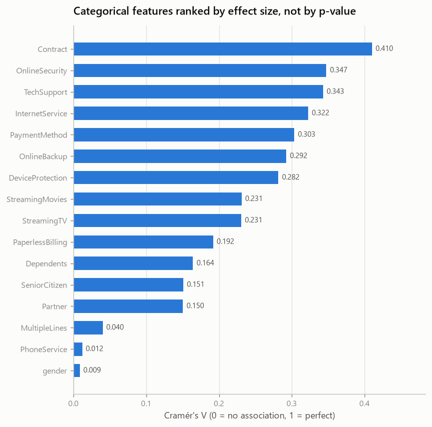

*Categorical features ranked by Cramér's V*

**OBSERVATION — significance is not magnitude.** `MultipleLines` reaches
p = 0.00346,
which is "statistically significant" at any conventional level, yet its effect
size is 0.040
— negligible. Ranking features by p-value would have promoted it above nothing
useful. This is the concrete reason p-values are not used as a feature ranking
here.

For the numeric variables, Mann-Whitney was used (no normality assumption; both
charge distributions are visibly skewed and bimodal):

| Variable | Median churned | Median retained | Rank-biserial | p-value |
| --- | --- | --- | --- | --- |
| `tenure` | 10.0 | 38.0 | -0.480 | 2.42e-208 |
| `MonthlyCharges` | 79.65 | 64.43 | 0.242 | 3.31e-54 |
| `TotalCharges` | 703.55 | 1683.60 | -0.303 | 2e-84 |

**Multiple testing.** 16 categorical associations and 3
numeric comparisons were tested against the same target on the same sample. **No
formal multiple-testing correction (Bonferroni, Holm, Benjamini-Hochberg or
otherwise) was applied.** The p-values here are therefore **exploratory**: they
flag where a difference is unlikely to be sampling noise, nothing more. They are
not used in isolation to rank or select features — effect size and practical
relevance take precedence, which is exactly what the `MultipleLines` case above
illustrates. Any inferential claim that needs calibrated error rates would have to
be re-tested with an explicit correction, on data not used to generate the
hypothesis.

## 12. Observations

- Base churn rate 26.54%; class ratio 2.77:1.
- Strongest associations, by effect size: `Contract` (0.410), `OnlineSecurity` (0.347), `TechSupport` (0.343), `InternetService` (0.322), `PaymentMethod` (0.303).
- Weakest: `MultipleLines` (0.040), `PhoneService` (0.012), `gender` (0.009).
- Churn rate falls monotonically with tenure across all five descriptive bands.
- The contract gap and the payment-method gap both survive conditioning.
- Within internet tiers, churners do not pay more per month than those who stay.
- `No internet service` and `No phone service` are informative product states.
- The 11 unreadable `TotalCharges` cells coincide exactly with
  `tenure == 0`.
- Raw service *count* is not monotonically related to churn (section 13), while
  the count of *protective* services is.

## 13. Hypotheses

Each needs validation beyond this phase; none is established here.

1. **Commitment.** Contract length reflects both a contractual barrier and
   self-selection by customers who already intended to stay.
2. **Early-life risk.** The first months carry the highest risk, whether because
   risk genuinely decays or because the early period filters out a transient
   segment.
3. **Friction and engagement.** Protective services and automatic payment may act
   as switching friction, or may simply mark more embedded customers.
4. **Fiber experience.** The elevated fiber rate may reflect price, service
   quality, or the profile of who buys fiber. This sample cannot separate them.
5. **Charges are confounded with tier.** The population-level charge gap does not
   survive conditioning on `InternetService`. Confounding by service type is a
   plausible reading; price sensitivity is neither demonstrated nor excluded, and
   separating the two would need a design this snapshot cannot provide.

## 14. Candidate features / deferred decisions

Conceptual only — nothing is implemented in this phase.

| Candidate | Hypothesis | Possible benefit | Redundancy risk | Leakage risk | Decision |
| --- | --- | --- | --- | --- | --- |
| Count of protective services | Friction accumulates with protection | Churn falls from 56.7% at 0 to 5.3% at 4 among internet subscribers, monotonically | High with the four source columns | None — all known at signup | **Investigate** |
| Total count of services | "More services means stickier" | None visible: the rate is non-monotonic (1:11%, 2:31%, 3:45%, 4:36%, 5:31%, 6:26%, 7:22%, 8:12%, 9:5%) | High | None | **Discard as a plain count**; composition matters, not volume |
| Streaming bundle indicator | Entertainment add-ons signal engagement | Weak: both streaming services sit near the baseline | High | None | Low priority |
| Tenure × contract combination | Commitment interacts with relationship age | Captures the interaction in section 5 explicitly | Moderate with both parents | None | **Investigate** |
| Charge intensity (`MonthlyCharges` relative to tier median) | Isolates paying above one's own tier from paying more in absolute terms | Directly tests the price hypothesis that the raw variable confounds | Moderate | None | **Investigate** |
| `TotalCharges / tenure` (average historical bill) | Separates historical price from current price | May carry the price drift the ratio analysis exposed | High with both parents | Undefined at `tenure == 0` — must be handled inside the pipeline | Investigate with care |
| Automatic vs manual payment flag | Automatic payment is friction against leaving | Collapses four categories into the distinction that carries the signal | High with `PaymentMethod` | None | Investigate |

Deferred decisions, all belonging to later phases:

- treatment of blank `TotalCharges` (Phase 4);
- encoding of the three-level service columns, and whether `No internet service`
  collapses into `No` (Phase 4);
- scaling of the numeric variables (Phase 4);
- class-imbalance handling (Phase 7);
- decision threshold and its cost framing (Phase 9).

## 15. EDA limitations

- **Observational data.** Every relationship here is association. No intervention,
  no time ordering, no counterfactual.
- **Survivorship.** Long-tenure customers are, by construction, those who did not
  leave. Rates conditioned on high tenure are not "risk after four years".
- **`MonthlyCharges` is the current price**, so all price analysis compares a
  present-day value against an accumulated past.
- **No cost information.** No retention cost, customer value or campaign capacity
  exists in this dataset, so no threshold or business-impact claim can be made.
- **Small cells.** Some interaction cells rest on a few dozen customers; group
  sizes are printed next to every rate for that reason.

### No temporal dimension — and what that costs the protocol

The file carries no observation timestamp, no churn date and no explicit
prediction window. `tenure` is a duration recorded at snapshot time, not a
history. Consequences that must stay documented in the academic and portfolio
deliverables:

- **Prospective temporal validation is not implementable.** There is no time
  ordering to split on, so no train-past / test-future protocol is available.
- **The task is a snapshot classification approximation of churn**, not
  forecasting of future churn over a defined horizon.
- **No claim may be made that this protocol reproduces a real churn-prediction
  system**, which would predict churn within a stated window from features
  observed before that window.
- No horizon is invented to compensate: the dataset does not contain one.

### Analyst exposure to the full sample

This EDA ran on all 7,043 rows, the future holdout included. Stated
precisely:

- **No fitting, preprocessing, model selection or tuning was performed** on any
  part of the data. Nothing was learned from the file in a form a model could
  inherit.
- **However, the hypotheses and candidate features in sections 13 and 14 were
  informed by the complete dataset**, holdout rows included. The analyst has seen
  those rows; the modeling choices that follow are not independent of them.
- From Phase 4 onward the test set is protected against *fitting and tuning* —
  every transformation is fitted on training folds only, and **holdout metrics are
  not consulted until the final evaluation in Phase 9**.
- It should not, therefore, be described as **completely unseen** in the
  analyst-exposure sense. Protected from fitting: yes. Never looked at: no.
- This is a **limitation of the protocol adopted**, not an oversight. Avoiding it
  would have required splitting before any exploration and confining the EDA to
  the training partition — a defensible alternative that was not chosen here.
- Practical consequence: because the complete dataset informed the exploratory
  hypotheses and candidate features, the future holdout estimate **may be subject
  to optimistic bias from analyst exposure**. Whether such bias actually
  materialises, and how large it would be, **cannot be quantified in this
  experiment** — there is no independent sample against which to measure it. It is
  recorded here as a methodological limitation, not as a correction factor.
- Regardless of that, candidate features must earn their place through
  cross-validation on the training set, not through the numbers in this report.

### Multiple testing

16 categorical associations and 3 numeric comparisons
were tested against the same target on the same sample, with **no formal
multiple-testing correction applied**. The p-values are exploratory evidence, not
calibrated inferential statements; they are never used on their own to rank or
select features. See section 11 for the `MultipleLines` case, where a
"significant" p-value accompanies a negligible effect size.

## 16. Recommended questions for preprocessing and modeling

1. Which `TotalCharges` treatment survives comparison, and does the choice change
   model behaviour at all?
2. Should the three-level service columns keep `No internet service` as its own
   level, or collapse it into `No` with the internet status carried separately?
3. Does an explicit tenure × contract interaction add anything over the two raw
   variables in a linear model?
4. Does charge intensity relative to the tier median outperform raw
   `MonthlyCharges`?
5. Is `TotalCharges` worth keeping at all, given how closely it tracks
   `tenure × MonthlyCharges`?
6. Under stratified cross-validation, which metric separates candidate models
   most reliably given a 26.5% positive rate?
7. What recall is operationally reachable, and at what precision cost, once a
   threshold discussion becomes possible?
