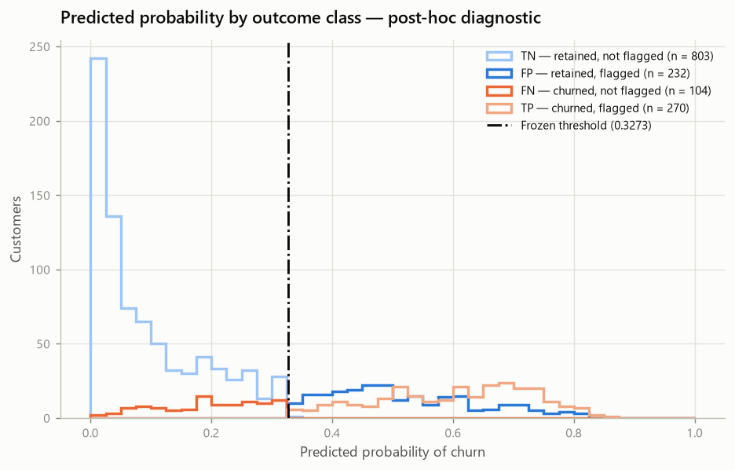
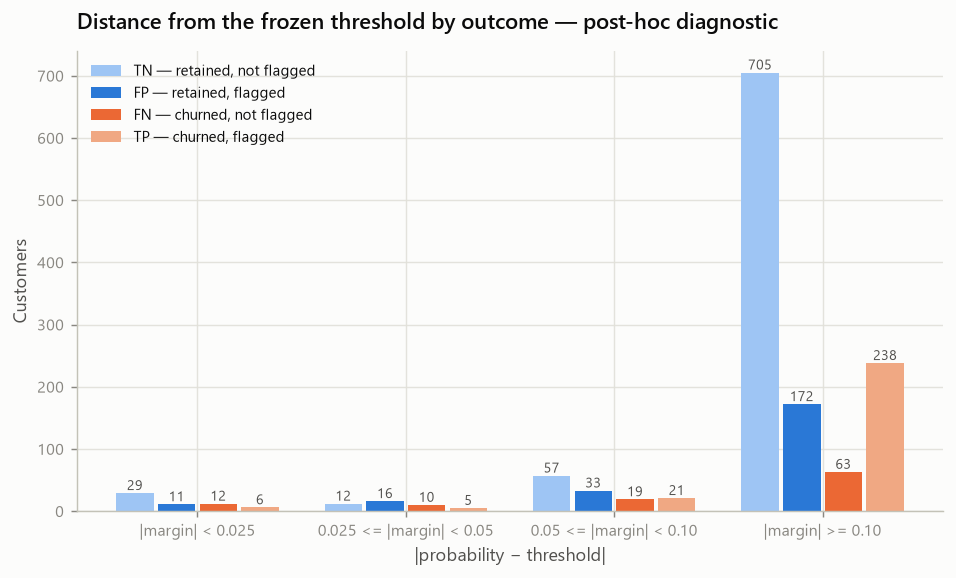
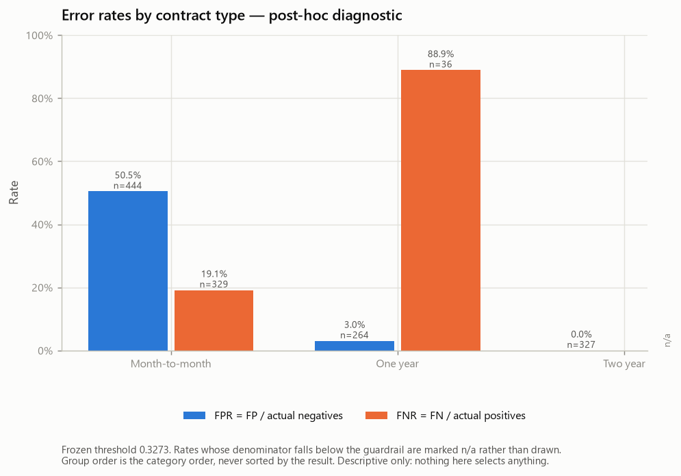
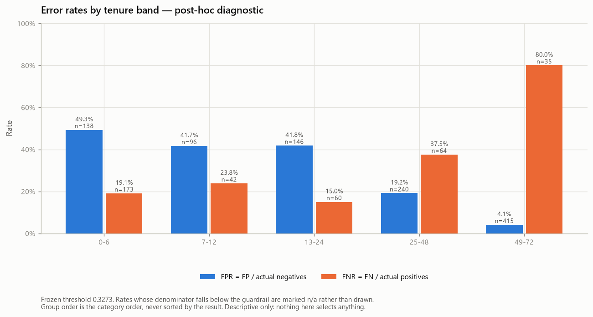
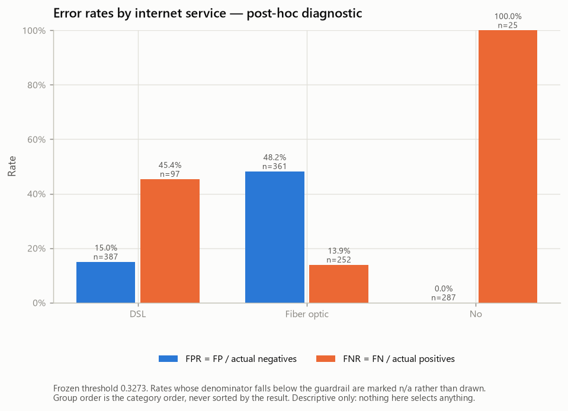
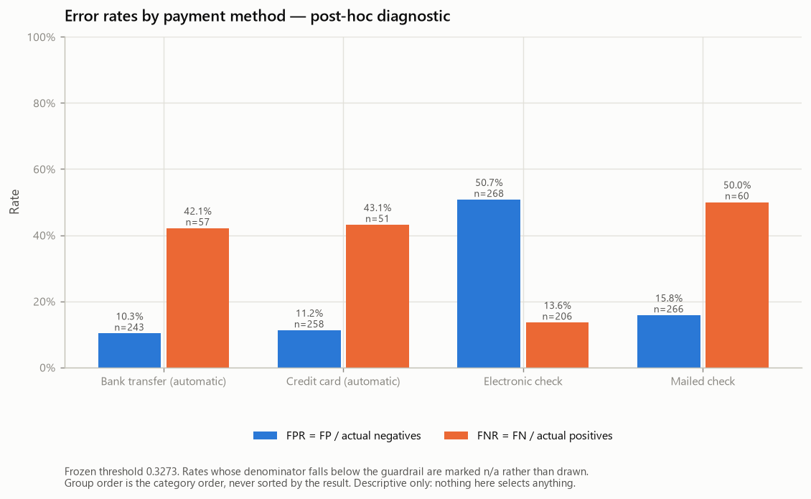
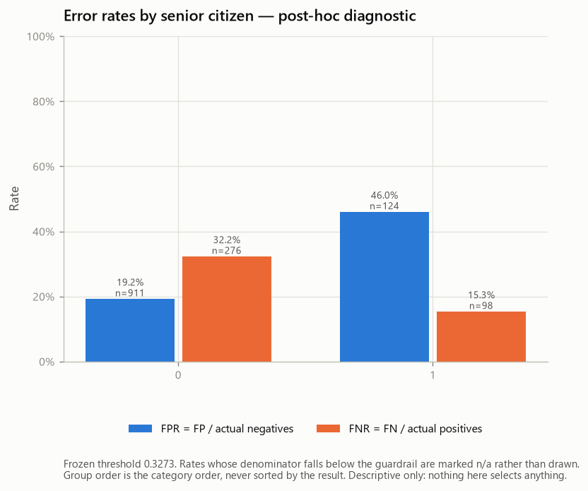

# Post-hoc Error Analysis — Telco Customer Churn (Phase 9E)

- Generated by: `scripts/run_error_analysis.py`
- Machine-readable record: `reports/experiments/error_analysis_results.json`
- Describes the evaluation committed in: `8c8e266` — feat: evaluate frozen churn model on final holdout
- Model frozen in: `9d1db49`

> **This report carries no generation date.** It is a pure function of its
> inputs, so re-running the generator on an unchanged repository reproduces it
> byte for byte and any diff is a real change. Git records when it was produced.

---

## 1. Scope and methodological status

This analysis ran **after** the final evaluation was produced and committed. It
describes where the errors that estimate already counted actually fell.

| Property | Value |
| --- | --- |
| `analysis_type` | **POST_HOC_ERROR_ANALYSIS** |
| `post_hoc` | **True** |
| `descriptive_only` | **True** |
| `holdout_already_consumed` | **True** |
| `selection_allowed` | **False** |
| `model_change_allowed` | **False** |
| `selection_after_analysis` | **False** |

**Why looking is permitted, and acting is not.** The evaluation sample has been
consumed: it has already served as the **designated final held-out evaluation
under the frozen protocol**, so it can no longer provide a fresh independent
estimate for any decision made after it was examined. That is exactly what makes
a descriptive account of its errors harmless — and what makes acting on that
account destructive. Any change to the model, the preprocessing, the features,
the calibration policy or the threshold justified by something in this report
would leave the Phase 9D figures describing a system that no longer exists, with
no held-out sample left to measure the replacement on.

**What the Phase 9D result is, stated precisely.** It is the final evaluation
estimate produced *after* the model and the decision policy were frozen and
committed, on rows that took no part in any fit, fold, feature decision,
calibration gate or threshold search. It is **not** described here as an unbiased
estimate, and the reason is a limitation this project has carried since Phase 3:
the exploratory analysis ran on all 7,043 rows, including the ones that later
became the evaluation sample. The holdout was protected against fitting, tuning
and selection from Phase 4 onwards, but that earlier **analyst exposure** came
first, and it can carry an optimistic bias that this project cannot quantify.
The protection is real and the limitation is real; both are stated rather than
one being allowed to imply the absence of the other.

The question here is therefore **not** "how do we improve the model". It is:
*under what conditions, and in what manner, does this frozen system get it
wrong.*

### What this phase deliberately did not do

| Not done | Count |
| --- | --- |
| Fits | 0 |
| Alternative models evaluated | 0 |
| Alternative thresholds scored | 0 |
| Calibrations | 0 |
| Hyperparameter searches | 0 |
| Feature selections | 0 |
| Significance tests | 0 |
| Features swept for interesting slices | 0 |
| Explainability computed | False |
| Financial quantities assumed | False |
| Causal claims | False |
| Identifiers persisted | False |

Explainability is **Phase 10's** subject: this phase asks *where* the decisions
were wrong, not *how* the features drove them. The two are kept apart on purpose.

## 2. Frozen result being diagnosed

| Property | Value |
| --- | --- |
| Estimator | `LogisticRegression` |
| Calibration policy | **NONE** |
| Threshold policy | **F1_MAXIMIZATION** |
| `final_threshold` | **0.3272694566222328** |
| Comparison | `>=` |
| Positive class | label `1`, column `1` |
| Reopened here | False |
| Alternative thresholds scored | 0 |
| Model fingerprint verified after load | **True** |
| Pipeline unchanged by this analysis | **True** |
| Refitted here | False |

### Integrity gate: the same classification

The outcomes below were rederived from the frozen pipeline, the frozen threshold
and the evaluation sample, then checked against the Phase 9D record. They agree
exactly, which is what makes this a description of *that* result rather than of a
different one:

| Cell | Rederived | Recorded in Phase 9D |
| --- | --- | --- |
| TN | 803 | 803 |
| FP | 232 | 232 |
| FN | 104 | 104 |
| TP | 270 | 270 |
| **Total** | **1,409** | **1,409** |

Reproduced: **True**. The run aborts on any disagreement.

| Artefact | SHA-256 |
| --- | --- |
| `reports/split_manifest.json` | `834eb1313536c49e…` |
| `reports/decision_policy.json` | `bd7aa800ae36ac04…` |
| `reports/model_freeze_report.md` | `01a00472a3366327…` |
| `reports/holdout_evaluation_report.md` | `fdab7ad2005b1aff…` |
| `reports/experiments/baseline_results.json` | `2bd6eb992a4ed235…` |
| `reports/experiments/feature_engineering_results.json` | `bd8a3f03df405f7b…` |
| `reports/experiments/model_comparison_results.json` | `648aca646146e6bc…` |
| `reports/experiments/hgb_representation_results.json` | `794bd1bde4a78240…` |
| `reports/experiments/tuning_results.json` | `d9d245e22fc89320…` |
| `reports/experiments/calibration_results.json` | `0119ca11c5c47190…` |
| `reports/experiments/threshold_results.json` | `6e58772b7fc954f1…` |
| `reports/experiments/holdout_results.json` | `de174fe94dd49206…` |

## 3. Error taxonomy

1,409 customers, 374 of whom churned
(prevalence 0.2654). Every row falls in exactly one class:

| Outcome | Count | Meaning |
| --- | --- | --- |
| **TN** | 803 | retained and not flagged |
| **FP** | 232 | retained but flagged — a contact spent on someone who stayed |
| **FN** | 104 | churned and **not** flagged — a churner the system missed |
| **TP** | 270 | churned and flagged |

The two error classes are the subject of the next two sections:
**232 false positives** and **104 false negatives**.

### Probability distribution by outcome

| Outcome | n | Mean | Median | Q1 | Q3 | Min | Max |
| --- | --- | --- | --- | --- | --- | --- | --- |
| **TN** | 803 | 0.0929 | 0.0584 | 0.0175 | 0.1529 | 0.0017 | 0.3264 |
| **FP** | 232 | 0.5175 | 0.4908 | 0.4215 | 0.6026 | 0.3275 | 0.8179 |
| **FN** | 104 | 0.1928 | 0.1965 | 0.1223 | 0.2624 | 0.0054 | 0.3248 |
| **TP** | 270 | 0.6024 | 0.6177 | 0.5086 | 0.7006 | 0.3290 | 0.8550 |



*Predicted probability by outcome class*

## 4. False-positive profile

Customers whose true label is *retained* and whose score reached the threshold.

**Composition, with the denominator that makes it readable.** The left pair of
columns says how the false positives are made up; the right pair says how the
population that *could* have produced them — the 1,035 actual
non-churners — is made up. A category is over-represented among the errors only
relative to the second pair. Reading the first pair alone is the standard
mistake: the largest category usually supplies the most errors by being largest.

| Group | FP count | Share of FP | actual non-churners | Share of actual non-churners |
| --- | --- | --- | --- | --- |
| Month-to-month | 224 | 96.6% | 444 | 42.9% |
| One year | 8 | 3.4% | 264 | 25.5% |
| Two year | 0 | 0.0% | 327 | 31.6% |

| Group | FP count | Share of FP | actual non-churners | Share of actual non-churners |
| --- | --- | --- | --- | --- |
| 0-6 | 68 | 29.3% | 138 | 13.3% |
| 7-12 | 40 | 17.2% | 96 | 9.3% |
| 13-24 | 61 | 26.3% | 146 | 14.1% |
| 25-48 | 46 | 19.8% | 240 | 23.2% |
| 49-72 | 17 | 7.3% | 415 | 40.1% |

| Group | FP count | Share of FP | actual non-churners | Share of actual non-churners |
| --- | --- | --- | --- | --- |
| DSL | 58 | 25.0% | 387 | 37.4% |
| Fiber optic | 174 | 75.0% | 361 | 34.9% |
| No | 0 | 0.0% | 287 | 27.7% |

| Group | FP count | Share of FP | actual non-churners | Share of actual non-churners |
| --- | --- | --- | --- | --- |
| Bank transfer (automatic) | 25 | 10.8% | 243 | 23.5% |
| Credit card (automatic) | 29 | 12.5% | 258 | 24.9% |
| Electronic check | 136 | 58.6% | 268 | 25.9% |
| Mailed check | 42 | 18.1% | 266 | 25.7% |

The conditional rate that answers "which categories err most among their own
non-churners" is the **FPR** column in sections 8 to 12, not any share above.

## 5. False-negative profile

Customers who churned and whose score did not reach the threshold. There are
104 of them out of 374 churners.

False negatives are **operationally important** in a retention setting because
they are churners the system did not flag: no retention action can reach a
customer the model never surfaced. Their **relative** importance against false
positives cannot be established from this dataset, because no business-cost ratio
is available — there is no cost of losing a customer, no cost of a retention
action, no customer value and no operational capacity anywhere in it. This
project never established that a false negative costs more than a false positive,
and nothing in this section asserts it.

| Group | FN count | Share of FN | actual churners | Share of actual churners |
| --- | --- | --- | --- | --- |
| Month-to-month | 63 | 60.6% | 329 | 88.0% |
| One year | 32 | 30.8% | 36 | 9.6% |
| Two year | 9 | 8.7% | 9 | 2.4% |

| Group | FN count | Share of FN | actual churners | Share of actual churners |
| --- | --- | --- | --- | --- |
| 0-6 | 33 | 31.7% | 173 | 46.3% |
| 7-12 | 10 | 9.6% | 42 | 11.2% |
| 13-24 | 9 | 8.7% | 60 | 16.0% |
| 25-48 | 24 | 23.1% | 64 | 17.1% |
| 49-72 | 28 | 26.9% | 35 | 9.4% |

| Group | FN count | Share of FN | actual churners | Share of actual churners |
| --- | --- | --- | --- | --- |
| DSL | 44 | 42.3% | 97 | 25.9% |
| Fiber optic | 35 | 33.7% | 252 | 67.4% |
| No | 25 | 24.0% | 25 | 6.7% |

| Group | FN count | Share of FN | actual churners | Share of actual churners |
| --- | --- | --- | --- | --- |
| Bank transfer (automatic) | 24 | 23.1% | 57 | 15.2% |
| Credit card (automatic) | 22 | 21.2% | 51 | 13.6% |
| Electronic check | 28 | 26.9% | 206 | 55.1% |
| Mailed check | 30 | 28.8% | 60 | 16.0% |

The conditional rate here is the **FNR** column in sections 8 to 12.

## 6. Distance from the frozen threshold

```text
margin          = probability − 0.3272694566222328
absolute margin = |margin|
```

`margin > 0` is the flagged side, `margin < 0` the unflagged side. The bands were
**fixed before the errors were placed in them**
(`bands_fixed_before_analysis: True`),
and the threshold is the frozen one — it is not re-derived here
(`threshold_re_derived: False`).

| Distance from the threshold | TN | FP | FN | TP | Total |
| --- | --- | --- | --- | --- | --- |
| `|margin| < 0.025` | 29 | 11 | 12 | 6 | 58 |
| `0.025 <= |margin| < 0.05` | 12 | 16 | 10 | 5 | 43 |
| `0.05 <= |margin| < 0.10` | 57 | 33 | 19 | 21 | 130 |
| `|margin| >= 0.10` | 705 | 172 | 63 | 238 | 1,178 |



*Distance from the frozen threshold by outcome*

### Absolute margin within each outcome class

| Outcome | n | Mean | Median | Q1 | Q3 | Max |
| --- | --- | --- | --- | --- | --- | --- |
| **TN** | 803 | 0.2344 | 0.2689 | 0.1743 | 0.3098 | 0.3256 |
| **FP** | 232 | 0.1902 | 0.1636 | 0.0943 | 0.2753 | 0.4907 |
| **FN** | 104 | 0.1344 | 0.1308 | 0.0649 | 0.2049 | 0.3219 |
| **TP** | 270 | 0.2751 | 0.2904 | 0.1813 | 0.3734 | 0.5278 |

### Marginal errors

An error is called **marginal** when its score lies within 0.05 of the frozen
decision boundary. That means the binary decision is **boundary-proximate under
the frozen operating point**. It does **not** mean the estimated churn
probability is close to 50%: the boundary sits at 0.3272694566222328, so a
boundary-proximate score is near *that* value, not near a coin flip.

| Error class | Marginal | Total | Share |
| --- | --- | --- | --- |
| False positives | 27 | 232 | 11.6% |
| False negatives | 22 | 104 | 21.2% |

Both classes remain errors of the frozen decision — a false negative is a missed
churner whether its score sat close to the boundary or far from it. The margin
analysis does not divide the errors into real and incidental ones; it distinguishes
only **boundary-proximate errors** from **errors whose score lies farther from the
frozen boundary**.

Boundary proximity is **descriptive only**. Moving the threshold would change the
precision/recall trade-off, but evaluating such alternatives on this already
consumed sample would reopen decision selection and is therefore outside the
scope of this analysis. No alternative threshold was scored
(`alternative_thresholds_scored: 0`), and
no quantitative statement about the effect of moving the boundary appears
anywhere in this report.

## 7. Extreme-score errors

> **Terminology.** The record calls these *high-confidence* errors and the field
> names keep that wording for compatibility. **"High confidence" is descriptive
> shorthand for an extreme model probability under the frozen score. It is not a
> validated per-case confidence guarantee.** The probabilities are uncalibrated by
> the Phase 9A decision, so an extreme score is an extreme *output* of the model,
> not a demonstrated likelihood for the individual customer. This report says
> **extreme-score errors**.

| Criterion | Value |
| --- | --- |
| False positive with probability ≥ | 0.7 |
| False negative with probability ≤ | 0.1 |
| `diagnostic_only` | **True** |
| `decision_policy_candidate` | **False** |

| Error class | Extreme score | Total | Share |
| --- | --- | --- | --- |
| False positives | 24 | 232 | 10.3% |
| False negatives | 20 | 104 | 19.2% |

These two numbers answer one question — *does the model ever assign an extreme
probability and still get the case wrong?* — and nothing else.
these cut-offs answer whether the model ever assigns an extreme probability and still gets the case wrong. They are not candidate thresholds and must not be used to move the decision boundary or to reopen the calibration policy. The two cut-offs are **not** thresholds: the frozen decision
boundary is 0.3272694566222328 and is unchanged, and nothing here reopens the
`calibration_policy = NONE` decision taken in Phase 9A.

## 8. Guardrails and slice protocol

The slice axes were **fixed before this analysis ran**
(`slice_axes_fixed_before_analysis: True`), and each carries a
justification recorded in Phase 3, before the evaluation sample was opened:
`Contract`, `tenure_band`, `InternetService`, `PaymentMethod`, `SeniorCitizen`. No sweep over the 19 features was
performed (0 swept), and no automatic search
over their combinations was performed.

| Guardrail | Value |
| --- | --- |
| Minimum group size | 30 |
| Minimum actual positives for recall / FNR | 20 |
| Minimum actual negatives for specificity / FPR | 20 |
| Minimum predicted positives for precision | 20 |
| Fixed before interpretation | True |
| Applied uniformly | True |
| Categories merged to clear a threshold | **False** |
| Insufficient rate shown as | null, never zero and never a number |

A rate below its own guardrail is reported as **n/a**, never as zero and never as
a number: recall over a dozen churners is not an estimate of anything, and
printing it would invite a reader to treat it as one.

| Axis | Group | Why a rate was withheld |
| --- | --- | --- |
| `Contract` | One year | predicted_positives=12 < 20 |
| `Contract` | Two year | positives=9 < 20; predicted_positives=0 < 20 |
| `InternetService` | No | predicted_positives=0 < 20 |
| `Contract x tenure_band` | Month-to-month | 49-72 | positives=12 < 20 |
| `Contract x tenure_band` | One year | 0-6 | n=16 < 30; positives=3 < 20; negatives=13 < 20; predicted_positives=2 < 20 |
| `Contract x tenure_band` | One year | 7-12 | n=20 < 30; positives=2 < 20; negatives=18 < 20; predicted_positives=3 < 20 |
| `Contract x tenure_band` | One year | 13-24 | positives=4 < 20; predicted_positives=4 < 20 |
| `Contract x tenure_band` | One year | 25-48 | positives=11 < 20; predicted_positives=1 < 20 |
| `Contract x tenure_band` | One year | 49-72 | positives=16 < 20; predicted_positives=2 < 20 |
| `Contract x tenure_band` | Two year | 0-6 | n=4 < 30; positives=0 < 20; negatives=4 < 20; predicted_positives=0 < 20 |
| `Contract x tenure_band` | Two year | 7-12 | n=9 < 30; positives=0 < 20; negatives=9 < 20; predicted_positives=0 < 20 |
| `Contract x tenure_band` | Two year | 13-24 | n=18 < 30; positives=0 < 20; negatives=18 < 20; predicted_positives=0 < 20 |
| `Contract x tenure_band` | Two year | 25-48 | positives=2 < 20; predicted_positives=0 < 20 |
| `Contract x tenure_band` | Two year | 49-72 | positives=7 < 20; predicted_positives=0 < 20 |

## 9. Error rates by contract

| Group | n | Pos | Neg | Pred+ | TP | FP | FN | TN | Prevalence | Pred+ rate | Precision | Recall | Specificity | FPR | FNR |
| --- | --- | --- | --- | --- | --- | --- | --- | --- | --- | --- | --- | --- | --- | --- | --- |
| Month-to-month | 773 | 329 | 444 | 490 | 266 | 224 | 63 | 220 | 42.6% | 63.4% | 54.3% | 80.9% | 49.5% | 50.5% | 19.1% |
| One year | 300 | 36 | 264 | 12 | 4 | 8 | 32 | 256 | 12.0% | 4.0% | n/a | 11.1% | 97.0% | 3.0% | 88.9% |
| Two year | 336 | 9 | 327 | 0 | 0 | 0 | 9 | 327 | 2.7% | 0.0% | n/a | n/a | 100.0% | 0.0% | n/a |



*Error rates by contract type*

## 10. Error rates by tenure band

| Group | n | Pos | Neg | Pred+ | TP | FP | FN | TN | Prevalence | Pred+ rate | Precision | Recall | Specificity | FPR | FNR |
| --- | --- | --- | --- | --- | --- | --- | --- | --- | --- | --- | --- | --- | --- | --- | --- |
| 0-6 | 311 | 173 | 138 | 208 | 140 | 68 | 33 | 70 | 55.6% | 66.9% | 67.3% | 80.9% | 50.7% | 49.3% | 19.1% |
| 7-12 | 138 | 42 | 96 | 72 | 32 | 40 | 10 | 56 | 30.4% | 52.2% | 44.4% | 76.2% | 58.3% | 41.7% | 23.8% |
| 13-24 | 206 | 60 | 146 | 112 | 51 | 61 | 9 | 85 | 29.1% | 54.4% | 45.5% | 85.0% | 58.2% | 41.8% | 15.0% |
| 25-48 | 304 | 64 | 240 | 86 | 40 | 46 | 24 | 194 | 21.1% | 28.3% | 46.5% | 62.5% | 80.8% | 19.2% | 37.5% |
| 49-72 | 450 | 35 | 415 | 24 | 7 | 17 | 28 | 398 | 7.8% | 5.3% | 29.2% | 20.0% | 95.9% | 4.1% | 80.0% |



*Error rates by tenure band*

The bands are the ones the Phase 3 EDA defined
(`0-6`, `7-12`, `13-24`, `25-48`, `49-72`), reused unchanged so
the tables stay comparable with that analysis. No cut was searched for here.

## 11. Error rates by internet service

| Group | n | Pos | Neg | Pred+ | TP | FP | FN | TN | Prevalence | Pred+ rate | Precision | Recall | Specificity | FPR | FNR |
| --- | --- | --- | --- | --- | --- | --- | --- | --- | --- | --- | --- | --- | --- | --- | --- |
| DSL | 484 | 97 | 387 | 111 | 53 | 58 | 44 | 329 | 20.0% | 22.9% | 47.7% | 54.6% | 85.0% | 15.0% | 45.4% |
| Fiber optic | 613 | 252 | 361 | 391 | 217 | 174 | 35 | 187 | 41.1% | 63.8% | 55.5% | 86.1% | 51.8% | 48.2% | 13.9% |
| No | 312 | 25 | 287 | 0 | 0 | 0 | 25 | 287 | 8.0% | 0.0% | n/a | 0.0% | 100.0% | 0.0% | 100.0% |



*Error rates by internet service*

## 12. Error rates by payment method

| Group | n | Pos | Neg | Pred+ | TP | FP | FN | TN | Prevalence | Pred+ rate | Precision | Recall | Specificity | FPR | FNR |
| --- | --- | --- | --- | --- | --- | --- | --- | --- | --- | --- | --- | --- | --- | --- | --- |
| Bank transfer (automatic) | 300 | 57 | 243 | 58 | 33 | 25 | 24 | 218 | 19.0% | 19.3% | 56.9% | 57.9% | 89.7% | 10.3% | 42.1% |
| Credit card (automatic) | 309 | 51 | 258 | 58 | 29 | 29 | 22 | 229 | 16.5% | 18.8% | 50.0% | 56.9% | 88.8% | 11.2% | 43.1% |
| Electronic check | 474 | 206 | 268 | 314 | 178 | 136 | 28 | 132 | 43.5% | 66.2% | 56.7% | 86.4% | 49.3% | 50.7% | 13.6% |
| Mailed check | 326 | 60 | 266 | 72 | 30 | 42 | 30 | 224 | 18.4% | 22.1% | 41.7% | 50.0% | 84.2% | 15.8% | 50.0% |



*Error rates by payment method*

## 13. Descriptive demographic audit

> **Status: descriptive subgroup audit.**
> `is_fairness_assessment: False` ·
> `establishes_bias: False` ·
> `inferential_tests_run: 0`

reported as observations about this sample. A difference between two groups' rates is not evidence of bias or discrimination, no inferential test was run, and nothing here may be used to modify the model.

### SeniorCitizen

| Group | n | Pos | Neg | Pred+ | TP | FP | FN | TN | Prevalence | Pred+ rate | Precision | Recall | Specificity | FPR | FNR |
| --- | --- | --- | --- | --- | --- | --- | --- | --- | --- | --- | --- | --- | --- | --- | --- |
| 0 | 1,187 | 276 | 911 | 362 | 187 | 175 | 89 | 736 | 23.3% | 30.5% | 51.7% | 67.8% | 80.8% | 19.2% | 32.2% |
| 1 | 222 | 98 | 124 | 140 | 83 | 57 | 15 | 67 | 44.1% | 63.1% | 59.3% | 84.7% | 54.0% | 46.0% | 15.3% |



*Error rates by senior citizen status*

### gender

Included as a **control**: the Phase 3 EDA recorded an essentially null
association between gender and churn, which makes a large difference in error
rates here surprising in a way that a difference on `Contract` would not be.

| Group | n | Pos | Neg | Pred+ | TP | FP | FN | TN | Prevalence | Pred+ rate | Precision | Recall | Specificity | FPR | FNR |
| --- | --- | --- | --- | --- | --- | --- | --- | --- | --- | --- | --- | --- | --- | --- | --- |
| Female | 687 | 193 | 494 | 246 | 138 | 108 | 55 | 386 | 28.1% | 35.8% | 56.1% | 71.5% | 78.1% | 21.9% | 28.5% |
| Male | 722 | 181 | 541 | 256 | 132 | 124 | 49 | 417 | 25.1% | 35.5% | 51.6% | 72.9% | 77.1% | 22.9% | 27.1% |

Calling this a fairness analysis would overstate what it is. It is a description
of two rates in one sample, with no test, no margin and no protected-attribute
framework behind it. A real fairness assessment would need a stated notion of
fairness, a pre-specified tolerance and data this project does not have.

## 14. Secondary interaction

> **Status: secondary and descriptive.**
> `automatic_combination_search: False`

only the pair the Phase 3 EDA already crossed. Cells are small by construction, so most rates fail their guardrails and are reported as unavailable.

Only `Contract × tenure_band` is reported, because it is the pair the EDA already
crossed. A three-way or four-way breakdown would multiply the cells past the
point where any of them supports a rate, and the exercise would become post-hoc
mining rather than description.

| Cell | n | Pos | Neg | TP | FP | FN | TN | Recall | Specificity | FPR | FNR |
| --- | --- | --- | --- | --- | --- | --- | --- | --- | --- | --- | --- |
| Month-to-month | 0-6 | 291 | 170 | 121 | 139 | 67 | 31 | 54 | 81.8% | 44.6% | 55.4% | 18.2% |
| Month-to-month | 7-12 | 109 | 40 | 69 | 31 | 38 | 9 | 31 | 77.5% | 44.9% | 55.1% | 22.5% |
| Month-to-month | 13-24 | 157 | 56 | 101 | 50 | 58 | 6 | 43 | 89.3% | 42.6% | 57.4% | 10.7% |
| Month-to-month | 25-48 | 152 | 51 | 101 | 39 | 46 | 12 | 55 | 76.5% | 54.5% | 45.5% | 23.5% |
| Month-to-month | 49-72 | 64 | 12 | 52 | 7 | 15 | 5 | 37 | n/a | 71.2% | 28.8% | n/a |
| One year | 0-6 | 16 | 3 | 13 | 1 | 1 | 2 | 12 | n/a | n/a | n/a | n/a |
| One year | 7-12 | 20 | 2 | 18 | 1 | 2 | 1 | 16 | n/a | n/a | n/a | n/a |
| One year | 13-24 | 31 | 4 | 27 | 1 | 3 | 3 | 24 | n/a | 88.9% | 11.1% | n/a |
| One year | 25-48 | 105 | 11 | 94 | 1 | 0 | 10 | 94 | n/a | 100.0% | 0.0% | n/a |
| One year | 49-72 | 128 | 16 | 112 | 0 | 2 | 16 | 110 | n/a | 98.2% | 1.8% | n/a |
| Two year | 0-6 | 4 | 0 | 4 | 0 | 0 | 0 | 4 | n/a | n/a | n/a | n/a |
| Two year | 7-12 | 9 | 0 | 9 | 0 | 0 | 0 | 9 | n/a | n/a | n/a | n/a |
| Two year | 13-24 | 18 | 0 | 18 | 0 | 0 | 0 | 18 | n/a | n/a | n/a | n/a |
| Two year | 25-48 | 47 | 2 | 45 | 0 | 0 | 2 | 45 | n/a | 100.0% | 0.0% | n/a |
| Two year | 49-72 | 258 | 7 | 251 | 0 | 0 | 7 | 251 | n/a | 100.0% | 0.0% | n/a |

## 15. Comparison with earlier EDA observations

| Axis | Observation recorded in Phase 3 | Source |
| --- | --- | --- |
| `Contract` | month-to-month contracts showed a far higher churn rate than one-year or two-year contracts | `reports/eda_report.md, reports/figures/eda/04_churn_rate_by_contract.png` |
| `tenure_band` | low tenure was associated with higher churn | `reports/eda_report.md, reports/figures/eda/03_churn_rate_by_tenure_band.png` |
| `InternetService` | fiber optic showed a higher churn rate than DSL or no internet | `reports/eda_report.md, reports/figures/eda/06_service_churn_rates.png` |
| `PaymentMethod` | electronic check was associated with higher churn | `reports/eda_report.md, reports/figures/eda/09_churn_rate_by_payment_method.png` |
| `SeniorCitizen` | a descriptive difference in churn rate was recorded | `reports/eda_report.md` |
| `gender` | association with churn was essentially null | `reports/eda_report.md, reports/figures/eda/15_association_ranking.png` |

**Two different things, kept apart.** An *association with churn* is a property
of the data: month-to-month customers churned more often. An *error rate* is a
property of the model's decisions on a group. They are not the same quantity and
one does not imply the other — a group with a high churn rate can be easy for the
model precisely because the signal is strong there, and a group with a low churn
rate can be hard because its few churners look like everyone else.

The prior observations above are quoted as context for reading the tables, not as
an explanation of any rate in them, and no new causal story is constructed from
this sample.

## 16. What this analysis can and cannot support

**It can support:** a description of how the 336
errors are distributed across the pre-specified axes; how far each error class
sits from the frozen cut; how much of the error is a boundary effect versus a
confident mistake; and which cells are too small for any of that to be said.

**It cannot support:**

- any change to the model, the preprocessing, the features, the calibration
  policy or the threshold — not because the findings are uninteresting, but
  because the sample that produced them is spent;
- a claim that any group is treated unfairly: no fairness notion was specified,
  no tolerance was set and no test was run;
- a statistical claim of any kind about a subgroup difference. With this many
  descriptive cells examined after the outcome was known, a search for
  significant subgroups would find some whether or not anything is there, and
  **0** tests were run;
- a causal statement. Nothing here shows that changing an attribute would change
  an outcome;
- a monetary reading. A false negative is a churner the system did not identify
  and a false positive is a flagged customer who stayed; neither carries a value
  this dataset contains.

## 17. Implications for future work

Recorded as **hypotheses for a future development cycle**, not as changes to be
made to the current model. Each would need a fresh, independent validation set
to be assessed honestly — the sample described here can no longer serve that
purpose.

- A future cycle **could investigate** whether the error concentration visible in
  the tables above persists on new data, or whether it is a property of this
  sample.
- A future cycle **could investigate** whether features capturing the conditions
  where false negatives cluster carry signal the present 19 do not, evaluated
  under the same leakage-safe protocol used in Phase 6.
- A future cycle **could investigate** an operating point chosen against real
  costs, if a retention programme ever supplies them — Phase 9B recorded that the
  cost-optimal threshold depends entirely on a ratio this dataset does not
  contain.
- A future cycle **could investigate** whether the extreme-score errors in section
  7 share a describable structure, using the explainability tooling Phase 10
  introduces.

None of these is a recommendation to modify the frozen system, and none may be
applied retroactively: the Phase 9D figures describe the system as it was frozen,
and there is no held-out sample left in this project on which a modified system
could be measured.

## 18. Limitations

- **Post-hoc and descriptive.** Everything here was computed after the outcome was
  known, on a sample that is now spent.
- **One sample, finite groups.** Several cells are too small to support a rate and
  are marked `n/a`; the ones that are large enough are still single-sample
  descriptions with no interval attached.
- **No inference.** No test, no p-value, no interval on any slice. Differences
  between groups are observations about this sample.
- **Pre-specified axes only.** Five axes plus one control and one interaction.
  Error structure outside them was not examined, and its absence here is not
  evidence of its absence in the data.
- **No explainability.** Where the model errs is described; why it errs, in terms
  of feature influence, is Phase 10.
- **No causal claim, no monetary claim, no fairness verdict.**
- **The analyst-exposure limitation from Phase 3 still applies** to the training
  pool and therefore to everything selected on it.
- **Snapshot classification.** The dataset has no time dimension, so "churned"
  means "had churned at the time of the snapshot".

---

`POST_HOC_ERROR_ANALYSIS` · `selection_after_analysis: False` · `model_change_allowed: False`

The analysis describes the errors of the frozen configuration on the already consumed evaluation sample. No selection, fit, calibration, tuning, threshold choice or model change followed it.
