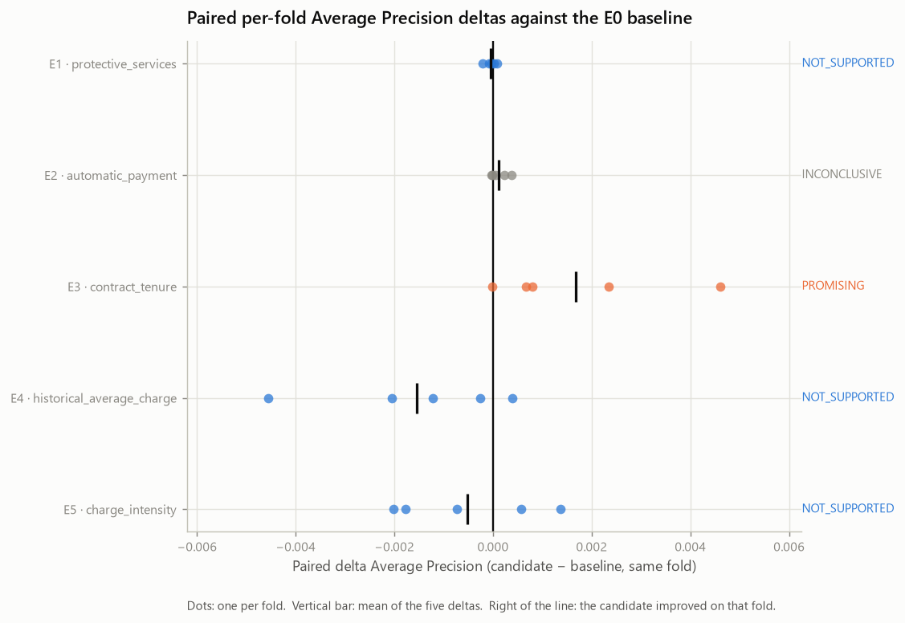
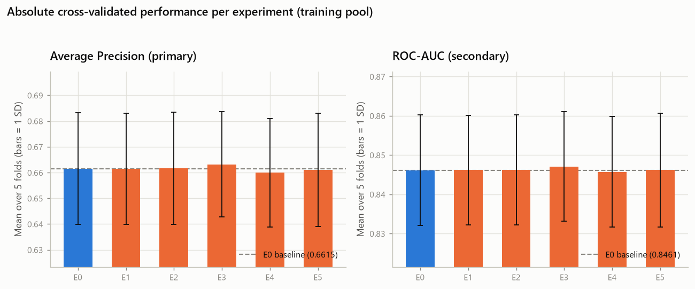

# Feature Engineering Ablation — Telco Customer Churn (Phase 6)

- Generated on: 2026-08-13
- Generated by: `scripts/run_feature_engineering.py`
- Machine-readable record: `reports/experiments/feature_engineering_results.json`
- Raw SHA-256: `88be4b93fbe0cc83421af1c503794c97c342eca914c1576db7c276e61d61358a`
- Training partition fingerprint: `a553196dd46b672f6344867707144fbf56a8abe14b338a225662c7208a1450dd`

> **Every number here is cross-validated on the training pool.** No holdout row
> was loaded, transformed, predicted or measured. There is no test result in
> this repository before Phase 9.

---

## 1. Objective

Answer one question, five times:

> Does a derived representation consistently improve the frozen logistic-regression
> baseline under *exactly* the same validation protocol?

This is an **ablation study**, not a search for features that happen to score
well. Each experiment differs from the baseline by one hypothesis. Nothing about
the model, the folds, the threshold or the hyperparameters was changed to
benefit a candidate — the only variable is what the model sees.

## 2. Frozen baseline

Inherited from Phase 5 and not modified:

| Element | Value |
| --- | --- |
| Model | `LogisticRegression` |
| `C` / `penalty` / `class_weight` | 1.0 / l2 / None |
| `solver` / `max_iter` | lbfgs / 100 |
| Cross-validation | `StratifiedKFold(n_splits=5, shuffle=True, random_state=42)` |
| Identical folds as Phase 5 | True |
| Primary metric | Average Precision |
| Secondary metric | ROC-AUC |
| Threshold | 0.5 (unchanged, not optimised) |
| Training rows | 5,634 |
| Positive prevalence | 0.2654 |

The classifier is built by the *same function* the Phase 5 baseline uses, so its
configuration cannot drift between baseline and candidate: there is one
definition, not two copies.

**Maintenance note — a deprecation warning, deliberately not silenced.**
scikit-learn 1.9.0 emits a `FutureWarning` for the
explicit `penalty="l2"` argument: it was deprecated in 1.8 and is scheduled for
removal in 1.10, in favour of `l1_ratio`. The warning is **not** a correctness
problem here — `penalty="l2"` is still honoured, and section 6 shows E0
reproducing the Phase 5 per-fold metrics to the last recorded digit. It is not
fixed in this phase either, because the model configuration is frozen and
changing it to quiet a warning would silently redefine the baseline every later
number is measured against.

It is recorded as a **maintenance item**, to be executed as a controlled
migration in whichever phase next has a mandate to touch the estimator, and in
any case before scikit-learn 1.10. The migration is not a text substitution: it
must ship with a numerical-equivalence test proving that `l1_ratio=0` reproduces
the per-fold metrics of the frozen `penalty="l2"` baseline within the same
tolerance section 6 uses. Until that test exists and passes, the argument stays
as it is and the warning stays visible.

The warning surfaced for the first time in this phase. It had always been raised,
but the Phase 5 cross-validation loop wrapped each `fit` in
`warnings.catch_warnings(record=True)` to detect convergence failures, and that
context manager intercepts *every* warning, not only the one being looked for. It
now re-emits anything that is not a `ConvergenceWarning`. That change altered no
number — the artefacts of both phases were regenerated and are byte-identical —
but it removed a place where a real warning could have gone unnoticed.

## 3. Experimental protocol

Every experiment is a complete pipeline, cloned fresh for each fold:

```text
TotalChargesCleaner  →  derived feature columns  →  ColumnTransformer  →  LogisticRegression
```

The cleaner runs first because `historical_average_charge` divides by a
`TotalCharges` that must already be numeric. The encoder runs last so that every
derived column is standardised with the **fold's own** statistics, exactly like
the original ones. Nothing is fitted outside a training fold.

| Experiment | Feature groups added |
| --- | --- |
| E0 | — (baseline) |
| E1 | `protective_services` |
| E2 | `automatic_payment` |
| E3 | `contract_tenure` |
| E4 | `historical_average_charge` |
| E5 | `charge_intensity` |

## 4. Paired-comparison methodology

For each candidate and each fold:

```text
delta_AP_fold  = AP_candidate_fold  - AP_baseline_fold
delta_ROC_fold = ROC_candidate_fold - ROC_baseline_fold
```

**Why paired.** Most of the spread in a per-fold metric comes from the folds
themselves — some partitions are simply harder — and that component cancels when
both models are measured on the same partition. Consequently the baseline's
between-fold standard deviation is **not** used as a bar a gain must clear: it
describes dispersion of one model across partitions, not the uncertainty of a
difference between two models. A candidate can be consistently better by less
than that figure.

**Classification.** An engineering heuristic about direction and consistency,
not inference:

| Label | Rule |
| --- | --- |
| `NOT_SUPPORTED` | mean delta AP ≤ 0, or the candidate loses in a majority of folds |
| `INCONCLUSIVE` | fewer than 4 of 5 folds improve, or AP improves while ROC-AUC moves against it |
| `PROMISING` | mean delta AP > 0, at least 4 of 5 folds improve, and ROC-AUC does not move against it |

**No minimum-gain cutoff exists anywhere in the rule.** Magnitude,
interpretability and complexity are reported separately (section 14) and weighed
by a reader. Five folds cannot support a significance test and none was run.

## 5. Candidate definitions

| Group | Adds | Stateful | Hypothesis |
| --- | --- | --- | --- |
| `protective_services` | `protective_service_count` | False | Churn falls monotonically as protective services accumulate, so the count carries signal the four independent dummies cannot express as one slope. |
| `automatic_payment` | `automatic_payment` | False | The manual/automatic split is the axis of the payment-method signal, and one pooled coefficient estimates it more stably than four separate dummies. |
| `contract_tenure` | `tenure_x_month_to_month`, `tenure_x_one_year` | False | The tenure gradient differs by contract type, which the purely additive baseline cannot express with a single shared tenure slope. |
| `historical_average_charge` | `historical_average_charge` | False | Accumulated charge per month of tenure exposes the price history that the current MonthlyCharges hides, and the model would otherwise have to recover it from three separate columns. |
| `charge_intensity` | `charge_intensity` | True | Paying above the going rate for one's own internet tier relates to churn, whereas the raw charge mostly encodes which tier was bought — the EDA showed the marginal charge gap reversing once the tier is held fixed. |

Every derived column is routed to the **numeric** block. These are ordinal or
binary quantities whose hypotheses are monotone, so a single coefficient states
exactly the claim being tested; one-hot encoding them would spend several
coefficients on a shape nobody hypothesised.

No original feature was removed. This phase tests *added representation*.
Feature selection is a different question and is not mixed in here.

**Informational status of E1 and E2 — what these two experiments actually test.**
`protective_service_count` is a deterministic combination of four service
indicators that the baseline already receives as one-hot columns.
`automatic_payment` is a deterministic aggregation of two of the four
`PaymentMethod` categories the encoder already emits. Both are exact functions of
what the model already has, so **neither introduces new information in the
informational sense**. What they test is a *re-parametrisation*: a coarser,
redundant aggregation of information that is already available.

That is still a legitimate experiment. A regularised logistic regression does not
pick an arbitrary member of an equivalence class of equivalent fits — the L2
penalty selects one specific solution, and adding a collinear aggregate changes
how the penalty distributes weight across the correlated columns. The learned
coefficients, and therefore the fitted probabilities, can change. The experiment
asks whether that shift helps.

It follows that the E1 and E2 deltas **must not be read as evidence of a gain, of
new signal, or of the absence of signal** in protective services or payment
method. Those associations were characterised in the EDA and are unaffected by
this phase. The deltas measure only what a redundant parametrisation did to one
regularised linear model on these five folds.

## 6. Baseline reproduction

E0 rebuilds the Phase 5 baseline through the Phase 6 pipeline builder and
compares every per-fold metric against `reports/experiments/baseline_results.json`
(schema v2).

| | Value |
| --- | --- |
| Reproduced | **True** |
| Tolerance | 1e-09 |
| Largest absolute difference | 0.0e+00 |

The run aborts if this check fails. A protocol that no longer reproduces its own
baseline cannot attribute a delta to a feature — the delta could be an artefact
of the pipeline being assembled differently.

## 7. Individual ablation results

Paired **Average Precision** deltas (the primary metric):

| Experiment | Feature group | F1 | F2 | F3 | F4 | F5 | Mean | SD | +/− folds | Class |
| --- | --- | --- | --- | --- | --- | --- | --- | --- | --- | --- |
| E1 | `protective_services` | +0.0001 | -0.0000 | -0.0001 | +0.0000 | -0.0002 | **-0.0000** | 0.0001 | 2/3 | NOT_SUPPORTED |
| E2 | `automatic_payment` | +0.0001 | -0.0000 | +0.0002 | +0.0004 | -0.0000 | **+0.0001** | 0.0002 | 3/2 | INCONCLUSIVE |
| E3 | `contract_tenure` | +0.0008 | +0.0046 | +0.0007 | -0.0000 | +0.0023 | **+0.0017** | 0.0018 | 4/1 | PROMISING |
| E4 | `historical_average_charge` | +0.0004 | -0.0020 | -0.0012 | -0.0046 | -0.0003 | **-0.0015** | 0.0019 | 1/4 | NOT_SUPPORTED |
| E5 | `charge_intensity` | -0.0007 | -0.0018 | -0.0020 | +0.0006 | +0.0014 | **-0.0005** | 0.0015 | 2/3 | NOT_SUPPORTED |

Paired **ROC-AUC** deltas (secondary):

| Experiment | Feature group | F1 | F2 | F3 | F4 | F5 | Mean | SD | +/− folds | Class |
| --- | --- | --- | --- | --- | --- | --- | --- | --- | --- | --- |
| E1 | `protective_services` | +0.0000 | +0.0001 | -0.0000 | +0.0000 | -0.0000 | **+0.0000** | 0.0001 | 3/2 | NOT_SUPPORTED |
| E2 | `automatic_payment` | +0.0000 | +0.0001 | +0.0000 | +0.0001 | +0.0000 | **+0.0000** | 0.0000 | 5/0 | INCONCLUSIVE |
| E3 | `contract_tenure` | -0.0011 | +0.0020 | +0.0004 | +0.0012 | +0.0024 | **+0.0010** | 0.0014 | 4/1 | PROMISING |
| E4 | `historical_average_charge` | +0.0001 | -0.0007 | -0.0003 | -0.0010 | -0.0001 | **-0.0004** | 0.0005 | 1/4 | NOT_SUPPORTED |
| E5 | `charge_intensity` | +0.0008 | -0.0002 | -0.0012 | +0.0005 | +0.0005 | **+0.0001** | 0.0008 | 3/2 | NOT_SUPPORTED |



*Paired per-fold Average Precision deltas against the E0 baseline*

Absolute cross-validated performance:

| Experiment | Input features | Transformed | Average Precision (primary) | ROC-AUC (secondary) | Precision @0.5 | Recall @0.5 | F1 @0.5 | Accuracy @0.5 |
| --- | --- | --- | --- | --- | --- | --- | --- | --- | --- |
| E0 | 19 | 46 | 0.6615 ± 0.0217 | 0.8461 ± 0.0140 | 0.6521 ± 0.0286 | 0.5438 ± 0.0457 | 0.5924 ± 0.0333 | 0.8019 ± 0.0132 |
| E1 | 20 | 47 | 0.6614 ± 0.0216 | 0.8462 ± 0.0140 | 0.6532 ± 0.0285 | 0.5438 ± 0.0457 | 0.5928 ± 0.0330 | 0.8023 ± 0.0130 |
| E2 | 20 | 47 | 0.6616 ± 0.0218 | 0.8462 ± 0.0140 | 0.6537 ± 0.0284 | 0.5438 ± 0.0457 | 0.5931 ± 0.0329 | 0.8025 ± 0.0129 |
| E3 | 21 | 48 | 0.6632 ± 0.0204 | 0.8471 ± 0.0139 | 0.6581 ± 0.0243 | 0.5438 ± 0.0465 | 0.5949 ± 0.0334 | 0.8040 ± 0.0124 |
| E4 | 20 | 47 | 0.6600 ± 0.0210 | 0.8457 ± 0.0140 | 0.6530 ± 0.0287 | 0.5458 ± 0.0483 | 0.5939 ± 0.0340 | 0.8025 ± 0.0131 |
| E5 | 20 | 47 | 0.6610 ± 0.0220 | 0.8462 ± 0.0145 | 0.6514 ± 0.0291 | 0.5425 ± 0.0444 | 0.5914 ± 0.0338 | 0.8016 ± 0.0134 |



*Absolute cross-validated performance per experiment*

## 8. protective_services — E1

**Hypothesis.** Churn falls monotonically as protective services accumulate, so the count carries signal the four independent dummies cannot express as one slope.

**Definition.** Adds `protective_service_count` (deterministic, stateless). Counts only explicit 'Yes'. 'No' and the sentinel 'No internet service' both count as zero. The four source columns are kept, so the count is a deterministic sum of indicators the baseline already receives one-hot: it adds no information, only a coarser parametrisation of information the model already had.

| | Value |
| --- | --- |
| Paired delta average_precision per fold | +0.0001, -0.0000, -0.0001, +0.0000, -0.0002 |
| Mean / SD | **-0.0000** / 0.0001 |
| Folds improved / worsened | 2 / 3 |
| Paired delta roc_auc (mean) | +0.0000 (3/2 folds) |
| Absolute average_precision | 0.6614 ± 0.0216 |
| Absolute roc_auc | 0.8462 ± 0.0140 |
| Transformed width | 47 columns |
| Diagnostic @0.5 (not used for selection) | Precision @0.5 0.6532, Recall @0.5 0.5438, F1 @0.5 0.5928 |

**Classification: NOT_SUPPORTED.** mean delta average_precision = -0.0000 with 2/5 folds improving: the hypothesis does not show up under the frozen protocol.

**How to read this delta.** `protective_service_count` is a deterministic function of columns the baseline already receives after one-hot encoding, so this experiment introduces no new information: it tests a redundant re-parametrisation of information the model already had. The delta is therefore not evidence that the underlying quantity does or does not carry signal, and not evidence that new signal was or was not found. It measures one thing only — what the coarser parametrisation did to a regularised logistic regression on these folds.

## 9. automatic_payment — E2

**Hypothesis.** The manual/automatic split is the axis of the payment-method signal, and one pooled coefficient estimates it more stably than four separate dummies.

**Definition.** Adds `automatic_payment` (deterministic, stateless). Positive for 'Bank transfer (automatic)' and 'Credit card (automatic)'. PaymentMethod is kept, so the flag is a deterministic aggregation of two of the four categories the encoder already emits: it adds no information, only a coarser parametrisation of information the model already had.

| | Value |
| --- | --- |
| Paired delta average_precision per fold | +0.0001, -0.0000, +0.0002, +0.0004, -0.0000 |
| Mean / SD | **+0.0001** / 0.0002 |
| Folds improved / worsened | 3 / 2 |
| Paired delta roc_auc (mean) | +0.0000 (5/0 folds) |
| Absolute average_precision | 0.6616 ± 0.0218 |
| Absolute roc_auc | 0.8462 ± 0.0140 |
| Transformed width | 47 columns |
| Diagnostic @0.5 (not used for selection) | Precision @0.5 0.6537, Recall @0.5 0.5438, F1 @0.5 0.5931 |

**Classification: INCONCLUSIVE.** mean delta average_precision = +0.0001 but only 3/5 folds improve: the direction is not consistent enough to act on with five folds and no significance test.

**How to read this delta.** `automatic_payment` is a deterministic function of columns the baseline already receives after one-hot encoding, so this experiment introduces no new information: it tests a redundant re-parametrisation of information the model already had. The delta is therefore not evidence that the underlying quantity does or does not carry signal, and not evidence that new signal was or was not found. It measures one thing only — what the coarser parametrisation did to a regularised logistic regression on these folds.

## 10. contract_tenure — E3

**Hypothesis.** The tenure gradient differs by contract type, which the purely additive baseline cannot express with a single shared tenure slope.

**Definition.** Adds `tenure_x_month_to_month`, `tenure_x_one_year` (deterministic, stateless). 'Two year' is the implicit reference. A third interaction would sum with the other two to exactly 'tenure', which is already in the matrix.

| | Value |
| --- | --- |
| Paired delta average_precision per fold | +0.0008, +0.0046, +0.0007, -0.0000, +0.0023 |
| Mean / SD | **+0.0017** / 0.0018 |
| Folds improved / worsened | 4 / 1 |
| Paired delta roc_auc (mean) | +0.0010 (4/1 folds) |
| Absolute average_precision | 0.6632 ± 0.0204 |
| Absolute roc_auc | 0.8471 ± 0.0139 |
| Transformed width | 48 columns |
| Diagnostic @0.5 (not used for selection) | Precision @0.5 0.6581, Recall @0.5 0.5438, F1 @0.5 0.5949 |

**Classification: PROMISING.** mean delta average_precision = +0.0017, improving in 4/5 folds, with roc_auc +0.0010: consistent in direction under the frozen protocol.

## 11. historical_average_charge — E4

**Hypothesis.** Accumulated charge per month of tenure exposes the price history that the current MonthlyCharges hides, and the model would otherwise have to recover it from three separate columns.

**Definition.** Adds `historical_average_charge` (deterministic, stateless). A descriptive ratio, not an exact average contractual price. Undefined at tenure 0 and represented there as 0.0, coherent with the structural zero of TotalCharges; the model still receives tenure and can tell those rows apart.

| | Value |
| --- | --- |
| Paired delta average_precision per fold | +0.0004, -0.0020, -0.0012, -0.0046, -0.0003 |
| Mean / SD | **-0.0015** / 0.0019 |
| Folds improved / worsened | 1 / 4 |
| Paired delta roc_auc (mean) | -0.0004 (1/4 folds) |
| Absolute average_precision | 0.6600 ± 0.0210 |
| Absolute roc_auc | 0.8457 ± 0.0140 |
| Transformed width | 47 columns |
| Diagnostic @0.5 (not used for selection) | Precision @0.5 0.6530, Recall @0.5 0.5458, F1 @0.5 0.5939 |

**Classification: NOT_SUPPORTED.** mean delta average_precision = -0.0015 with 1/5 folds improving: the hypothesis does not show up under the frozen protocol.

## 12. charge_intensity — E5

**Hypothesis.** Paying above the going rate for one's own internet tier relates to churn, whereas the raw charge mostly encodes which tier was bought — the EDA showed the marginal charge gap reversing once the tier is held fixed.

**Definition.** Adds `charge_intensity` (stateful). The only stateful candidate. Tier medians are learned in fit — inside each training fold — and an unseen tier falls back to the training fold's global median. No median from the full-dataset EDA is reused.

| | Value |
| --- | --- |
| Paired delta average_precision per fold | -0.0007, -0.0018, -0.0020, +0.0006, +0.0014 |
| Mean / SD | **-0.0005** / 0.0015 |
| Folds improved / worsened | 2 / 3 |
| Paired delta roc_auc (mean) | +0.0001 (3/2 folds) |
| Absolute average_precision | 0.6610 ± 0.0220 |
| Absolute roc_auc | 0.8462 ± 0.0145 |
| Transformed width | 47 columns |
| Diagnostic @0.5 (not used for selection) | Precision @0.5 0.6514, Recall @0.5 0.5425, F1 @0.5 0.5914 |

**Classification: NOT_SUPPORTED.** mean delta average_precision = -0.0005 with 2/5 folds improving: the hypothesis does not show up under the frozen protocol.

## 13. Combined promising features

**Not built.** Exactly one candidate was classified PROMISING (`contract_tenure`), so a combination would be identical to E3. Building it anyway would produce a duplicate row and the appearance of an extra result.

## 14. Complexity versus gain

Magnitude, consistency, interpretability and complexity are separate axes and
are stated separately here on purpose — collapsing them into a single score is
how an ablation study turns into a leaderboard.

| Candidate | Columns added | Interpretability | Stateful | Folds improved | Mean delta AP |
| --- | --- | --- | --- | --- | --- |
| `protective_services` | 1 | one monotone coefficient | False | 2/5 | -0.0000 |
| `automatic_payment` | 1 | one monotone coefficient | False | 3/5 | +0.0001 |
| `contract_tenure` | 2 | two slope terms | False | 4/5 | +0.0017 |
| `historical_average_charge` | 1 | one monotone coefficient | False | 1/5 | -0.0015 |
| `charge_intensity` | 1 | one monotone coefficient | True | 2/5 | -0.0005 |

A stateful feature costs more than a column: it adds fitted state that must be
persisted, versioned and monitored, and it introduces a failure mode — an unseen
group at prediction time — that a deterministic feature does not have. That cost
is worth paying only for a gain that is both consistent and large enough to
matter operationally.

**Magnitude in context — the headline of this phase.** The largest mean gain
observed is +0.0017 Average Precision against a baseline of
0.6615 — a relative change of
0.25%. Read plainly: **no candidate produced a material change in
the cross-validated performance of this linear model.** That is a legitimate
result, not a failed experiment.

Two of the five were never able to produce one for informational reasons.
`protective_services` and `automatic_payment` are deterministic aggregations of
columns the model already receives one-hot (section 5), so E1 and E2 only ever
tested whether a redundant re-parametrisation shifts a regularised fit. Their
near-zero deltas describe that shift and nothing else — in particular they are
not a verdict on whether protective services or payment method carry signal.
`contract_tenure` is the one candidate that expresses something the additive
baseline genuinely cannot state, which is consistent with it being the only one
that moved in a stable direction — but it moved very little.

## 15. Supported and unsupported hypotheses

**Held up under the protocol**

- **contract_tenure** (E3) — +0.0017 AP, 4/5 folds.

"Held up" means the pre-defined heuristic was satisfied — a positive mean delta
and a consistent direction across folds. It is a statement about direction and
consistency only, not about effect size, and not a demonstration that the feature
is worth adopting. Section 17 states what that implies for Phase 7.

**Did not hold up**

- **protective_services** (E1, NOT_SUPPORTED) — mean delta average_precision = -0.0000 with 2/5 folds improving: the hypothesis does not show up under the frozen protocol.
- **automatic_payment** (E2, INCONCLUSIVE) — mean delta average_precision = +0.0001 but only 3/5 folds improve: the direction is not consistent enough to act on with five folds and no significance test.
- **historical_average_charge** (E4, NOT_SUPPORTED) — mean delta average_precision = -0.0015 with 1/5 folds improving: the hypothesis does not show up under the frozen protocol.
- **charge_intensity** (E5, NOT_SUPPORTED) — mean delta average_precision = -0.0005 with 2/5 folds improving: the hypothesis does not show up under the frozen protocol.

For E1 and E2 this sentence is about the re-parametrisation, not about the
underlying quantity: both are exact functions of columns the model already had
(section 5), so "did not hold up" means the coarser encoding did not help a
regularised linear fit — it does not mean protective services or payment method
lack association with churn.

**What this does and does not mean.** A feature that improves prediction has
demonstrated a better *representation* of information already in the dataset. It
has not demonstrated that the quantity it measures **causes** churn, and it has
not established a new association beyond what the EDA reported — the derived
columns are functions of the original ones, so no new information entered the
model. The dataset remains observational: every relationship here is association
within this sample.

Equally, a candidate classified `NOT_SUPPORTED` has not been shown to be
irrelevant. It has been shown that *this* encoding of *that* hypothesis does not
help *this* linear model on *these* folds. A non-linear model in Phase 7 may
extract the same interaction without an explicit column.

## 16. Limitations

- **No holdout estimate.** Everything is training-pool cross-validation.
- **Five folds, no significance test.** The classification labels describe
  direction and consistency; they are not statistical claims, and a
  `PROMISING`/`INCONCLUSIVE` boundary case should be read as such.
- **One model.** Every conclusion is conditional on an untuned logistic
  regression. A feature that helps a linear model may be redundant for a tree
  ensemble, and vice versa.
- **The threshold is untouched**, so the diagnostic trio at
  0.5 describes one operating point and was not used to
  select anything.
- **Candidates were chosen from the EDA**, which ran on the complete dataset. The
  analyst-exposure limitation recorded in Phase 3 therefore still applies to the
  hypotheses tested here.
- **Multiplicity.** Five candidates were evaluated against one baseline. No
  correction was applied because no inferential claim is made, but the more
  candidates are tried, the more likely one looks good by chance.

## 17. Feature set status going into Phase 7

**Reference feature set: the original 19 features.** They are unchanged, and they remain the
feature set the Phase 7 model comparison is run on. No candidate replaced them,
and no candidate was adopted as *the* Phase 7 feature set.

**Retained candidates**

- **`contract_tenure`** (E3) — mean ΔAP +0.00168, 4/5 folds positive. Retained as a **candidate feature**, to be re-examined in the Phase 7 sensitivity analysis. Not adopted.

**What `PROMISING` means, and what it does not.** The label was assigned by the
heuristic fixed in section 4 *before* any result was seen — mean ΔAP > 0 and at
least 4 of 5 folds improving — and it was not
revised once the numbers were in. Revising a classification because the surviving
effect looks small would mean choosing the rule to fit the result, which is the
failure mode a pre-registered rule exists to prevent. But the label certifies
exactly what the rule tests, and no more: **direction and consistency**. It makes
no claim about magnitude, and the magnitudes here are small — the largest mean
gain is +0.00168 AP against a baseline of 0.6615 (0.25% relative), with five
folds and no significance test behind it. **Passing the pre-defined heuristic is
not the same as establishing a material benefit.** Nothing in this phase
establishes one.

**Phase 7 protocol, fixed here — before any Phase 7 result exists.**

1. **Primary comparison — model families on the original 19 features**, on the same folds and under the same metric protocol. This is the comparison that selects a model family.
2. **Secondary analysis — sensitivity to `contract_tenure`.** The retained candidate is re-run as a sensitivity check on top of that comparison, to ask whether a small, consistent gain measured on a linear model survives a family that captures interactions natively. A tree ensemble may make an explicit interaction column redundant, in which case the candidate is dropped.
3. **E1, E2, E4 and E5 are not automatically reopened for every new model family.** Re-running rejected candidates against each family would turn a controlled comparison into a search over feature-set × model-family cells, which is how a leaderboard eventually finds a lucky combination. They may be revisited deliberately, with a stated reason — never by default, and never promoted on the strength of the numbers in this report.

Fixing this now is the point: deciding after seeing Phase 7 numbers which feature
set to compare model families on would make the feature set another tuned
parameter. No candidate is carried into Phase 7 on the basis of its EDA
hypothesis alone, and none is carried as an established improvement.
