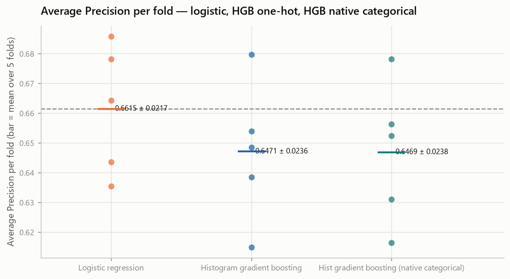
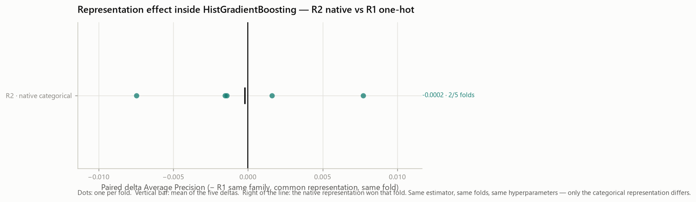
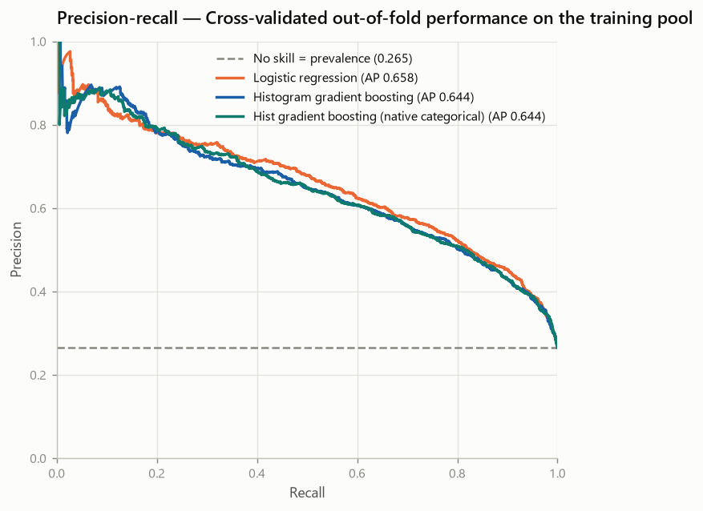

# HistGradientBoosting Representation Gate — Telco Customer Churn (Phase 8A)

- Generated on: 2026-08-13
- Generated by: `scripts/run_hgb_representation.py`
- Machine-readable record: `reports/experiments/hgb_representation_results.json`
- Raw SHA-256: `88be4b93fbe0cc83421af1c503794c97c342eca914c1576db7c276e61d61358a`
- Training partition fingerprint: `a553196dd46b672f6344867707144fbf56a8abe14b338a225662c7208a1450dd`

> **Every number here is cross-validated on the training pool.** No holdout row
> was loaded, transformed, predicted or measured. There is no test result in
> this repository before Phase 9.

---

## 1. Objective

One question, and nothing else:

> How much of the difference between HistGradientBoosting and logistic
> regression is sensitive to the representation of the categorical features?

**This is not tuning.** No hyperparameter was searched or changed, no threshold
was moved, no engineered feature was added, no model was selected.

## 2. Why this gate exists

Phase 7 held the representation constant so that the estimator was the only
variable, and recorded that a common representation is not necessarily optimal
for every family — that its results estimate the performance of the tested
configurations under a common representation, not the ceiling of each algorithm.

That leaves one factor unmeasured and one interpretation unavailable. The
0.0144 Average Precision by which
`hist_gradient_boosting` sat below `logistic_regression` in Phase 7 could be a property of
the family, of the representation, or of both. Tuning a family before knowing
which would be searching hyperparameters to compensate for an encoding — an
expensive way to answer the wrong question.

So this phase changes **one factor**: how the 16 contracted categorical columns
reach the estimator.

## 3. Frozen experimental protocol

| Element | Value |
| --- | --- |
| Data | Frozen Phase 4 training pool, 5,634 rows |
| Positive prevalence | 0.2654 |
| Cross-validation | `StratifiedKFold(n_splits=5, shuffle=True, random_state=42)` |
| Identical folds as Phases 5-7 | True |
| Primary metric | Average Precision |
| Secondary ranking metric | ROC-AUC |
| Diagnostics @ 0.5 | Precision, Recall, F1 (Accuracy auxiliary) |
| Threshold optimised | False |
| Hyperparameter tuning | False |
| Calibration | False |
| Engineered features | none |
| Seed | 42 |
| scikit-learn | 1.9.0 |

**Preprocessing is refitted inside every fold** for all three experiments: the
scaler's statistics, the encoder's categories and the estimator's parameters are
estimated on the training fold alone.

`contract_tenure` is **not** used. It remains the retained candidate Phase 6
documented. Adding it here would put a feature effect and a representation
effect into the same number, and neither could then be recovered.

## 4. Reference reproduction

Two gates run before anything below is interpreted:

| Experiment | Reproduces | Artefact | Tolerance | Largest difference | Reproduced |
| --- | --- | --- | --- | --- | --- |
| R0 | `main_comparison[M0]` | `reports/experiments/model_comparison_results.json` | 1e-09 | 0.0e+00 | **True** |
| R1 | `main_comparison[M2]` | `reports/experiments/model_comparison_results.json` | 1e-09 | 0.0e+00 | **True** |

R0 and R1 are not re-declared — they are rebuilt through the **Phase 7 pipeline
builder**, so they are the same objects that produced `model_comparison_results.json`.
Every per-fold metric is compared against that artefact and the run aborts if
either fails. Without this, a difference attributed to the representation could
be an artefact of the pipeline being assembled differently.

## 5. Common representation (R0, R1)

The Phase 4 block, unchanged:

```text
TotalChargesCleaner → StandardScaler (numeric) → OneHotEncoder(handle_unknown="ignore")
```

46 transformed columns:
3 scaled numeric and
43 one-hot indicators
derived from the 16 categorical features.

## 6. Native categorical representation (R2)

```text
prepare_features
  → TotalChargesCleaner
  → cardinality guard (training fold only)
  → ColumnTransformer
       numeric      : tenure, MonthlyCharges, TotalCharges → StandardScaler
       categorical  : the same 16 features → OrdinalEncoder
  → HistGradientBoostingClassifier(categorical_features=<explicit mask>)
```

| Property | Value |
| --- | --- |
| Raw features | 19 (the same 19; none added, none removed) |
| Transformed columns | **19** |
| Numeric columns | 3 |
| Categorical columns | 16 |
| `categorical_features` | explicit positional mask (True) |
| Mask indices | [3, 4, 5, 6, 7, 8, 9, 10, 11, 12, 13, 14, 15, 16, 17, 18] |
| Cardinality limit | 255 (`max_bins`) |
| Engineered features | none |

The mask is `[False × 3, True × 16]`, matching the `ColumnTransformer`
output order: the numeric block first, then the categorical one. It is stated
positionally and **never** inferred through `categorical_features="from_dtype"`,
because a representation whose nominality depends on an upstream dtype is not a
guarantee of anything.

**The ordinal codes are not an ordinal assumption.** `OrdinalEncoder` assigns
integers in sorted order and nothing about those integers is meaningful. What
keeps the columns nominal is the second half of the arrangement: the same
16 positions are declared categorical to
the estimator, so the split finder partitions **sets of categories** instead of
thresholding a number line. The encoder alone would be an ordinal assumption;
the encoder plus the declaration is not.

The estimator configuration is otherwise **identical** to Phase 7's M2 — it is
built from the same frozen parameter dictionary, with `categorical_features`
replaced. `early_stopping` stays `False`, so no model selection happens inside a
training fold.

## 7. Leakage-safe categorical vocabulary

The encoder is fitted **inside each training fold**. A category that appears
only in a validation fold never enters `categories_`; it is encoded as `NaN` and
routed to the estimator's native missing-value handling at split time.

That `NaN` is **serving behaviour for a new but valid category, not blank
handling**. Blanks, `None` and whitespace-only values are rejected earlier by the
Phase 4 feature contract, which has not been relaxed. A new valid category and
invalid input remain different things and are handled at different boundaries.

Cardinality is checked **in the training fold only**, by a guard that raises
rather than repairs. No column is grouped, hashed or truncated to fit the
estimator's 255-category limit:
silently collapsing levels would change the representation under test while the
experiment kept claiming only the encoding had changed.

Observed in the training pool — every column is far below the limit, so the
guard did not fire:

| Feature | Categories in the training pool |
| --- | --- |
| `gender` | 2 |
| `SeniorCitizen` | 2 |
| `Partner` | 2 |
| `Dependents` | 2 |
| `PhoneService` | 2 |
| `MultipleLines` | 3 |
| `InternetService` | 3 |
| `OnlineSecurity` | 3 |
| `OnlineBackup` | 3 |
| `DeviceProtection` | 3 |
| `TechSupport` | 3 |
| `StreamingTV` | 3 |
| `StreamingMovies` | 3 |
| `Contract` | 3 |
| `PaperlessBilling` | 2 |
| `PaymentMethod` | 4 |

## 8. HGB representation comparison

Absolute cross-validated performance, mean ± sample standard deviation over
5 folds:

| Experiment | Model | Representation | Transformed | ROC-AUC (secondary) | Average Precision (primary) | Precision @0.5 | Recall @0.5 | F1 @0.5 | Accuracy @0.5 |
| --- | --- | --- | --- | --- | --- | --- | --- | --- | --- |
| R0 | `logistic_regression` | `common_ohe` | 46 | 0.8461 ± 0.0140 | 0.6615 ± 0.0217 | 0.6521 ± 0.0286 | 0.5438 ± 0.0457 | 0.5924 ± 0.0333 | 0.8019 ± 0.0132 |
| R1 | `hist_gradient_boosting` | `common_ohe` | 46 | 0.8364 ± 0.0061 | 0.6471 ± 0.0236 | 0.6439 ± 0.0259 | 0.5124 ± 0.0311 | 0.5703 ± 0.0254 | 0.7954 ± 0.0104 |
| R2 | `hgb_native` | `native_categorical` | 19 | 0.8368 ± 0.0106 | 0.6469 ± 0.0238 | 0.6402 ± 0.0321 | 0.5110 ± 0.0433 | 0.5679 ± 0.0361 | 0.7941 ± 0.0140 |



*Average Precision per fold — the three experiments*

Per-fold Average Precision:

| Experiment | Model | F1 | F2 | F3 | F4 | F5 | Mean ± SD |
| --- | --- | --- | --- | --- | --- | --- | --- |
| R0 | `logistic_regression` | 0.6437 | 0.6355 | 0.6859 | 0.6782 | 0.6643 | **0.6615** ± 0.0217 |
| R1 | `hist_gradient_boosting` | 0.6386 | 0.6149 | 0.6797 | 0.6486 | 0.6539 | **0.6471** ± 0.0236 |
| R2 | `hgb_native` | 0.6312 | 0.6165 | 0.6783 | 0.6563 | 0.6524 | **0.6469** ± 0.0238 |

## 9. Paired Average Precision deltas — R2 vs R1 (question A)

The representation effect **inside one family**. Same estimator, same
hyperparameters, same folds; only the categorical representation differs:

| Metric | Reference | F1 | F2 | F3 | F4 | F5 | Mean | SD | +/− folds |
| --- | --- | --- | --- | --- | --- | --- | --- | --- | --- |
| Average Precision (primary) | R1 | -0.0075 | +0.0016 | -0.0014 | +0.0077 | -0.0015 | **-0.0002** | 0.0055 | 2/3 |
| ROC-AUC (secondary) | R1 | -0.0064 | -0.0035 | -0.0006 | +0.0055 | +0.0069 | **+0.0004** | 0.0057 | 2/3 |



*Paired per-fold deltas, native categorical vs one-hot*

**Classification: REPRESENTATION_NOT_SUPPORTED.**
mean delta average_precision = -0.00022 with 2/5 folds improving: the native representation does not improve the family under the frozen protocol.

The labels — `REPRESENTATION_HELPFUL`, `REPRESENTATION_INCONCLUSIVE`,
`REPRESENTATION_NOT_SUPPORTED` — are engineering heuristics about direction and
consistency, fixed before any result was seen. They carry **no minimum-gain
cutoff**, and with five folds no significance test is possible or was run.

Read against Phase 7: the native representation moves this family by
-0.00022 AP, against a Phase 7 shortfall of
-0.01436 AP versus the logistic regression — closing **none** of that distance — the movement does not point towards the reference model.

That is the direct answer to the question this phase asks. **Under this
protocol, on this dataset, the categorical representation accounts for very
little of the distance between the two families.**

A **plausible mechanism, which this experiment did not measure**: the highest
cardinality among the 16 categorical features is
4 (section 7).
Native categorical handling is generally expected to pay off when a feature has
many levels, because one-hot then scatters one variable across many sparse
indicator columns that a tree must recombine through depth. That condition is
not present in this dataset. Stated as a hypothesis consistent with the result —
testing it would require varying cardinality, which is not this gate.

## 10. Comparison against logistic regression (question B)

A different question, deliberately not mixed with the one above: the delta below
compares R2 against **R0**, not against R1.

| Metric | Reference | F1 | F2 | F3 | F4 | F5 | Mean | SD | +/− folds |
| --- | --- | --- | --- | --- | --- | --- | --- | --- | --- |
| Average Precision (primary) | R0 | -0.0125 | -0.0189 | -0.0076 | -0.0219 | -0.0119 | **-0.0146** | 0.0058 | 0/5 |
| ROC-AUC (secondary) | R0 | -0.0176 | -0.0025 | -0.0048 | -0.0154 | -0.0065 | **-0.0093** | 0.0067 | 0/5 |

**Standing: BELOW_LOGISTIC.** mean delta average_precision = -0.01458 in 0/5 folds: still below the logistic regression, consistently across folds.

A representation change can help a family measurably and still leave it behind
the reference model. Those two statements are compatible, and keeping them in
separate sections is what stops the first from being read as the second.

## 11. Out-of-fold results

Each of the 5,634 training rows received exactly one
prediction, produced by a model that never saw that row while fitting:

| Experiment | Model | ROC-AUC (secondary) | Average Precision (primary) | Precision @0.5 | Recall @0.5 | F1 @0.5 | Accuracy @0.5 |
| --- | --- | --- | --- | --- | --- | --- | --- |
| R0 | `logistic_regression` | 0.8456 | 0.6584 | 0.6520 | 0.5438 | 0.5930 | 0.8019 |
| R1 | `hist_gradient_boosting` | 0.8361 | 0.6444 | 0.6437 | 0.5124 | 0.5706 | 0.7954 |
| R2 | `hgb_native` | 0.8362 | 0.6440 | 0.6404 | 0.5110 | 0.5685 | 0.7941 |



*Precision-recall from out-of-fold predictions on the training pool*

These are **cross-validated out-of-fold results on the training pool**, not test
metrics. No per-customer prediction was persisted: the identifier is not part of
the feature matrix and no `customerID`-to-probability mapping is written
anywhere.

Threshold-0.5 diagnostics, which selected nothing:

| Experiment | Model | Precision @0.5 | Recall @0.5 | F1 @0.5 | Accuracy @0.5 |
| --- | --- | --- | --- | --- | --- |
| R0 | `logistic_regression` | 0.6521 | 0.5438 | 0.5924 | 0.8019 |
| R1 | `hist_gradient_boosting` | 0.6439 | 0.5124 | 0.5703 | 0.7954 |
| R2 | `hgb_native` | 0.6402 | 0.5110 | 0.5679 | 0.7941 |

## 12. Complexity implications

| Property | Common representation | Native categorical |
| --- | --- | --- |
| Transformed columns | 46 | 19 |
| Fitted encoder state | category lists + one-hot layout | category lists only |
| Unseen category at serving | all-zero block (silent) | `NaN`, routed to the estimator's missing branch |
| Estimator coupling | none — any estimator accepts the matrix | the mask must match the column order, and only some estimators consume it |
| Interpretability | one column per level | one column per feature, split sets must be decoded |

The native representation is **narrower** but more **coupled**: the mask is
positional, so any future change to the `ColumnTransformer` order silently
changes what the estimator treats as categorical. That is a real maintenance
cost and is the reason the mask is asserted in the tests rather than assumed.

Neither representation is "simpler" outright. One trades width for coupling.

## 13. Limitations

- **No holdout estimate.** Everything is training-pool cross-validation.
- **Five folds, no significance test.** The deltas and the classification
  describe direction and consistency; they are not statistical claims.
- **Still untuned.** Both HGB experiments run the frozen base configuration, so
  neither result is that family's ceiling under either representation.
- **One family.** The gate was run for HistGradientBoosting only. Nothing here
  says what a native representation would do for a random forest — scikit-learn's
  forest does not consume one — or for any other family.
- **One representation change.** Ordinal-plus-declaration is not the only
  alternative encoding; target and frequency encodings exist and were not tested,
  the first being a leakage pattern this project rejects outright.
- **No calibration.** Probability quality was not measured and ranked nothing.
- **No class-imbalance handling.** `class_weight` is `None` everywhere.
- **The analyst-exposure limitation from Phase 3 still applies.**
- **Snapshot classification, not forecasting.** The dataset has no time
  dimension.

## 14. Decision intentionally deferred

**No tuning candidate was selected here, and no tuning was performed.**
No tuning candidate was selected. This gate measures one factor — the categorical representation — and the decision about which models, if any, are worth tuning is deferred to a human review of this evidence.

Selecting a candidate inside the same run that produced the evidence would make
the selection a function of a single result, which is precisely the failure mode
the phase separation exists to prevent. What follows is evidence for a reviewer,
not a recommendation the script is authorised to act on.

## 15. Evidence to inform tuning eligibility

Stated as measurements, in the order a reviewer needs them:

| Question | Measurement |
| --- | --- |
| Does the representation move the family? | -0.00022 AP, 2/5 folds → REPRESENTATION_NOT_SUPPORTED |
| Does the representation move the ranking metric? | +0.00037 ROC-AUC |
| Where does R2 stand against the reference model? | -0.01458 AP, 0/5 folds → BELOW_LOGISTIC |
| Best mean AP in this phase | R0 (0.6615) |
| Was anything tuned, thresholded or calibrated? | No |

The reviewer's decision is which models, if any, justify a tuning budget — and
that decision should weigh the size of these deltas against the interpretability
and coupling costs in section 12, not the ordering alone.

Nothing here has been tuned, calibrated, thresholded or evaluated on the
holdout, and no model has been selected.
