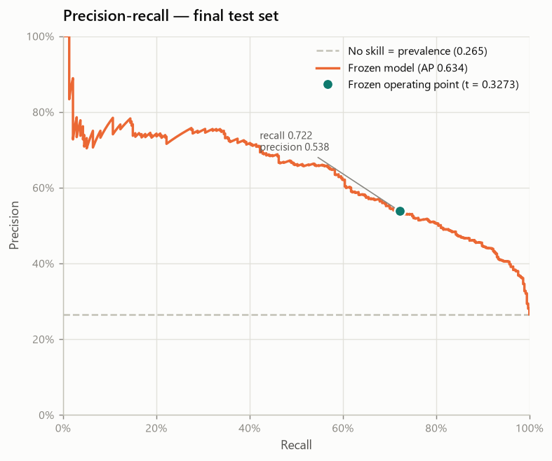
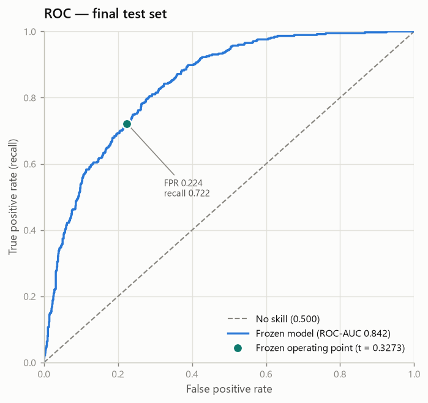
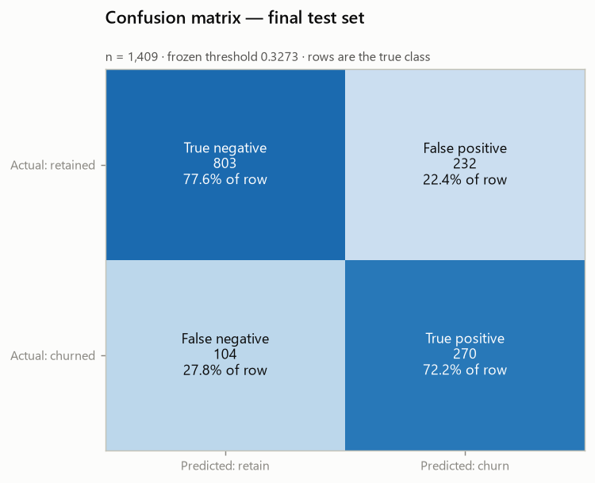
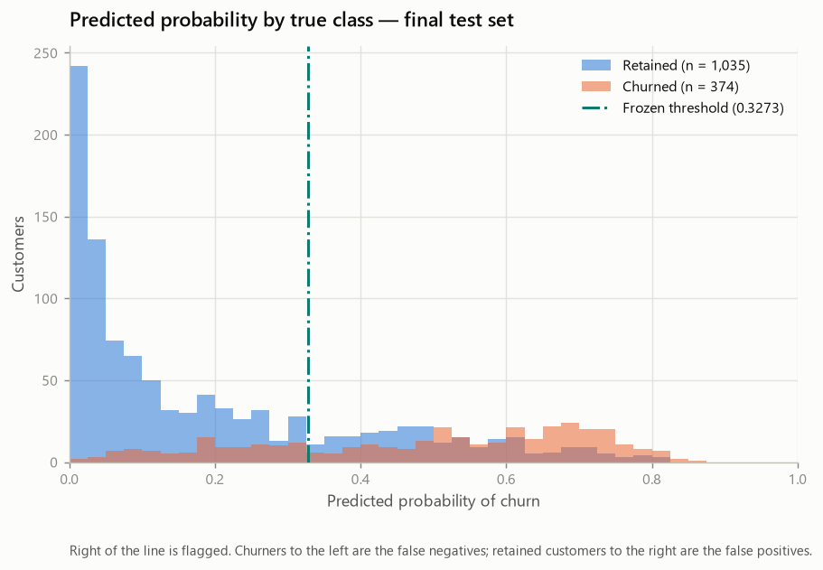

# Final Holdout Evaluation — Telco Customer Churn (Phase 9D)

- Generated by: `scripts/evaluate_holdout.py`
- Machine-readable record: `reports/experiments/holdout_results.json`
- Frozen in commit: `9d1db49` — feat: freeze final churn model and decision policy
- Raw SHA-256: `88be4b93fbe0cc83421af1c503794c97c342eca914c1576db7c276e61d61358a`
- Holdout partition fingerprint: `1ad8aefb7e34776a78d76765d2465c630a41b3813b1d7d96d0d1b03d049776f6`

> **This report carries no generation date.** It is a pure function of its
> inputs, so re-running the generator on an unchanged repository reproduces it
> byte for byte and any diff is a real change. Git records when it was produced.

> **This is the final test result.** Every other report in this repository shows
> cross-validated training-pool performance. The numbers here were computed on
> 1,409 customers that took no part in any fit, any fold, any
> feature decision, the calibration gate or the threshold search.

---

## 1. Executive summary

**One** frozen model-and-decision-policy configuration was evaluated on the
previously untouched holdout, and no selection followed its results.

| Result | Value | 95% CI |
| --- | --- | --- |
| **Average Precision** | **0.6337** | [0.5777, 0.6864] |
| **ROC-AUC** | **0.8420** | [0.8183, 0.8633] |
| F1 at the frozen threshold | 0.6164 | [0.5762, 0.6534] |
| Recall at the frozen threshold | 0.7219 | [0.6760, 0.7652] |
| Precision at the frozen threshold | 0.5378 | [0.4937, 0.5791] |

Read against the two references that make those numbers interpretable: a
no-skill ranker scores an Average Precision equal to the prevalence
(0.2654) and a ROC-AUC of 0.500. The frozen operating point
flags 35.6% of customers and catches
72.2% of the churners among them.

Section 8 compares this with the development estimates. Section 10 states what
the result does not support.

## 2. Frozen evaluation protocol

**The model and the decision policy were frozen and committed before the holdout
was opened**, in commit `9d1db49`
(`9d1db4962769093a617f1db2db66354536acffb3`). That ordering is the entire basis for calling
this an estimate of generalisation, so it is verified rather than asserted:

| Gate | Result |
| --- | --- |
| `build_split.py --verify` | the partition is reproducible from the raw bytes and the config |
| `freeze_model.py --verify` | 29 integrity checks on the freeze, all passing |
| Model fingerprint after load | `a57568e18ec0333e1c85b590f98e75da…` |
| Matches the policy | **True** |
| Pipeline SHA-256 before | `574fde36c6e2e991de7c3dfdab21981d…` |
| Pipeline SHA-256 after | `574fde36c6e2e991de7c3dfdab21981d…` |
| Unchanged by the evaluation | **True** |
| Refitted here | False |

The evaluation would have aborted before touching a single holdout row if any of
those had failed. The order was: verify the split, verify the freeze, load the
fitted pipeline, re-verify its fingerprint — **and only then** open the holdout.

### What was evaluated

| Property | Value |
| --- | --- |
| Estimator | `LogisticRegression` |
| Hyperparameters | `C=1.0`, `class_weight=None`, `l1_ratio=0.0`, `max_iter=100`, `solver=lbfgs` |
| Features | 19 original, engineered none |
| Calibration policy | **NONE** |
| Threshold policy | **F1_MAXIMIZATION** |
| `final_threshold` | **0.3272694566222328** |
| Decision rule | `positive = probability >= final_threshold` |
| Comparison | `>=` |
| Positive class | label `1`, column `1` (resolved from `classes_`) |
| Feature entry point | `churn.preprocessing.contracts.prepare_features` |
| Reopened here | False |

`pipeline.predict()` was deliberately **not** used: it applies scikit-learn's
internal 0.5, not the frozen threshold, and would have measured a different
operating point than the one that was frozen.

### Upstream artefacts, listed explicitly

| Artefact | SHA-256 |
| --- | --- |
| `reports/split_manifest.json` | `834eb1313536c49e…` |
| `reports/decision_policy.json` | `bd7aa800ae36ac04…` |
| `reports/model_freeze_report.md` | `01a00472a3366327…` |
| `reports/experiments/baseline_results.json` | `2bd6eb992a4ed235…` |
| `reports/experiments/feature_engineering_results.json` | `bd8a3f03df405f7b…` |
| `reports/experiments/model_comparison_results.json` | `648aca646146e6bc…` |
| `reports/experiments/hgb_representation_results.json` | `794bd1bde4a78240…` |
| `reports/experiments/tuning_results.json` | `d9d245e22fc89320…` |
| `reports/experiments/calibration_results.json` | `0119ca11c5c47190…` |
| `reports/experiments/threshold_results.json` | `6e58772b7fc954f1…` |

Every pre-Phase-9D artefact this evaluation depends on is named individually
above, with its digest. That is deliberate: a directory-level check would be no
evidence at all here, because `reports/experiments/` **gained** a file in this
phase — `holdout_results.json`, the record of this evaluation — and an untracked
addition does not appear in a diff of tracked files. The frozen pipeline is not
in the table because it is covered more strongly, by the before-and-after digest
pair in the previous section.

## 3. Holdout dataset

| Property | Value |
| --- | --- |
| Loader | `churn.preprocessing.splitting.load_holdout` |
| Rows | **1,409** |
| Churned (positive) | 374 |
| Retained (negative) | 1,035 |
| Prevalence | **0.2654** |
| Positive label | `1` = Churn = Yes |
| Matches the frozen manifest | **True** |
| Identifier digest | `1ad8aefb7e34776a78d76765d2465c63…` |

The partition is regenerated rather than stored, so before any metric was
computed it was checked against the frozen manifest twice: the row count, and a
SHA-256 over the sorted identifiers — a digest of the *set* of rows, independent
of their order. the partition is a pure function of the raw bytes plus configs/base.toml, so it is regenerated rather than stored; the identifier digest depends on the set of rows, not on their order.

**Status: OPENED for the final evaluation in this phase. It is no longer untouched and can no longer provide an unbiased estimate for any decision taken from here on.**

## 4. Final discrimination performance

These are the **primary results**. Both are threshold-independent: they describe
how well the model ranks customers by risk, and no decision rule enters them.

| Metric | Value | 95% CI |
| --- | --- | --- |
| Average Precision | **0.6337** | [0.5777, 0.6864] |
| ROC-AUC | **0.8420** | [0.8183, 0.8633] |



*Precision-recall on the final test set*



*ROC on the final test set*

Average Precision is reported rather than "PR-AUC" because the two are not the
same computation: AP is a weighted sum of precisions at each threshold, while a
trapezoidal PR-AUC interpolates between operating points and is optimistically
biased. The interpretation reference for AP is the **prevalence**
(0.2654) — a ranking with no signal converges to it — while
for ROC-AUC it is 0.500.

## 5. Frozen operating-point performance

Everything in this section is a consequence of one number: the threshold
**0.3272694566222328**, chosen in Phase 9B on the training pool and not touched since.

| Metric | Value | 95% CI |
| --- | --- | --- |
| F1 | **0.6164** | [0.5762, 0.6534] |
| Precision | **0.5378** | [0.4937, 0.5791] |
| Recall (sensitivity) | **0.7219** | [0.6760, 0.7652] |
| Specificity | **0.7758** | [0.7495, 0.8008] |
| Balanced accuracy | **0.7489** | — |
| Predicted positive rate | **0.3563** | — |

### Auxiliary metrics

| Metric | Value |
| --- | --- |
| Accuracy | 0.7615 |
| Negative predictive value | 0.8853 |
| False positive rate | 0.2242 |
| False negative rate | 0.2781 |

**Accuracy is auxiliary and was never a criterion.**

| Rule | Accuracy |
| --- | --- |
| Majority class — always predict "retained" | 0.7346 (1,035 of 1,409) |
| **The frozen rule** | **0.7615** |
| Difference | +2.7 percentage points |

That comparison is reported for completeness and **decides nothing**. Accuracy
remains auxiliary because it is dominated by the majority class — most of what it
measures is the model agreeing with "retained" — and because it collapses false
positives and false negatives into one number that cannot show which way the rule
leans. A rule tuned for recall buys churners at the cost of false alarms;
accuracy charges it for the false alarms and credits the churners at the same
rate, so the trade-off that defines this operating point is invisible in it. The
metrics in section 5 are the ones that show it.

### Probability diagnostics

| Metric | Value |
| --- | --- |
| Brier score | 0.1380 |
| Log loss | 0.4204 |

Reported to close the thread Phase 9A opened, and **diagnostic only**: the
calibration policy is `NONE`, it was decided under
cross-validation before the holdout existed as data, and nothing here reopens it.
A calibration curve on this sample could not be used to justify recalibrating
without destroying the property that makes this evaluation worth anything.

## 6. Confusion matrix

| Cell | Count | Meaning |
| --- | --- | --- |
| **TN** (true negatives) | 803 | retained, correctly not flagged |
| **FP** (false positives) | 232 | retained but flagged — a contact spent on a customer who would stay |
| **FN** (false negatives) | 104 | churned and **not** flagged — a churner the system missed |
| **TP** (true positives) | 270 | churned and flagged — the churners the system caught |
| **Total** | 1,409 | every holdout row, exactly once |

| Property | Value |
| --- | --- |
| Orientation | rows are the true class, columns the predicted class: [[TN, FP], [FN, TP]] with labels pinned to [0, 1] |
| Cells sum to the sample | **True** (1,409) |
| Actual positive rate | 0.2654 |
| Predicted positive rate | 0.3563 |



*Confusion matrix on the final test set*



*Predicted probability by true class, final test set*

### Prevalence against action rate

These two numbers answer different questions and the gap between them is **not an
error**:

- **0.2654** is the share of holdout customers who
  actually churned — a property of the data;
- **0.3563** is the share the frozen rule flags —
  a property of the operating point.

actual_positive_rate is the share of customers who had churned; predicted_positive_rate is the share the frozen rule flags. They are different quantities and a gap between them is a property of the operating point, not an error: a rule tuned to recall necessarily flags more customers than churn. A threshold below 0.5 on a model whose probabilities are
roughly calibrated will necessarily flag more customers than churn: that is what
buying recall costs, and it was chosen deliberately in Phase 9B.

Qualitatively, and with no monetary value attached: **FN are churners the system
did not identify**, and **FP are flagged customers who would have stayed**. Which
of the two matters more depends on costs this dataset does not contain — see
section 10.

## 7. Uncertainty

| Property | Value |
| --- | --- |
| Method | `bootstrap_percentile` |
| Resampling unit | holdout observation, with replacement |
| Replications | 2,000 |
| Confidence level | 0.95 |
| Percentiles | 2.5, 97.5 |
| Seed | 42 |
| Model refitted per replication | False |
| Threshold reselected per replication | False |
| Point estimate | the metric on the real holdout, never the mean of the replications |

| Metric | Estimate | CI lower | CI upper | Width | Valid | Degenerate |
| --- | --- | --- | --- | --- | --- | --- |
| Average Precision | **0.6337** | 0.5777 | 0.6864 | 0.1087 | 2,000 | 0 |
| ROC-AUC | **0.8420** | 0.8183 | 0.8633 | 0.0449 | 2,000 | 0 |
| F1 | **0.6164** | 0.5762 | 0.6534 | 0.0772 | 2,000 | 0 |
| Precision | **0.5378** | 0.4937 | 0.5791 | 0.0853 | 2,000 | 0 |
| Recall (sensitivity) | **0.7219** | 0.6760 | 0.7652 | 0.0892 | 2,000 | 0 |
| Specificity | **0.7758** | 0.7495 | 0.8008 | 0.0513 | 2,000 | 0 |

**What the procedure is.** 2,000 resamples of the
1,409 holdout observations are drawn with replacement; the
existing probabilities are re-indexed — **no model is refitted**, so this
measures the uncertainty of the *evaluation*, not of the training; each metric is
recomputed on each resample at the **same frozen threshold**; and the interval is
the empirical 2.5th to 97.5th percentile of the valid values. The seed is fixed
and recorded, so every bound above is reproducible to the last digit.

**What it is not.** These are not significance tests. There is no null hypothesis
anywhere in this phase, no p-value, and nothing was compared against a threshold
of evidence. An interval says how far the estimate would move under resampling of
this population; it does not say the model is "significantly" anything.

A replication in which a metric is mathematically undefined is excluded from that metric's percentiles and counted, never filled with a substituted value. In this run the
degenerate count was 0 across all metrics — expected, since a resample
of 1,409 rows at this prevalence is essentially certain to
contain both classes.

## 8. Comparison with development estimates

| Metric | Holdout | Development | Source | Difference | Directly comparable |
| --- | --- | --- | --- | --- | --- |
| Average Precision | **0.6337** | 0.6615 | `phase9b outer-fold mean (threshold-independent)` | -0.0278 | yes |
| ROC-AUC | **0.8420** | 0.8461 | `phase9b outer-fold mean (threshold-independent)` | -0.0041 | yes |
| Average Precision | **0.6337** | 0.6584 | `phase9a pooled out-of-fold (C0)` | -0.0247 | yes |
| ROC-AUC | **0.8420** | 0.8456 | `phase9a pooled out-of-fold (C0)` | -0.0036 | yes |
| F1 | **0.6164** | 0.6333 | `phase9b nested D1 mean` | -0.0169 | **no** |
| Precision | **0.5378** | 0.5396 | `phase9b nested D1 mean` | -0.0017 | **no** |
| Recall (sensitivity) | **0.7219** | 0.7672 | `phase9b nested D1 mean` | -0.0453 | **no** |

Average Precision and ROC-AUC are directly comparable: both phases computed them on probabilities, with no threshold involved. The threshold-dependent metrics are NOT directly comparable, because Phase 9B measured a nested procedure in which each outer fold used a threshold chosen inside its own training fold, while this phase applies one fixed threshold to one sample.

**Average Precision and ROC-AUC are the honest comparison.** Both phases computed
them on probabilities with no threshold involved, on the same estimator and the
same preprocessing. The difference is a **generalization check**: the observed gap
between a cross-validated estimate on 5,634 training rows and a single-sample
estimate on 1,409 held-out rows.

Stated plainly, and without softening either half:

- **ROC-AUC stayed very close** to the development estimate
  (-0.0041, 0.8420 against
  0.8461);
- **Average Precision was lower on the holdout** (-0.0278,
  0.6337 against 0.6615).

That AP difference is reported, not explained away. Two things are true about it
at once, and neither cancels the other. It is the larger of the two gaps and it
is the metric this project treated as primary throughout. And the holdout
estimate carries real sampling uncertainty — the interval in section 4 spans
[0.5777, 0.6864] — so a single sample of
1,409 rows cannot localise the true value tightly enough for
the gap to be attributed with confidence to anything in particular.

**What that does not license.** An interval wide enough to overlap a development
estimate is **not evidence of equivalence**. Establishing equivalence needs a
pre-specified margin and a test designed for it; none was specified, none was
run, and reading overlap as agreement is the same error as reading
non-significance as no effect. What can be said is bounded and is the whole
claim: on this sample, discrimination was somewhat lower than development
cross-validation suggested for Average Precision and nearly unchanged for
ROC-AUC, with the uncertainty stated.

**The threshold-dependent rows are marked "not directly comparable", and the
reason is structural.** In Phase 9B each outer fold received a threshold selected
by F1-maximisation *inside its own training fold*, so the reported F1, precision
and recall estimate a **procedure** — "select a threshold, then apply it". This
phase applies **one fixed threshold** to one sample. Those are different
estimands. A gap between them can come from the change of protocol alone, and
reading it as model decay would be a mistake about what was measured, not an
observation about the model.

There is **no gate here** (`gate: None`,
`cutoff: None`). No cutoff exists in
this project that turns a difference into a pass or a failure, and inventing one
after seeing the numbers would be exactly the retrospective gate the protocol
forbids.

## 9. Interpretation

The frozen operating point is a deliberate trade, and the confusion matrix shows
its shape: of 374 churners in the holdout the
system flags 270 and misses
104; of 1,035 customers
who stayed it also flags 232.

Restated as the two rates that matter operationally: the system catches
**72.2% of churners**, and **53.8% of
the customers it flags** actually churn. Moving the threshold up would raise the
second at the cost of the first, and down the reverse — that is what the curve in
section 4 shows, and the threshold was fixed at F1-maximum, which weighs the two
symmetrically.

**Symmetric weighting is a defensible default, not a business optimum.** F1 gives
precision and recall equal importance because this dataset provides no basis for
any other weighting: it has no customer lifetime value, no campaign cost and no
record of whether a retention offer works. A real programme would almost
certainly not weigh them equally, and the honest consequence is that this
operating point is a **research** one. Section 10 keeps that limitation attached
to the result rather than mentioned once and forgotten.

The discrimination result is the more transferable finding: it describes the
ranking, which is what any future threshold — chosen with real costs — would be
applied to.

## 10. Limitations

- **One dataset, one snapshot.** A single public telecommunications dataset with
  no time dimension. "Will churn" here means "resembles customers who had
  churned", and nothing establishes that the association holds in another market,
  another period or another operator.
- **A finite holdout.** 1,409 customers,
  374 of them churners. The confidence intervals in section
  7 are the honest width of that limitation; the point estimates alone overstate
  the precision of what is known.
- **The intervals are percentile bootstrap intervals**, not exact coverage
  guarantees, and they inherit any bias the estimator itself has.
- **No external validation.** The model has never been evaluated on data from a
  different source, and no such data exists in this project.
- **No real cost of error.** No `cost_FN`, no `cost_FP`, no customer lifetime
  value, no revenue. The confusion matrix is **not** converted into money
  anywhere in this report, because any such number would be an assumption
  wearing the clothes of a result.
- **The threshold was optimised for F1, not for profit.** See section 9.
- **No causal claim.** The coefficients and the predictions describe association.
  Nothing here supports "changing this attribute would prevent this churn".
- **No subgroup analysis.** A slice battery improvised after opening the holdout
  invites opportunistic narratives. Fairness and monitoring slices belong to the
  later phases, which can pre-specify them.
- **Calibration was not reassessed as a decision.** The policy is
  `NONE`; the diagnostics in section 5 are reported,
  not acted on.
- **The analyst-exposure limitation from Phase 3 still applies** to the training
  pool, and therefore to everything that was selected on it.
- **The holdout is now consumed.** It has served its single purpose. Any decision
  taken from these numbers from here on would make future evaluations on this
  partition optimistic, and no honest replacement for it exists in this dataset.

## 11. Final status

```text
The final holdout has now been used for evaluation.
No model-selection decision was made from the holdout results.
```

| Flag | Value |
| --- | --- |
| `holdout_touched` | **True** |
| `holdout_purpose` | **FINAL_EVALUATION** |
| `holdout_opened_after_model_freeze` | **True** |
| `selection_allowed` | **False** |
| `selection_after_holdout` | **False** |
| `evaluations_performed` (frozen configurations) | 1 |
| `fit_calls_after_holdout_opened` | 0 |
| `models_evaluated` | 1 |
| `thresholds_evaluated` | 1 |
| `calibrations_performed` | 0 |
| `hyperparameter_searches` | 0 |
| `subgroup_slices_evaluated` | 0 |
| `financial_costs_assumed` | False |
| `causal_claims` | False |

No selection, fit, calibration, tuning or threshold choice occurred after the holdout was opened.

**What "one evaluation" counts, precisely.** The number that matters
scientifically is `1`: one frozen
configuration was evaluated, and nothing was selected, adapted or reconsidered
after its results were seen. It is **not** a claim that the holdout file was
physically read exactly once — the number of physical executions
may exceed one. Deterministic verification and the automated test suite re-run the identical frozen evaluation, which reproduces byte-identical artefacts. Those re-runs are not additional attempts at selection: there is nothing to select between, and no decision varies across them.

Re-running the identical frozen evaluation cannot constitute a further attempt at
selection, because there is nothing to select between: `models_evaluated` stays
1, `thresholds_evaluated` stays 1, `calibrations_performed` stays 0, and every
run reproduces byte-identical artefacts.

The estimator, the calibration policy, the threshold and the decision rule are
unchanged from commit `9d1db49`, and the pipeline file
is byte-identical before and after this evaluation. What comes next — global and
local explainability, the inference interface, the monitoring design — reads this
result; it does not revise the model in response to it.
