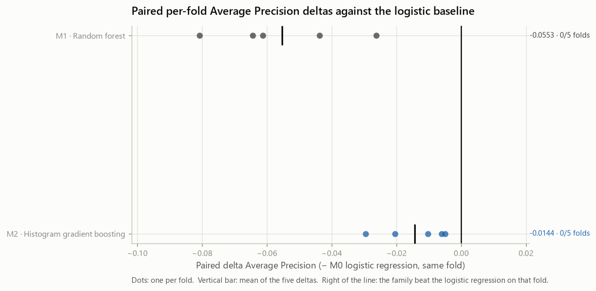
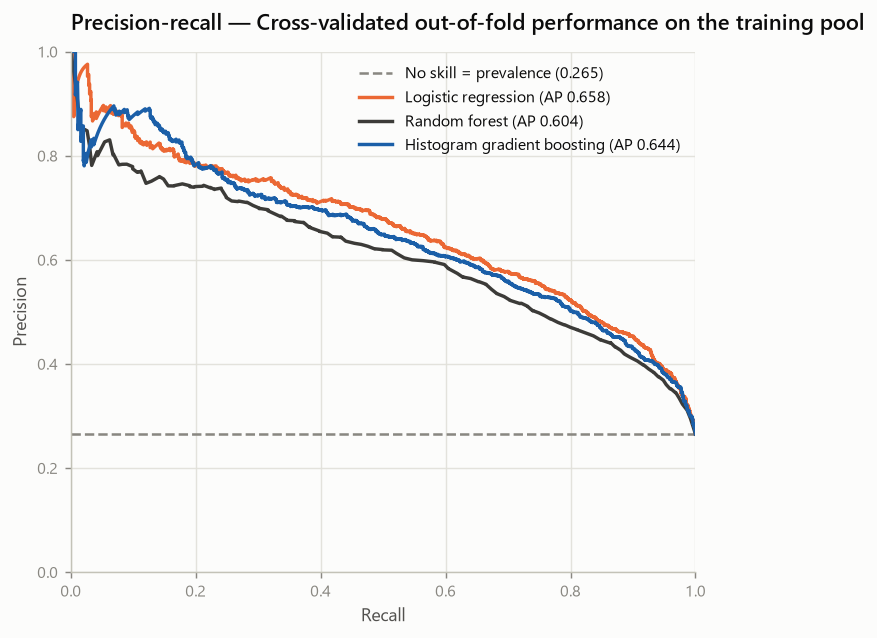
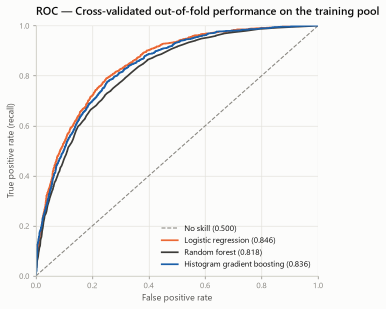
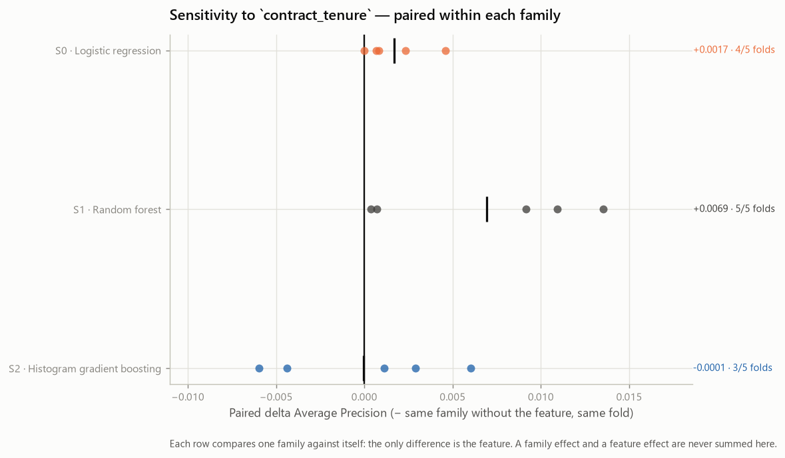

# Model Family Comparison — Telco Customer Churn (Phase 7)

- Generated on: 2026-08-13
- Generated by: `scripts/run_model_comparison.py`
- Machine-readable record: `reports/experiments/model_comparison_results.json`
- Raw SHA-256: `88be4b93fbe0cc83421af1c503794c97c342eca914c1576db7c276e61d61358a`
- Training partition fingerprint: `a553196dd46b672f6344867707144fbf56a8abe14b338a225662c7208a1450dd`

> **Every number here is cross-validated on the training pool.** No holdout row
> was loaded, transformed, predicted or measured. There is no test result in
> this repository before Phase 9.

---

## 1. Objective

One question:

> Does a non-linear model family improve predictive capability over logistic
> regression when data, features, preprocessing, folds and metrics are held
> constant?

And, separately, a second one:

> Does the manual interaction `contract_tenure` still contribute once the
> family can represent interactions by itself?

The two are answered apart, in sections 7-10 and 11 respectively. Mixing them
would produce a single number containing both a family effect and a feature
effect, from which neither could be recovered.

This phase **selects nothing and tunes nothing**. It produces evidence for a
review that happens before Phase 8.

## 2. Frozen protocol

| Element | Value |
| --- | --- |
| Data | Frozen Phase 4 training pool, 5,634 rows |
| Positive prevalence | 0.2654 |
| Cross-validation | `StratifiedKFold(n_splits=5, shuffle=True, random_state=42)` |
| Identical folds as Phases 5 and 6 | True |
| Primary metric | Average Precision |
| Secondary ranking metric | ROC-AUC |
| Diagnostics @ 0.5 | Precision, Recall, F1 (Accuracy auxiliary) |
| Threshold optimised | False |
| Hyperparameter tuning | False |
| Calibration | False |
| Seed | 42 |
| scikit-learn | 1.9.0 |

**Preprocessing is refitted inside every fold.** Each experiment is a complete
pipeline — `TotalChargesCleaner` → `ColumnTransformer` → classifier — cloned
fresh per fold, so the scaler's statistics, the encoder's categories and the
model's parameters are estimated on the training fold alone.

**Paired comparison.** Every delta is a per-fold difference on the identical
partition:

```text
delta_AP_fold  = AP_candidate_fold  - AP_reference_fold
delta_ROC_fold = ROC_candidate_fold - ROC_reference_fold
```

The between-fold standard deviation is **not** used as a bar a gain must clear:
it describes how one model varies across partitions, not the uncertainty of a
difference between two models measured on the same partitions. With five folds
no significance test is possible and none was run.

## 3. Why the representation is held constant

All three families receive the **same 46-column
matrix** produced from the 19 original features by the
same block:

```text
TotalChargesCleaner → StandardScaler (numeric) → OneHotEncoder(handle_unknown="ignore")
```

Holding this block constant is a design decision, not an oversight: it is what
makes the **estimator the only variable** between M0, M1 and M2. If one family
received its own encoding, its delta would measure *estimator plus
representation* against *estimator*, and no part of the difference could be
attributed to the family.

**A common representation is not necessarily the optimal representation for
every family.** Standardisation does not affect where a tree places a split, and
`HistGradientBoostingClassifier` can consume raw categories through
`categorical_features` rather than 46 one-hot
columns. Neither option is exercised here.

What follows is a scope statement about what these numbers estimate: the
performance of **the tested configurations under a common representation**, not
the ceiling of each algorithm. The comparison answers "what does swapping the
estimator do, holding everything else fixed". Whether a different representation
changes the ordering is a separate, unanswered question — a representation
experiment was not run in this phase.

## 4. Model families

| Experiment | Family | Estimator | Declared configuration |
| --- | --- | --- | --- |
| M0 | `logistic_regression` | `LogisticRegression` | `C=1.0`, `penalty=l2`, `class_weight=None`, `solver=lbfgs`, `max_iter=100` |
| M1 | `random_forest` | `RandomForestClassifier` | `n_estimators=100`, `criterion=gini`, `max_depth=None`, `min_samples_split=2`, `min_samples_leaf=1`, `max_features=sqrt`, `bootstrap=True`, `oob_score=False`, `class_weight=None`, `random_state=42`, `n_jobs=1` |
| M2 | `hist_gradient_boosting` | `HistGradientBoostingClassifier` | `loss=log_loss`, `learning_rate=0.1`, `max_iter=100`, `max_leaf_nodes=31`, `max_depth=None`, `min_samples_leaf=20`, `l2_regularization=0.0`, `max_features=1.0`, `early_stopping=False`, `class_weight=None`, `random_state=42` |

**M0 — Logistic regression.** Additive log-odds in the encoded features. It is the reference, not a candidate: every delta in this phase is measured against it. Frozen at the Phase 5 configuration and reproduced fold by fold before any other family is interpreted.
**M1 — Random forest.** Averaging deep, decorrelated trees captures interactions and non-monotone tenure and charge effects that a single additive slope cannot express. Fully grown trees on a 46-column one-hot matrix: variance is controlled by averaging alone, since no depth or leaf-size limit is imposed in this phase.
**M2 — Histogram gradient boosting.** Sequentially fitting shallow trees to the residual gradient targets the errors a linear model leaves behind, which is a different way of reaching the same interactions the forest averages over. Boosting is the family most sensitive to its learning parameters, so its untuned result is the weakest evidence of the three about what the family can do — and the strongest about what it does for free.

Every configuration above is the family's declared base configuration, fixed
before any result existed. No grid, no random search, no early stopping on an
internal split, no class weighting, no resampling. The full effective parameter
set of each estimator — including the defaults not shown here — is recorded in
`model_comparison_results.json` under `models[].effective_hyperparameters`.

## 5. Baseline reproduction

Two gates run before anything in this report is interpreted:

| Experiment | Reproduces | Artefact | Tolerance | Largest difference | Reproduced |
| --- | --- | --- | --- | --- | --- |
| M0 | `models[logistic_regression]` | `reports/experiments/baseline_results.json` | 1e-09 | 0.0e+00 | **True** |
| S0 | `experiments[E3]` | `reports/experiments/feature_engineering_results.json` | 1e-09 | 0.0e+00 | **True** |

M0 rebuilds the frozen Phase 5 logistic regression through the Phase 7 pipeline
builder; S0 rebuilds E3 of the Phase 6 ablation. Both compare **every per-fold
metric** against the stored artefact, and the run aborts if either fails. A
protocol that cannot reproduce its own references cannot attribute a difference
to a family or to a feature — the difference could be an artefact of the
pipeline being assembled differently.

## 6. Primary model-family comparison

Absolute cross-validated performance, mean ± sample standard deviation over
5 folds:

| Experiment | Model | Features | Transformed | ROC-AUC (secondary) | Average Precision (primary) | Precision @0.5 | Recall @0.5 | F1 @0.5 | Accuracy @0.5 |
| --- | --- | --- | --- | --- | --- | --- | --- | --- | --- |
| M0 | `logistic_regression` | 19 | 46 | 0.8461 ± 0.0140 | 0.6615 ± 0.0217 | 0.6521 ± 0.0286 | 0.5438 ± 0.0457 | 0.5924 ± 0.0333 | 0.8019 ± 0.0132 |
| M1 | `random_forest` | 19 | 46 | 0.8180 ± 0.0129 | 0.6062 ± 0.0296 | 0.6213 ± 0.0307 | 0.4870 ± 0.0246 | 0.5457 ± 0.0226 | 0.7849 ± 0.0112 |
| M2 | `hist_gradient_boosting` | 19 | 46 | 0.8364 ± 0.0061 | 0.6471 ± 0.0236 | 0.6439 ± 0.0259 | 0.5124 ± 0.0311 | 0.5703 ± 0.0254 | 0.7954 ± 0.0104 |


*Average Precision per fold, one column per family*

Per-fold Average Precision:

| Experiment | Model | F1 | F2 | F3 | F4 | F5 | Mean ± SD |
| --- | --- | --- | --- | --- | --- | --- | --- |
| M0 | `logistic_regression` | 0.6437 | 0.6355 | 0.6859 | 0.6782 | 0.6643 | **0.6615** ± 0.0217 |
| M1 | `random_forest` | 0.5628 | 0.5917 | 0.6245 | 0.6138 | 0.6380 | **0.6062** ± 0.0296 |
| M2 | `hist_gradient_boosting` | 0.6386 | 0.6149 | 0.6797 | 0.6486 | 0.6539 | **0.6471** ± 0.0236 |

Highest mean Average Precision: **M0 `logistic_regression`**
(0.6615). A ranking is not a verdict — whether that
lead is consistent and whether it is large enough to matter are the next two
sections.

## 7. Paired Average Precision comparison

The primary metric, paired fold by fold against M0:

| Experiment | Model | Reference | F1 | F2 | F3 | F4 | F5 | Mean | SD | +/− folds |
| --- | --- | --- | --- | --- | --- | --- | --- | --- | --- | --- |
| M1 | `random_forest` | M0 | -0.0808 | -0.0437 | -0.0614 | -0.0644 | -0.0263 | **-0.0553** | 0.0209 | 0/5 |
| M2 | `hist_gradient_boosting` | M0 | -0.0050 | -0.0206 | -0.0062 | -0.0296 | -0.0104 | **-0.0144** | 0.0105 | 0/5 |



*Paired per-fold Average Precision deltas vs the logistic baseline*

Read one at a time:

- **M1 `random_forest`** — -0.05531 AP (-8.36% relative), improving on its reference in 0/5 folds — material in size.
- **M2 `hist_gradient_boosting`** — -0.01436 AP (-2.17% relative), improving on its reference in 0/5 folds — material in size.

**Question A — does a non-linear family improve on the logistic regression?**

**No, and not marginally.** Neither non-linear family improved Average Precision over the logistic regression on this representation. 2 of 2 lost in **every one** of the 5 folds, so the direction is not a fold artefact — which is exactly what a paired comparison is for. Note what this does *not* say: it is a statement about these base configurations on a one-hot matrix, not about the ceiling of either family.

"Material" / "immaterial at this scale" compares the size of a delta against a
baseline AP of 0.6615, applied after the fact as a
reading aid. It classified nothing: no experiment in this phase was promoted,
discarded or ranked by it, and a small mean delta with a consistent direction is
exactly the case where five folds cannot distinguish a real effect from noise.

## 8. ROC-AUC comparison

The secondary ranking metric, on the same folds:

| Experiment | Model | Reference | F1 | F2 | F3 | F4 | F5 | Mean | SD | +/− folds |
| --- | --- | --- | --- | --- | --- | --- | --- | --- | --- | --- |
| M1 | `random_forest` | M0 | -0.0362 | -0.0196 | -0.0251 | -0.0464 | -0.0135 | **-0.0282** | 0.0132 | 0/5 |
| M2 | `hist_gradient_boosting` | M0 | -0.0111 | +0.0010 | -0.0042 | -0.0209 | -0.0133 | **-0.0097** | 0.0085 | 1/4 |

Per-fold ROC-AUC:

| Experiment | Model | F1 | F2 | F3 | F4 | F5 | Mean ± SD |
| --- | --- | --- | --- | --- | --- | --- | --- |
| M0 | `logistic_regression` | 0.8479 | 0.8251 | 0.8419 | 0.8629 | 0.8530 | **0.8461** ± 0.0140 |
| M1 | `random_forest` | 0.8117 | 0.8055 | 0.8168 | 0.8165 | 0.8394 | **0.8180** ± 0.0129 |
| M2 | `hist_gradient_boosting` | 0.8368 | 0.8261 | 0.8377 | 0.8420 | 0.8396 | **0.8364** ± 0.0061 |

ROC-AUC is reported as a second view of ranking quality, not as a tie-breaker. A
family that improves ROC-AUC while losing Average Precision has moved negatives
around more than it has improved churner retrieval, which on this problem is the
less useful of the two.

## 9. Out-of-fold comparison

Each of the 5,634 training rows received exactly one
prediction, produced by a model that never saw that row while fitting. Metrics
recomputed over the pooled out-of-fold predictions:

| Experiment | Model | ROC-AUC (secondary) | Average Precision (primary) | Precision @0.5 | Recall @0.5 | F1 @0.5 | Accuracy @0.5 |
| --- | --- | --- | --- | --- | --- | --- | --- |
| M0 | `logistic_regression` | 0.8456 | 0.6584 | 0.6520 | 0.5438 | 0.5930 | 0.8019 |
| M1 | `random_forest` | 0.8178 | 0.6044 | 0.6206 | 0.4870 | 0.5457 | 0.7849 |
| M2 | `hist_gradient_boosting` | 0.8361 | 0.6444 | 0.6437 | 0.5124 | 0.5706 | 0.7954 |



*Precision-recall from out-of-fold predictions on the training pool*



*ROC from out-of-fold predictions on the training pool*

These are **cross-validated out-of-fold results on the training pool**, not test
metrics, and must never be relabelled as such. Pooled OOF metrics are computed
on one merged score vector produced by five different fitted models, so they are
a slightly different quantity from the mean of the per-fold metrics; both are
reported and neither replaces the other.

## 10. Threshold-0.5 diagnostics

The decision rule was not moved. These describe one operating point:

| Experiment | Model | Precision @0.5 | Recall @0.5 | F1 @0.5 | Accuracy @0.5 |
| --- | --- | --- | --- | --- | --- |
| M0 | `logistic_regression` | 0.6521 | 0.5438 | 0.5924 | 0.8019 |
| M1 | `random_forest` | 0.6213 | 0.4870 | 0.5457 | 0.7849 |
| M2 | `hist_gradient_boosting` | 0.6439 | 0.5124 | 0.5703 | 0.7954 |

Accuracy is auxiliary and ranks nothing: at a 26.54%
positive rate a model that never predicts churn already reaches ~73%. Recall and
precision at 0.5 are a description of where the default cut-off happens to sit
on each model's score distribution — a model whose probabilities are shifted can
look worse here while ranking identically. Threshold selection is Phase 9.

## 11. Contract-tenure sensitivity

Phase 6 retained `contract_tenure` as a **candidate**, not as an adopted
feature. The question here is whether the manual interaction still contributes
once a family can represent interactions natively.

Each experiment is paired against **its own family** without the feature, so the
only difference inside each row is `contract_tenure`:

| Experiment | Model | Features | Transformed | ROC-AUC (secondary) | Average Precision (primary) | Precision @0.5 | Recall @0.5 | F1 @0.5 | Accuracy @0.5 |
| --- | --- | --- | --- | --- | --- | --- | --- | --- | --- |
| S0 | `logistic_regression` | 21 | 48 | 0.8471 ± 0.0139 | 0.6632 ± 0.0204 | 0.6581 ± 0.0243 | 0.5438 ± 0.0465 | 0.5949 ± 0.0334 | 0.8040 ± 0.0124 |
| S1 | `random_forest` | 21 | 48 | 0.8214 ± 0.0108 | 0.6131 ± 0.0257 | 0.6185 ± 0.0280 | 0.4910 ± 0.0291 | 0.5472 ± 0.0263 | 0.7845 ± 0.0114 |
| S2 | `hist_gradient_boosting` | 21 | 48 | 0.8370 ± 0.0092 | 0.6471 ± 0.0212 | 0.6451 ± 0.0329 | 0.5064 ± 0.0333 | 0.5668 ± 0.0268 | 0.7948 ± 0.0118 |

Paired Average Precision deltas:

| Experiment | Model | Reference | F1 | F2 | F3 | F4 | F5 | Mean | SD | +/− folds |
| --- | --- | --- | --- | --- | --- | --- | --- | --- | --- | --- |
| S0 | `logistic_regression` | M0 | +0.0008 | +0.0046 | +0.0007 | -0.0000 | +0.0023 | **+0.0017** | 0.0018 | 4/1 |
| S1 | `random_forest` | M1 | +0.0135 | +0.0092 | +0.0109 | +0.0007 | +0.0004 | **+0.0069** | 0.0060 | 5/0 |
| S2 | `hist_gradient_boosting` | M2 | -0.0060 | +0.0060 | -0.0044 | +0.0011 | +0.0029 | **-0.0001** | 0.0050 | 3/2 |

Paired ROC-AUC deltas:

| Experiment | Model | Reference | F1 | F2 | F3 | F4 | F5 | Mean | SD | +/− folds |
| --- | --- | --- | --- | --- | --- | --- | --- | --- | --- | --- |
| S0 | `logistic_regression` | M0 | -0.0011 | +0.0020 | +0.0004 | +0.0012 | +0.0024 | **+0.0010** | 0.0014 | 4/1 |
| S1 | `random_forest` | M1 | +0.0053 | +0.0067 | +0.0060 | -0.0007 | -0.0000 | **+0.0034** | 0.0035 | 3/2 |
| S2 | `hist_gradient_boosting` | M2 | -0.0043 | -0.0016 | -0.0011 | +0.0054 | +0.0046 | **+0.0006** | 0.0042 | 2/3 |



*Sensitivity to contract_tenure, paired within each family*

Read one at a time:

- **S0 `logistic_regression`** — +0.00168 AP (+0.25% relative), improving on its reference in 4/5 folds — immaterial at this scale, ROC-AUC +0.00096.
- **S1 `random_forest`** — +0.00694 AP (+1.15% relative), improving on its reference in 5/5 folds — material in size, ROC-AUC +0.00345.
- **S2 `hist_gradient_boosting`** — -0.00006 AP (-0.01% relative), improving on its reference in 3/5 folds — immaterial at this scale, ROC-AUC +0.00060.

S0 is E3 of Phase 6, reproduced exactly (section 5), so the logistic row carries
no new information — it is the control that proves the sensitivity analysis is
measuring the same thing Phase 6 measured. The tree rows are the new evidence.

**Question B — does the manual interaction still contribute when the family can
learn interactions itself?**

The largest sensitivity gain is **S1 `random_forest`** at +0.00694 AP in 5/5 folds. Read it in context: that family sits 0.0553 AP **below** M0 without the feature, so the gain recovers part of its own deficit rather than adding anything over the reference model. A feature helping a weaker model is evidence about that model, not about the feature's value to the project. The two families that can express an interaction without being told
about it are precisely the two where the answer matters, and they disagree with
each other — which is itself the finding: one explicit interaction column is not
uniformly redundant for a tree ensemble, nor uniformly useful.

The four Phase 6 candidates that did not pass its heuristic —
`protective_services`, `automatic_payment`, `historical_average_charge`,
`charge_intensity` — were **not** reopened. Re-running every rejected candidate
against every new family would turn a controlled comparison into a search over
feature-set × family cells, which is how a leaderboard eventually finds a lucky
combination.

## 12. Complexity and interpretability trade-offs

| Family | Fitted objects | Interpretability | Inference cost | Fitted state to persist |
| --- | --- | --- | --- | --- |
| `logistic_regression` | 1 coefficient vector (46 weights) | Direct: one signed coefficient per column, odds-ratio readable | One dot product | Smallest |
| `random_forest` | 100 unpruned trees | Indirect: impurity or permutation importance, no single signed effect | 100 tree traversals | Largest |
| `hist_gradient_boosting` | 100 boosted trees over binned features | Indirect: same, plus an additive stage structure | 100 shallow traversals | Middle |

A non-linear family is not merely "more accurate or not". It costs
interpretability, which this project needs in Phase 10; it costs a larger
artefact to persist, version and monitor; and it costs a fitting procedure with
more parameters that can silently change behaviour between versions. Those costs
are worth paying for a gain that is consistent and large enough to matter
operationally — and the paired deltas in section 7 are the evidence on which
that judgement has to be made, not the ranking in section 6.

## 13. Limitations

- **No holdout estimate.** Everything is training-pool cross-validation.
- **Five folds, no significance test.** The deltas describe direction and
  consistency; they are not statistical claims.
- **Untuned configurations.** Each family ran one declared configuration. A
  family's result here is not that family's ceiling, and boosting in particular
  is the family most sensitive to its learning parameters.
- **One representation, chosen to isolate the estimator.** It is held constant
  by design and is not necessarily optimal for every family, so these results
  estimate the performance of the tested configurations under a common
  representation rather than the ceiling of each algorithm.
- **No calibration.** Probability quality was not measured and was not used to
  rank anything; ranking metrics say nothing about whether a 0.7 means 70%.
- **No class-imbalance handling.** `class_weight` is `None` everywhere.
- **The analyst-exposure limitation from Phase 3 still applies.**
- **Snapshot classification, not forecasting.** The dataset has no time
  dimension.

## 14. What was deliberately not tested

| Not tested | Why | Where it belongs |
| --- | --- | --- |
| Number of trees, depth, learning rate, regularisation | This is a family comparison at base configuration | Phase 8 |
| `class_weight`, resampling | A separate lever, and one that interacts with the threshold | Phase 8/9 |
| Native categorical handling in `HistGradientBoosting` | Would vary the representation together with the estimator | A representation experiment |
| Out-of-bag scoring for the forest | A second, differently-computed number invites selecting on it | — |
| Early stopping | Model selection inside a training fold | Phase 8, if at all |
| XGBoost, LightGBM, CatBoost | No dependency was added; three families already answer the question | — |
| Threshold movement, calibration, cost framing | Not this phase's question | Phase 9 |
| The four Phase 6 candidates that did not pass its heuristic | Closed by the Phase 6 protocol | — |

## 15. Candidates carried to Phase 8

This section records what the evidence supports carrying forward. It does not
authorise tuning: that decision is taken by a reviewer, after reading sections
7 to 12.

| Family | Status going into Phase 8 |
| --- | --- |
| `logistic_regression` | mean AP 0.6615 (reference) |
| `random_forest` | mean AP 0.6062, paired -0.05531 vs M0 in 0/5 folds |
| `hist_gradient_boosting` | mean AP 0.6471, paired -0.01436 vs M0 in 0/5 folds |

`contract_tenure` remains a **retained candidate**, now with per-family
evidence (section 11) instead of logistic-only evidence. It was not adopted into
any feature set, and the 19 original features remain
the reference representation.

Nothing here has been tuned, calibrated, thresholded or evaluated on the
holdout, and no family has been selected.
