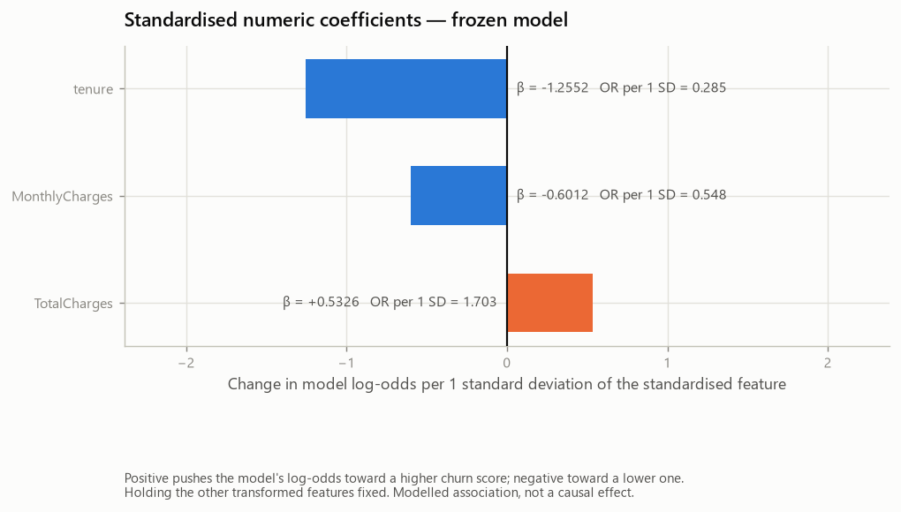
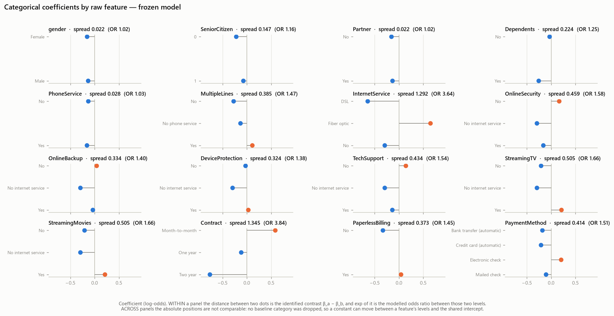
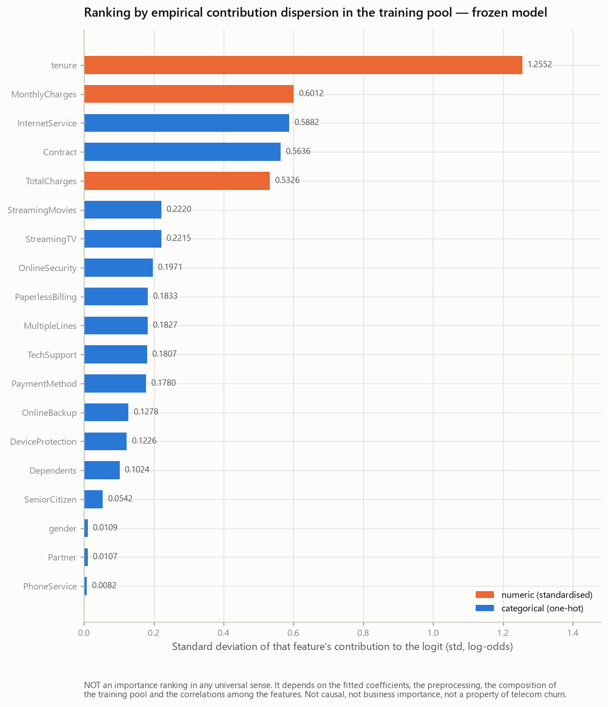
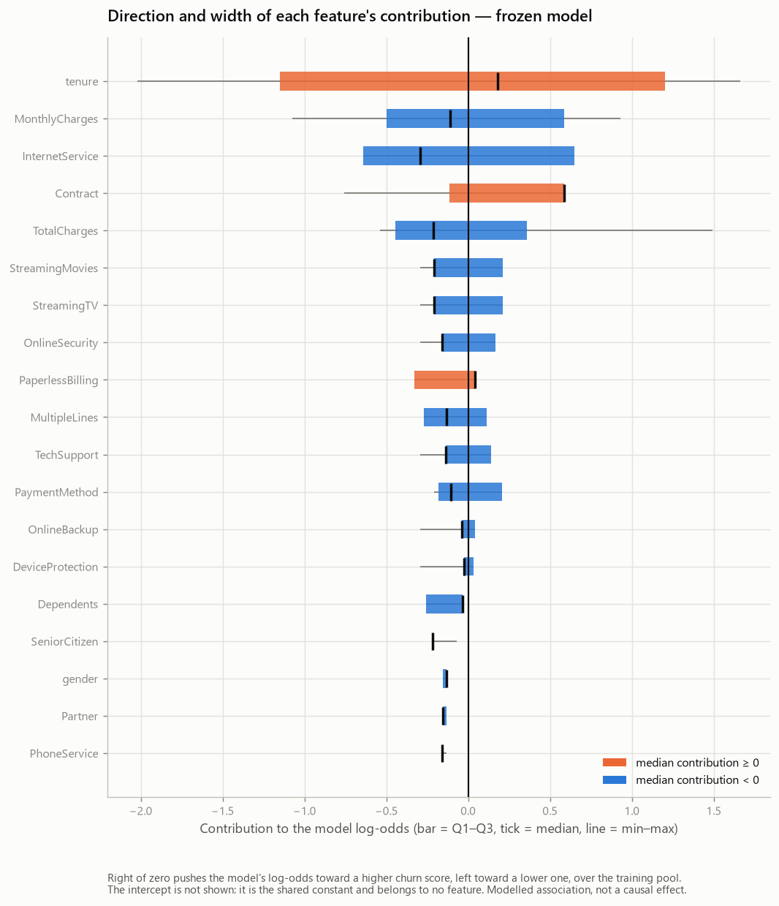

# Model Interpretation — Telco Customer Churn (Phase 10)

- Generated by: `scripts/run_model_interpretation.py`
- Machine-readable record: `reports/experiments/model_interpretation_results.json`
- Model frozen in: `9d1db49` — feat: freeze final churn model and decision policy
- Final estimate in: `8c8e266` — feat: evaluate frozen churn model on final holdout
- Error analysis in: `5e9c4e9` — feat: analyze final churn prediction errors

> **This report carries no generation date.** It is a pure function of its
> inputs, so re-running the generator on an unchanged repository reproduces it
> byte for byte and any diff is a real change. Git records when it was produced.

---

## 1. Scope

This phase answers one question:

> **How does the frozen model turn the 19 contracted features into an
> estimated churn score?**

It does **not** answer "how could the model be better". That question is closed:
the estimator, the preprocessing, the feature set, the calibration policy and the
threshold were frozen in `9d1db49`, measured once in
`8c8e266` and diagnosed in
`5e9c4e9`. Nothing in this report may change
any of them, and nothing in it was chosen because of what the earlier phases
found.

| Property | Value |
| --- | --- |
| `analysis_type` | **FROZEN_MODEL_INTERPRETATION** |
| `selection_allowed` | **False** |
| `model_change_allowed` | **False** |
| `fit_calls` | **0** |
| `holdout_used_for_global_interpretation` | **False** |
| Interpretation population | **training pool**, 5,634 rows |

### What this phase deliberately did not do

| Not done | Count / flag |
| --- | --- |
| Fits of any kind | 0 |
| Alternative models evaluated | 0 |
| Thresholds scored | 0 |
| Calibrations | 0 |
| Hyperparameter searches | 0 |
| Feature selections | 0 |
| Features added / removed | 0 / 0 |
| New performance estimates | 0 |
| New dependencies added | 0 |
| SHAP used | False |
| LIME / ELI5 used | False / False |
| Permutation importance used | False |
| Partial dependence / ICE used | False / False |
| Holdout loaded | False |
| Identifiers persisted | False |
| Individual explanations persisted | False |
| Causal claims | False |

**Why the training pool and not the holdout.** The holdout was consumed by the
Phase 9D evaluation. Ranking features on it — deciding, after the fact, which
inputs "matter" using the sample that produced the final estimate — is post-hoc
mining of a spent partition, and it would contaminate the one number this project
still relies on. The global interpretation therefore runs on the
5,634 rows of the training pool, which is also the population
the coefficients and the scaler statistics were learned from. The Phase 10
modules do not import `load_holdout` at all.

**Why the Phase 9E findings did not steer this report.** All
19 raw features and all 46
transformed columns are reported. None was included, excluded, highlighted or
suppressed because of an error pattern observed in the holdout.

## 2. Frozen model being interpreted

| Property | Value |
| --- | --- |
| Estimator | `LogisticRegression` |
| Hyperparameters | `C = 1.0`, `l1_ratio = 0.0`, `solver = lbfgs`, `class_weight = None`, `max_iter = 100` |
| `classes_` | `[0, 1]` |
| Positive class | label `1`, column `1` |
| Positive class resolution | resolved from classifier.classes_, never assumed. decision_function scores classes_[1], which is the positive class here |
| `intercept_` | **-0.5300483006137556** |
| `n_iter_` | `[42]` (converged: True, max 100) |
| Original features | **19** (3 numeric, 16 categorical) |
| Transformed features | **46** |
| Coefficients | **46** |
| Engineered features | `[]` |
| `calibration_policy` | **NONE** |
| `threshold_policy` | **F1_MAXIMIZATION** |
| `final_threshold` | **0.3272694566222328** |
| Model fingerprint verified after load | **True** |
| Pipeline unchanged by this phase | **True** |
| Refitted here | False |

| Artefact | SHA-256 |
| --- | --- |
| `reports/split_manifest.json` | `834eb1313536c49e…` |
| `reports/decision_policy.json` | `bd7aa800ae36ac04…` |
| `reports/model_freeze_report.md` | `01a00472a3366327…` |
| `reports/holdout_evaluation_report.md` | `fdab7ad2005b1aff…` |
| `reports/error_analysis_report.md` | `826658b6ea807aaf…` |
| `reports/experiments/baseline_results.json` | `2bd6eb992a4ed235…` |
| `reports/experiments/feature_engineering_results.json` | `bd8a3f03df405f7b…` |
| `reports/experiments/model_comparison_results.json` | `648aca646146e6bc…` |
| `reports/experiments/hgb_representation_results.json` | `794bd1bde4a78240…` |
| `reports/experiments/tuning_results.json` | `d9d245e22fc89320…` |
| `reports/experiments/calibration_results.json` | `0119ca11c5c47190…` |
| `reports/experiments/threshold_results.json` | `6e58772b7fc954f1…` |
| `reports/experiments/holdout_results.json` | `de174fe94dd49206…` |
| `reports/experiments/error_analysis_results.json` | `004a6d3b6d0a033e…` |

## 3. Exact mathematical model

The frozen estimator is a logistic regression, so its response surface is known
in closed form rather than approximated:

```text
logit(P(Churn = 1 | x)) = intercept + Σ_j  coefficient_j × transformed_feature_j

P(Churn = 1 | x)        = sigmoid(logit) = 1 / (1 + exp(−logit))
```

with `intercept = -0.5300483006137556` and 46 coefficients,
one per transformed column.

Regrouping the 46 transformed columns into the
19 raw features they came from is exact, because the columns
partition:

```text
logit = intercept + Σ_g  contribution_g(x)

contribution_g(x) = Σ_{j ∈ g}  coefficient_j × z_j
```

- **numeric:** `contribution = coefficient × (raw_value − scaler_mean) / scaler_scale`
- **categorical:** `contribution =` the coefficient of the **active level**; the
  feature's other columns are zero, and an unseen category is all-zeros under
  `handle_unknown="ignore"`.

### The frozen decision boundary, in log-odds

The threshold is the frozen one. Expressing it in log-odds is a change of
coordinates on the **same** rule, not a new threshold:

```text
threshold_logit = log(threshold / (1 − threshold))
                = log(0.3272694566222328 / (1 − 0.3272694566222328))
                = -0.7205610102182292
```

A customer is classified positive when

```text
model_logit >= -0.7205610102182292      (equivalently  probability >= 0.3272694566222328)
```

which closes the chain this phase exists to make visible:

```text
feature contributions → logit → probability → frozen threshold → decision
```

`threshold_changed_here: False` ·
`calibration_changed_here: False` ·
`alternative_thresholds_scored: 0`

## 4. Reconstruction proof

An interpretation of a model that does not reproduce that model's own decision
function is not an interpretation of it. Three comparisons run over all
5,634 rows of the training pool, and the
phase **aborts** on any failure:

| Check | Reconstructed as | Compared against | Max absolute error |
| --- | --- | --- | --- |
| Logit | `intercept + Z @ coefficients` | `pipeline.decision_function(X)` | **0.000e+00** |
| Probability | `sigmoid(manual_logit)` | `pipeline.predict_proba(X)[:, positive_class_column]` | **1.110e-16** |
| Grouped logit | `intercept + Σ` of the 19 contributions | `pipeline.decision_function(X)` | **1.776e-15** |

Tolerance: **1e-12** · within tolerance:
**True**.

Both quantities are order 1 and are computed as a dot product of 46 float64 terms, so the accumulated rounding error is bounded by a few multiples of 2**-52 ~ 2.2e-16. The tolerance sits about four orders of magnitude above that noise floor and far below any error that would signal a wrong column, a missed intercept or a transposed coefficient.

The third row is the one that matters for everything below section 6: it proves
that regrouping the 43
one-hot columns into their 16 parent features loses
nothing and counts nothing twice.

### How the 46 columns map onto the 19 features

The mapping is derived from the **fitted encoder's own structure** —
`textual_parsing_used: False`. The
`ColumnTransformer` emits its numeric block first, one column per scaled feature,
then `len(categories_[i])` consecutive columns for the i-th categorical feature.
Splitting a name such as `categorical__PaymentMethod_Mailed check` on `_` would be
the fragile alternative, since both the separator and the level values contain the
delimiter. The generated names are used only to cross-check the result
(`cross_checked_against_generated_names: True`), and the
partition is verified explicitly
(`partition_verified: True`).

| Raw feature | Kind | Transformed columns | Levels |
| --- | --- | --- | --- |
| `tenure` | numeric | 0 (1) | — |
| `MonthlyCharges` | numeric | 1 (1) | — |
| `TotalCharges` | numeric | 2 (1) | — |
| `gender` | categorical | 3–4 (2) | `Female`, `Male` |
| `SeniorCitizen` | categorical | 5–6 (2) | `0`, `1` |
| `Partner` | categorical | 7–8 (2) | `No`, `Yes` |
| `Dependents` | categorical | 9–10 (2) | `No`, `Yes` |
| `PhoneService` | categorical | 11–12 (2) | `No`, `Yes` |
| `MultipleLines` | categorical | 13–15 (3) | `No`, `No phone service`, `Yes` |
| `InternetService` | categorical | 16–18 (3) | `DSL`, `Fiber optic`, `No` |
| `OnlineSecurity` | categorical | 19–21 (3) | `No`, `No internet service`, `Yes` |
| `OnlineBackup` | categorical | 22–24 (3) | `No`, `No internet service`, `Yes` |
| `DeviceProtection` | categorical | 25–27 (3) | `No`, `No internet service`, `Yes` |
| `TechSupport` | categorical | 28–30 (3) | `No`, `No internet service`, `Yes` |
| `StreamingTV` | categorical | 31–33 (3) | `No`, `No internet service`, `Yes` |
| `StreamingMovies` | categorical | 34–36 (3) | `No`, `No internet service`, `Yes` |
| `Contract` | categorical | 37–39 (3) | `Month-to-month`, `One year`, `Two year` |
| `PaperlessBilling` | categorical | 40–41 (2) | `No`, `Yes` |
| `PaymentMethod` | categorical | 42–45 (4) | `Bank transfer (automatic)`, `Credit card (automatic)`, `Electronic check`, `Mailed check` |

## 5. Numeric features

The three numeric features pass through `StandardScaler`, so the fitted
coefficient belongs to the **standardised** column: it is the change in the
model's log-odds per one standard deviation of that feature *as measured on the
training pool*.

| Feature | `standardized_coefficient` | `scaler_mean` | `scaler_scale` | `raw_logit_coefficient` | `odds_ratio_per_1_sd` | Raw unit |
| --- | --- | --- | --- | --- | --- | --- |
| `tenure` | -1.255202 | 32.485091 | 24.566563 | -0.05109392 | 0.285018 | one month of tenure |
| `MonthlyCharges` | -0.601168 | 64.929961 | 30.135431 | -0.01994888 | 0.548171 | one monetary unit of the dataset's monthly charge scale |
| `TotalCharges` | +0.532592 | 2299.334682 | 2279.001996 | +0.00023370 | 1.703341 | one monetary unit of the dataset's total charge scale |



*Standardised numeric coefficients of the frozen model*

**How to read `odds_ratio_per_1_sd`.** It is `exp(β)`, and it means:

> the multiplicative change in the **odds predicted by the model** for an increase
> of one standard deviation in that standardised feature, holding every other
> transformed feature constant.

It is a property of the frozen predictive function. It is **not** a statement that
changing the underlying attribute of a real customer would change their behaviour.

**How to read `raw_logit_coefficient`.** It is `β / scaler_scale`, an exact
algebraic re-expression of the same linear term — the transformed value is
`(x − mean) / scale`, so the derivative of the term with respect to the raw `x` is
`β / scale`. It is the same model in different units, not a second estimate, and no
increment was chosen after looking at the results to make an effect look larger:
the units are one month of tenure and one monetary unit of the dataset's own
charge scales.

## 6. Categorical features

**The one-hot encoding has no dropped baseline.** Every level of every categorical
feature has its own column, and the model also has an intercept. That
parameterisation is redundant: a constant can be added to every level of one
feature and subtracted from the intercept without changing a single prediction.
L2 regularisation picks one point in that family.

The consequence is concrete and governs this whole section:

> **`exp(β)` of a single level is NOT an odds ratio against a reference category**,
> because there is no reference category. `reference_level_declared: False`.

What **is** identified — invariant to that shift — is the **within-feature
contrast**:

```text
Δ log-odds(A vs B) = β_A − β_B
modelled_odds_ratio(A vs B) = exp(β_A − β_B)
```

> This is a contrast **inside the frozen predictive function**, holding every other
> transformed feature constant. It is not a causal estimate.

| Feature | Levels | Lowest β level | Highest β level | `spread` | `max_pairwise_modeled_odds_ratio` | Structurally coupled level |
| --- | --- | --- | --- | --- | --- | --- |
| `gender` | 2 | `Female` (-0.1552) | `Male` (-0.1333) | 0.0219 | 1.0221 | — |
| `SeniorCitizen` | 2 | `0` (-0.2176) | `1` (-0.0709) | 0.1467 | 1.1580 | — |
| `Partner` | 2 | `No` (-0.1550) | `Yes` (-0.1335) | 0.0215 | 1.0217 | — |
| `Dependents` | 2 | `Yes` (-0.2562) | `No` (-0.0324) | 0.2238 | 1.2508 | — |
| `PhoneService` | 2 | `Yes` (-0.1581) | `No` (-0.1305) | 0.0276 | 1.0279 | `No` |
| `MultipleLines` | 3 | `No` (-0.2714) | `Yes` (+0.1134) | 0.3848 | 1.4693 | `No phone service` |
| `InternetService` | 3 | `DSL` (-0.6436) | `Fiber optic` (+0.6480) | 1.2917 | 3.6389 | `No` |
| `OnlineSecurity` | 3 | `No internet service` (-0.2930) | `No` (+0.1655) | 0.4585 | 1.5817 | `No internet service` |
| `OnlineBackup` | 3 | `No internet service` (-0.2930) | `No` (+0.0415) | 0.3345 | 1.3972 | `No internet service` |
| `DeviceProtection` | 3 | `No internet service` (-0.2930) | `Yes` (+0.0308) | 0.3238 | 1.3823 | `No internet service` |
| `TechSupport` | 3 | `No internet service` (-0.2930) | `No` (+0.1413) | 0.4343 | 1.5438 | `No internet service` |
| `StreamingTV` | 3 | `No internet service` (-0.2930) | `Yes` (+0.2119) | 0.5049 | 1.6568 | `No internet service` |
| `StreamingMovies` | 3 | `No internet service` (-0.2930) | `Yes` (+0.2123) | 0.5052 | 1.6574 | `No internet service` |
| `Contract` | 3 | `Two year` (-0.7594) | `Month-to-month` (+0.5860) | 1.3454 | 3.8397 | — |
| `PaperlessBilling` | 2 | `No` (-0.3307) | `Yes` (+0.0422) | 0.3729 | 1.4519 | — |
| `PaymentMethod` | 4 | `Credit card (automatic)` (-0.2086) | `Electronic check` (+0.2056) | 0.4142 | 1.5131 | — |

`spread` is **not** called importance: it is the width of a feature's coefficient
range, which bounds how much that feature could move the logit *if* a customer's
level changed. It says nothing about how often levels differ in any population —
that is what section 7 adds.



*Categorical coefficients, faceted by raw feature*

### 6.1 Structural coupling between raw features

A contrast `β_A − β_B` is always an exact statement about the linear function. It
is **not** automatically a statement about a change a customer could undergo, and
in this dataset the two come apart for a specific, checkable reason: some encoded
states are tied to each other.

**The relationships were declared first, then verified — not assumed.** The
candidates come from the product semantics recorded in the Phase 2 data
dictionary (a sentinel such as `No internet service` exists *because* the customer
has no internet), never from the model's coefficients and never from the holdout
(`holdout_used: False`). Each one was
then counted row by row on the 5,634
rows of the training pool:

| Verified equivalence | Rows checked | Rows on both sides | Left only | Right only | Violations | Deterministic |
| --- | --- | --- | --- | --- | --- | --- |
| `InternetService=No <-> OnlineSecurity=No internet service` | 5,634 | 1,214 | 0 | 0 | **0** | **True** |
| `InternetService=No <-> OnlineBackup=No internet service` | 5,634 | 1,214 | 0 | 0 | **0** | **True** |
| `InternetService=No <-> DeviceProtection=No internet service` | 5,634 | 1,214 | 0 | 0 | **0** | **True** |
| `InternetService=No <-> TechSupport=No internet service` | 5,634 | 1,214 | 0 | 0 | **0** | **True** |
| `InternetService=No <-> StreamingTV=No internet service` | 5,634 | 1,214 | 0 | 0 | **0** | **True** |
| `InternetService=No <-> StreamingMovies=No internet service` | 5,634 | 1,214 | 0 | 0 | **0** | **True** |
| `PhoneService=No <-> MultipleLines=No phone service` | 5,634 | 559 | 0 | 0 | **0** | **True** |

7 of
7 rules hold on **every** row;
0 have violations. A rule's
`deterministic_in_training_pool` is *derived* from its violation count, so a rule
with even one violation cannot report itself as structural, and only deterministic
rules are allowed to qualify a contrast.

### What that does to the transformed matrix

If two raw states are the same state, their one-hot columns are the **same
vector**. That was checked directly, column against column, on the same
population:

**Block of 2 identical columns** — active on 559 rows.

| Raw feature | Level | Column | Coefficient |
| --- | --- | --- | --- |
| `PhoneService` | `No` | 11 | -0.1305052099 |
| `MultipleLines` | `No phone service` | 14 | -0.1305052099 |

- Largest difference between any two of these coefficients: **0.0e+00**
- Aggregate the model actually applies when the state is active: **-0.2610104199**
- Even split across 2 columns: **-0.1305052099** each

**Block of 7 identical columns** — active on 1,214 rows.

| Raw feature | Level | Column | Coefficient |
| --- | --- | --- | --- |
| `InternetService` | `No` | 18 | -0.2929549704 |
| `OnlineSecurity` | `No internet service` | 20 | -0.2929549704 |
| `OnlineBackup` | `No internet service` | 23 | -0.2929549704 |
| `DeviceProtection` | `No internet service` | 26 | -0.2929549704 |
| `TechSupport` | `No internet service` | 29 | -0.2929549704 |
| `StreamingTV` | `No internet service` | 32 | -0.2929549704 |
| `StreamingMovies` | `No internet service` | 35 | -0.2929549704 |

- Largest difference between any two of these coefficients: **0.0e+00**
- Aggregate the model actually applies when the state is active: **-2.0506847930**
- Even split across 7 columns: **-0.2929549704** each

**How to read the repeated coefficients.** The equal values are not six or seven
independent findings. Those columns are perfectly collinear, so the model's
parameters are not identified along that direction: any redistribution of the
block's total among its columns produces *identical predictions*. The L2 penalty
resolves the tie by splitting the shared weight evenly, which is exactly what the
pairwise differences above show — they are zero to the last bit. Stated plainly:

> **The repeated `No internet service` coefficients must not be read as
> independent evidence from several services.** Those encoded states are
> structurally coupled in this dataset, so the regularised model distributes one
> underlying no-internet state across redundant indicators. The quantity the model
> actually applies when that state is active is the block **aggregate**; the
> per-column values are one point in a family of equivalent parameterisations.

**What this does not change.** The decomposition remains exactly correct for *this*
frozen pipeline — section 4's three gates are unaffected, and every coefficient and
every contrast is still reported in full
(`contrasts_removed_or_altered: False`,
`coefficients_removed_or_altered: False`). What
changes is the *attribution*: how the total is split among raw features depends on
the parameterisation the model happened to use, not on the world.

### Levels and coefficients, feature by feature

#### gender

| Level | Coefficient (log-odds) | Structurally coupled |
| --- | --- | --- |
| `Female` | -0.155230 | no |
| `Male` | -0.133340 | no |

Widest within-feature contrast: `Male` against `Female`, Δ log-odds **+0.0219**, modelled odds ratio **1.0221**.

#### SeniorCitizen

| Level | Coefficient (log-odds) | Structurally coupled |
| --- | --- | --- |
| `0` | -0.217646 | no |
| `1` | -0.070924 | no |

Widest within-feature contrast: `1` against `0`, Δ log-odds **+0.1467**, modelled odds ratio **1.1580**.

#### Partner

| Level | Coefficient (log-odds) | Structurally coupled |
| --- | --- | --- |
| `No` | -0.155036 | no |
| `Yes` | -0.133534 | no |

Widest within-feature contrast: `Yes` against `No`, Δ log-odds **+0.0215**, modelled odds ratio **1.0217**.

#### Dependents

| Level | Coefficient (log-odds) | Structurally coupled |
| --- | --- | --- |
| `No` | -0.032387 | no |
| `Yes` | -0.256183 | no |

Widest within-feature contrast: `No` against `Yes`, Δ log-odds **+0.2238**, modelled odds ratio **1.2508**.

#### PhoneService

| Level | Coefficient (log-odds) | Structurally coupled |
| --- | --- | --- |
| `No` | -0.130505 | **yes** |
| `Yes` | -0.158065 | no |

Widest within-feature **algebraic** contrast: `No` against `Yes`, Δ log-odds **+0.0276**, modelled odds ratio **1.0279**.

> One of these levels is **structurally coupled** to another raw feature (section 6.1). The difference above is exact, but it is an *algebraic* contrast: changing only this feature between those two levels would describe a row that does not occur in the training pool. `raw_single_feature_counterfactual_supported: false`.

#### MultipleLines

| Level | Coefficient (log-odds) | Structurally coupled |
| --- | --- | --- |
| `No` | -0.271429 | no |
| `No phone service` | -0.130505 | **yes** |
| `Yes` | +0.113364 | no |

Widest within-feature contrast: `Yes` against `No`, Δ log-odds **+0.3848**, modelled odds ratio **1.4693**.

#### InternetService

| Level | Coefficient (log-odds) | Structurally coupled |
| --- | --- | --- |
| `DSL` | -0.643642 | no |
| `Fiber optic` | +0.648027 | no |
| `No` | -0.292955 | **yes** |

Widest within-feature contrast: `Fiber optic` against `DSL`, Δ log-odds **+1.2917**, modelled odds ratio **3.6389**.

#### OnlineSecurity

| Level | Coefficient (log-odds) | Structurally coupled |
| --- | --- | --- |
| `No` | +0.165550 | no |
| `No internet service` | -0.292955 | **yes** |
| `Yes` | -0.161164 | no |

Widest within-feature **algebraic** contrast: `No` against `No internet service`, Δ log-odds **+0.4585**, modelled odds ratio **1.5817**.

> One of these levels is **structurally coupled** to another raw feature (section 6.1). The difference above is exact, but it is an *algebraic* contrast: changing only this feature between those two levels would describe a row that does not occur in the training pool. `raw_single_feature_counterfactual_supported: false`.

#### OnlineBackup

| Level | Coefficient (log-odds) | Structurally coupled |
| --- | --- | --- |
| `No` | +0.041500 | no |
| `No internet service` | -0.292955 | **yes** |
| `Yes` | -0.037115 | no |

Widest within-feature **algebraic** contrast: `No` against `No internet service`, Δ log-odds **+0.3345**, modelled odds ratio **1.3972**.

> One of these levels is **structurally coupled** to another raw feature (section 6.1). The difference above is exact, but it is an *algebraic* contrast: changing only this feature between those two levels would describe a row that does not occur in the training pool. `raw_single_feature_counterfactual_supported: false`.

#### DeviceProtection

| Level | Coefficient (log-odds) | Structurally coupled |
| --- | --- | --- |
| `No` | -0.026421 | no |
| `No internet service` | -0.292955 | **yes** |
| `Yes` | +0.030806 | no |

Widest within-feature **algebraic** contrast: `Yes` against `No internet service`, Δ log-odds **+0.3238**, modelled odds ratio **1.3823**.

> One of these levels is **structurally coupled** to another raw feature (section 6.1). The difference above is exact, but it is an *algebraic* contrast: changing only this feature between those two levels would describe a row that does not occur in the training pool. `raw_single_feature_counterfactual_supported: false`.

#### TechSupport

| Level | Coefficient (log-odds) | Structurally coupled |
| --- | --- | --- |
| `No` | +0.141320 | no |
| `No internet service` | -0.292955 | **yes** |
| `Yes` | -0.136935 | no |

Widest within-feature **algebraic** contrast: `No` against `No internet service`, Δ log-odds **+0.4343**, modelled odds ratio **1.5438**.

> One of these levels is **structurally coupled** to another raw feature (section 6.1). The difference above is exact, but it is an *algebraic* contrast: changing only this feature between those two levels would describe a row that does not occur in the training pool. `raw_single_feature_counterfactual_supported: false`.

#### StreamingTV

| Level | Coefficient (log-odds) | Structurally coupled |
| --- | --- | --- |
| `No` | -0.207537 | no |
| `No internet service` | -0.292955 | **yes** |
| `Yes` | +0.211922 | no |

Widest within-feature **algebraic** contrast: `Yes` against `No internet service`, Δ log-odds **+0.5049**, modelled odds ratio **1.6568**.

> One of these levels is **structurally coupled** to another raw feature (section 6.1). The difference above is exact, but it is an *algebraic* contrast: changing only this feature between those two levels would describe a row that does not occur in the training pool. `raw_single_feature_counterfactual_supported: false`.

#### StreamingMovies

| Level | Coefficient (log-odds) | Structurally coupled |
| --- | --- | --- |
| `No` | -0.207885 | no |
| `No internet service` | -0.292955 | **yes** |
| `Yes` | +0.212270 | no |

Widest within-feature **algebraic** contrast: `Yes` against `No internet service`, Δ log-odds **+0.5052**, modelled odds ratio **1.6574**.

> One of these levels is **structurally coupled** to another raw feature (section 6.1). The difference above is exact, but it is an *algebraic* contrast: changing only this feature between those two levels would describe a row that does not occur in the training pool. `raw_single_feature_counterfactual_supported: false`.

#### Contract

| Level | Coefficient (log-odds) | Structurally coupled |
| --- | --- | --- |
| `Month-to-month` | +0.585998 | no |
| `One year` | -0.115166 | no |
| `Two year` | -0.759402 | no |

Widest within-feature contrast: `Month-to-month` against `Two year`, Δ log-odds **+1.3454**, modelled odds ratio **3.8397**.

#### PaperlessBilling

| Level | Coefficient (log-odds) | Structurally coupled |
| --- | --- | --- |
| `No` | -0.330735 | no |
| `Yes` | +0.042165 | no |

Widest within-feature contrast: `Yes` against `No`, Δ log-odds **+0.3729**, modelled odds ratio **1.4519**.

#### PaymentMethod

| Level | Coefficient (log-odds) | Structurally coupled |
| --- | --- | --- |
| `Bank transfer (automatic)` | -0.180296 | no |
| `Credit card (automatic)` | -0.208583 | no |
| `Electronic check` | +0.205585 | no |
| `Mailed check` | -0.105276 | no |

Widest within-feature contrast: `Electronic check` against `Credit card (automatic)`, Δ log-odds **+0.4142**, modelled odds ratio **1.5131**.

## 7. Contribution dispersion by original feature

Section 5 compares three standardised coefficients with one another and section 6
compares levels within a feature. Neither gives a view across all
19 raw features, and the obvious shortcut is wrong:

> **No `importance = abs(coefficient)` ranking is produced here**
> (`naive_abs_coefficient_ranking_produced: False`). Pooling
> standardised numeric coefficients with 0/1 dummy coefficients on one axis would
> compare quantities that do not share an operational scale.

The comparable view is empirical: for every customer in the training pool, each raw
feature contributes an additive term to the logit, and those terms sum exactly to
the logit (section 4). Describing the **distribution** of each feature's term puts
all 19 on the same axis — log-odds — in the population the
model was fitted on.

| Property | Value |
| --- | --- |
| Population | training pool, 5,634 rows |
| Unit | log-odds (the additive term this feature contributes to the logit) |
| Primary metric | **`std`** |
| Definition | population standard deviation (ddof=0) of that feature's additive contribution to the logit over the training pool, in log-odds units |
| Fixed before any value was computed | **True** |
| Supporting metrics | `mean_absolute_centered_contribution`, `iqr` |
| `mean_absolute_centered_contribution` | mean(abs(contribution - mean(contribution))), taken about the MEAN of that feature's contribution over the training pool, in log-odds units |

### Ranking by empirical contribution dispersion in the training pool

| Rank | Feature | Kind | `std` | `mean_absolute_centered_contribution` | `mean` | `median` | `q1` | `q3` | `iqr` |
| --- | --- | --- | --- | --- | --- | --- | --- | --- | --- |
| 1 | `tenure` | numeric | **1.2552** | 1.1176 | +0.0000 | +0.1781 | -1.1504 | +1.1999 | 2.3503 |
| 2 | `MonthlyCharges` | numeric | **0.6012** | 0.5245 | +0.0000 | -0.1111 | -0.5001 | +0.5839 | 1.0840 |
| 3 | `InternetService` | categorical | **0.5882** | 0.5701 | +0.0012 | -0.2930 | -0.6436 | +0.6480 | 1.2917 |
| 4 | `Contract` | categorical | **0.5636** | 0.5181 | +0.1155 | +0.5860 | -0.1152 | +0.5860 | 0.7012 |
| 5 | `TotalCharges` | numeric | **0.5326** | 0.4477 | +0.0000 | -0.2114 | -0.4432 | +0.3591 | 0.8022 |
| 6 | `StreamingMovies` | categorical | **0.2220** | 0.2144 | -0.0619 | -0.2079 | -0.2079 | +0.2123 | 0.4202 |
| 7 | `StreamingTV` | categorical | **0.2215** | 0.2138 | -0.0626 | -0.2075 | -0.2075 | +0.2119 | 0.4195 |
| 8 | `OnlineSecurity` | categorical | **0.1971** | 0.1915 | -0.0274 | -0.1612 | -0.1612 | +0.1655 | 0.3267 |
| 9 | `PaperlessBilling` | categorical | **0.1833** | 0.1802 | -0.1103 | +0.0422 | -0.3307 | +0.0422 | 0.3729 |
| 10 | `MultipleLines` | categorical | **0.1827** | 0.1761 | -0.0942 | -0.1305 | -0.2714 | +0.1134 | 0.3848 |
| 11 | `TechSupport` | categorical | **0.1807** | 0.1722 | -0.0337 | -0.1369 | -0.1369 | +0.1413 | 0.2783 |
| 12 | `PaymentMethod` | categorical | **0.1780** | 0.1647 | -0.0397 | -0.1053 | -0.1803 | +0.2056 | 0.3859 |
| 13 | `OnlineBackup` | categorical | **0.1278** | 0.1012 | -0.0582 | -0.0371 | -0.0371 | +0.0415 | 0.0786 |
| 14 | `DeviceProtection` | categorical | **0.1226** | 0.0986 | -0.0641 | -0.0264 | -0.0264 | +0.0308 | 0.0572 |
| 15 | `Dependents` | categorical | **0.1024** | 0.0936 | -0.0991 | -0.0324 | -0.2562 | -0.0324 | 0.2238 |
| 16 | `SeniorCitizen` | categorical | **0.0542** | 0.0401 | -0.1937 | -0.2176 | -0.2176 | -0.2176 | 0.0000 |
| 17 | `gender` | categorical | **0.0109** | 0.0109 | -0.1442 | -0.1333 | -0.1552 | -0.1333 | 0.0219 |
| 18 | `Partner` | categorical | **0.0107** | 0.0107 | -0.1446 | -0.1550 | -0.1550 | -0.1335 | 0.0215 |
| 19 | `PhoneService` | categorical | **0.0082** | 0.0049 | -0.1553 | -0.1581 | -0.1581 | -0.1581 | 0.0000 |



*Raw features ranked by empirical contribution dispersion*

**What this ranking is, stated precisely.** It is the
*empirical contribution dispersion in the training pool*. It is **not**
*true feature importance*, *causal importance*, *business importance*. It depends on:

- the fitted coefficients;
- the fitted preprocessing (scaler statistics and encoder categories);
- the composition of the training pool;
- the correlations among the features;
- the chosen representation, wherever features are structurally redundant;

Change any of those and the ordering can change without a single prediction of the
frozen model changing.

**The ranking is representation-dependent where features are redundant**
(`representation_dependent: True`). It is an
exact decomposition of the frozen function *under the current encoding*, but the
structurally coupled features of section 6.1 **split between them the variability
of one underlying state**. The features carrying a coupled level are
`DeviceProtection`, `InternetService`, `MultipleLines`, `OnlineBackup`, `OnlineSecurity`, `PhoneService`, `StreamingMovies`, `StreamingTV`, `TechSupport`.
Four consequences follow, and none of them is optional:

- **Do not sum ranks or dispersion values** across features
  (`ranks_may_be_summed: False`). The coupled part of
  their variability is the same quantity counted more than once.
- **Do not read the coupled service features as that many independent signals**
  (`coupled_features_are_independent_signals: False`).
- **Do not call any position importance without the qualifier.** The only sanctioned
  phrase is *empirical contribution dispersion in the training pool*.
- **A different representation could redistribute the same variability.** An encoding
  that dropped the redundant sentinels, or that merged them into one indicator, could
  preserve very similar predictive behaviour while moving contributions between
  columns — and would produce a different ordering here.

**One arithmetic caveat, stated rather than left for a reader to notice.** For the
three numeric features the metric reduces almost exactly to `|standardised
coefficient|`, because the scaler was fitted on this same pool and the standardised
columns therefore have unit variance on it. That is an identity of the population
being described, not independent corroboration of the coefficient.



*Direction and width of each feature's modelled contribution*

## 8. Strongest modelled contributions

Read as statements about the **frozen function**, never as effects.

### Numeric

- `tenure`: β = -1.2552 per 1 SD. A higher standardised value is associated with a **lower** modelled churn score, holding the other transformed features fixed (modelled odds ratio per 1 SD: 0.2850).
- `MonthlyCharges`: β = -0.6012 per 1 SD. A higher standardised value is associated with a **lower** modelled churn score, holding the other transformed features fixed (modelled odds ratio per 1 SD: 0.5482).
- `TotalCharges`: β = +0.5326 per 1 SD. A higher standardised value is associated with a **higher** modelled churn score, holding the other transformed features fixed (modelled odds ratio per 1 SD: 1.7033).

### The 5 widest within-feature categorical contrasts

| Feature | Encoded level | against | Δ model log-odds | Modelled odds ratio | Single-feature counterfactual supported |
| --- | --- | --- | --- | --- | --- |
| `Contract` | `Month-to-month` | `Two year` | +1.3454 | 3.8397 | yes |
| `InternetService` | `Fiber optic` | `DSL` | +1.2917 | 3.6389 | yes |
| `StreamingMovies` | `Yes` | `No internet service` | +0.5052 | 1.6574 | **no** — structurally coupled |
| `StreamingTV` | `Yes` | `No internet service` | +0.5049 | 1.6568 | **no** — structurally coupled |
| `OnlineSecurity` | `No` | `No internet service` | +0.4585 | 1.5817 | **no** — structurally coupled |

Two different readings, and the last column decides which one applies.

- **Counterfactual supported.** *Within the frozen model, encoding that feature at
  the first level instead of the second — holding every other transformed feature
  fixed — changes the model's log-odds by that amount.* Still not a claim that
  moving a customer between those states would change their behaviour.
- **Counterfactual not supported.** *The algebraic contrast between those two
  encoded levels is that amount.* The arithmetic is identical and exact, but one of
  the levels is structurally coupled (section 6.1), so "change only this feature"
  describes a row that does not occur in the training pool.

### Odds are not probability

An `odds_ratio` of 2 does **not** mean the probability doubles. It multiplies the
odds `p / (1 − p)` by 2, and how much `p` itself moves depends entirely on where it
started:

```text
p = 0.10  →  odds 0.111  →  ×2 = 0.222  →  p = 0.182   (+8.2 points)
p = 0.33  →  odds 0.493  →  ×2 = 0.985  →  p = 0.496   (+16.7 points)
p = 0.80  →  odds 4.000  →  ×2 = 8.000  →  p = 0.889   (+8.9 points)
```

The effect on the probability is largest near the middle of the scale and small in
either tail. Near the frozen threshold of
0.3273 it is close to its largest.

The three lines above are arithmetic on the definition of odds, not results
computed from this dataset.

## 9. Comparison with the Phase 3 EDA

Two different quantities, and they are kept apart:

- **EDA** measured a *marginal, descriptive association* — one feature against
  churn, nothing held fixed.
- **A coefficient here** describes *conditional behaviour of the frozen model* —
  what the fitted function does with one encoded input while every other encoded
  input is held constant.

They can disagree, and a disagreement does **not** automatically mean either is
wrong.

| Feature | Marginal association recorded in Phase 3 | Modelled conditional behaviour | Source |
| --- | --- | --- | --- |
| `tenure` | low tenure was associated with higher churn (median 10 months for churners against 38 for those retained; rank-biserial -0.480) | β = -1.2552 per 1 SD — pushes the modelled log-odds toward a **lower** churn score | `reports/eda_report.md, reports/figures/eda/03_churn_rate_by_tenure_band.png` |
| `MonthlyCharges` | churners showed HIGHER monthly charges marginally (median 79.65 against 64.43; rank-biserial +0.242), but the EDA also recorded that this association REVERSES once InternetService is held fixed: inside every tier the churners' median monthly charge was not above that of those retained | β = -0.6012 per 1 SD — pushes the modelled log-odds toward a **lower** churn score | `reports/eda_report.md, reports/figures/eda/11_internet_monthly_charges_by_churn.png` |
| `TotalCharges` | churners showed LOWER total charges marginally (median 703.55 against 1683.60; rank-biserial -0.303). The EDA also recorded Spearman 0.889 between TotalCharges and tenure, and 0.9996 against tenure x MonthlyCharges | β = +0.5326 per 1 SD — pushes the modelled log-odds toward a **higher** churn score | `reports/eda_report.md` |
| `Contract` | month-to-month contracts showed a far higher churn rate than one-year or two-year contracts, and the gap survived inside every tenure band | highest β at `Month-to-month` (+0.5860), lowest at `Two year` (-0.7594); spread 1.3454 | `reports/eda_report.md, reports/figures/eda/04_churn_rate_by_contract.png` |
| `InternetService` | fiber optic showed a higher churn rate than DSL or no internet | highest β at `Fiber optic` (+0.6480), lowest at `DSL` (-0.6436); spread 1.2917 | `reports/eda_report.md, reports/figures/eda/06_service_churn_rates.png` |
| `PaymentMethod` | electronic check was associated with higher churn | highest β at `Electronic check` (+0.2056), lowest at `Credit card (automatic)` (-0.2086); spread 0.4142 | `reports/eda_report.md, reports/figures/eda/09_churn_rate_by_payment_method.png` |
| `SeniorCitizen` | a descriptive difference in churn rate was recorded | highest β at `1` (-0.0709), lowest at `0` (-0.2176); spread 0.1467 | `reports/eda_report.md` |
| `gender` | association with churn was essentially null | highest β at `Male` (-0.1333), lowest at `Female` (-0.1552); spread 0.0219 | `reports/eda_report.md, reports/figures/eda/15_association_ranking.png` |

### The instructive disagreement: `MonthlyCharges`

The Phase 3 EDA recorded a **positive** marginal association: churners had higher
monthly charges (median 79.65 against 64.43, rank-biserial +0.242). The frozen
model's standardised coefficient for `MonthlyCharges` is
**-0.6012** — the opposite sign.

That is not a contradiction, and the EDA itself predicted it: the same report
recorded that **the marginal association reverses under conditioning on
`InternetService`** — inside every internet tier, the churners' median monthly
charge was not above that of the customers retained. The marginal association is
carried substantially by tier composition, since churners are over-represented in
the expensive fiber tier. A model that also holds `InternetService` fixed is
answering a different question than a marginal comparison, and it answers it with
a different sign.

`TotalCharges` shows the mirror image: marginally **lower** among churners
(rank-biserial −0.303), but with a **positive** conditional coefficient
(+0.5326) once `tenure` is in the model —
and the EDA recorded Spearman 0.889 between the two, plus 0.9996 against
`tenure × MonthlyCharges`. When two inputs carry an overlapping signal, how the fit
divides it between them is a property of the fit, not of the world.

This is the concrete reason the report never presents a coefficient as "the effect
of" anything.

## 10. Interpretation limitations

- Analyst exposure: the Phase 3 exploratory analysis ran on all 7,043 rows, including those that later formed the holdout. The protection against fitting, tuning and selection began at Phase 4, so an optimistic bias this project cannot quantify precedes it.
- L2 regularisation (C = 1.0) shrinks every coefficient toward zero, so every magnitude reported here is a penalised magnitude, not a maximum-likelihood one.
- Correlated features share their association. tenure and TotalCharges have Spearman 0.889 in this dataset, and TotalCharges tracks tenure x MonthlyCharges at 0.9996, so the split of a shared signal between them is a property of the fit, not of the world.
- The one-hot parameterisation is redundant and no baseline was dropped, so individual dummy coefficients are not identified and only within-feature contrasts are.
- Structural coupling between raw features, verified on the training pool, means some one-hot columns are the same vector. Their coefficients are one point in a family of equivalent parameterisations, repeated equal values are not independent evidence from several features, and contrasts touching a coupled level are algebraic contrasts rather than single-feature counterfactuals a customer could undergo.
- The contribution dispersion ranking is representation-dependent wherever features are structurally redundant: coupled features split the variability of one underlying state between them, so ranks must not be summed and a different encoding with similar predictive behaviour could redistribute the same variability.
- No uncertainty interval is attached to any coefficient.
- No causal claim can be supported. The dataset is a cross-sectional snapshot with no time ordering and no counterfactual.
- The contribution dispersion is a property of THIS training pool's composition as well as of the model. A population with a different mix of contracts or tenures would produce a different dispersion from the same coefficients.
- For the three numeric features the dispersion metric reduces almost exactly to the absolute standardised coefficient, because the scaler was fitted on this same pool and the standardised columns therefore have unit variance on it. That is an arithmetic identity of the population being described, not an independent confirmation of the coefficient.
- The interpretation is valid for THIS frozen model on THIS dataset snapshot. It is not a general account of telecom churn and does not transfer to another operator, another period or another model.
- The probabilities are uncalibrated by the Phase 9A decision, so a modelled probability is the model's own output rather than a validated likelihood.

## 11. Engineering status

| Confirmation | Value |
| --- | --- |
| Model changed | **False** |
| Threshold changed | **False** |
| Calibration changed | **False** |
| Selection performed | **False** |
| Holdout-based feature ranking | **False** |
| Fits | **0** |
| Models loaded | 1 |
| Pipeline byte-identical after the run | **True** |
| Model fingerprint | `a57568e18ec0333e…` (verified: True) |
| Pipeline SHA-256 | `574fde36c6e2e991…` |
| New dependencies | **0** |

```text
no model change
no selection
no holdout-based feature ranking
```

---

`FROZEN_MODEL_INTERPRETATION` · `selection_after_analysis: False` · `holdout_used_for_global_interpretation: False`

The analysis decomposes the frozen predictive function exactly and describes it over the training pool. No selection, fit, calibration, tuning, threshold choice, feature change or model change preceded or followed it.

Top of the ranking by empirical contribution dispersion in the training pool: `tenure`
(std = 1.2552). That phrase is the
whole claim — not "the most important factor".
