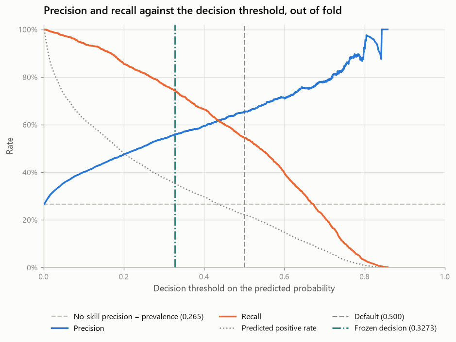
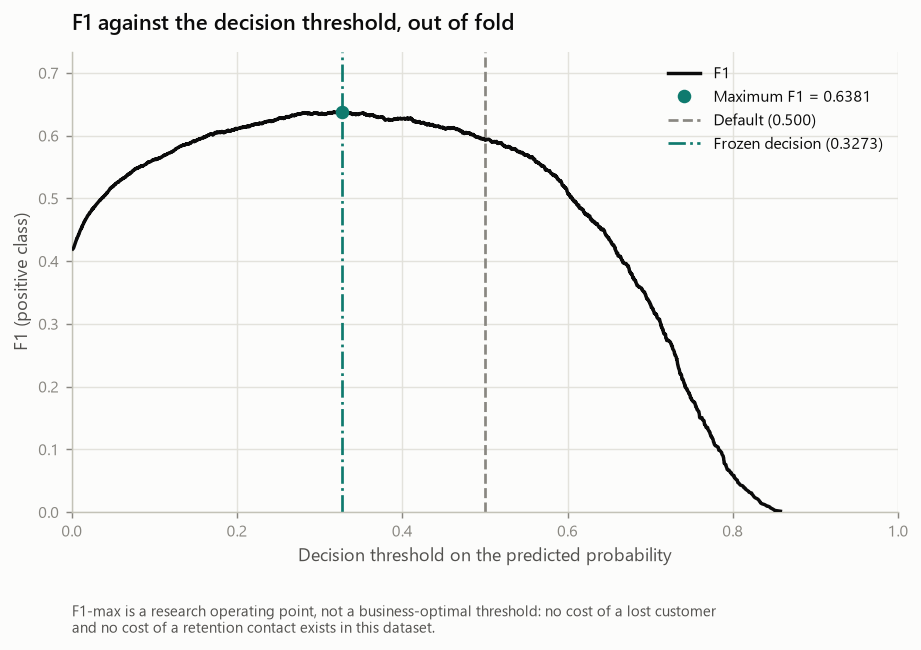
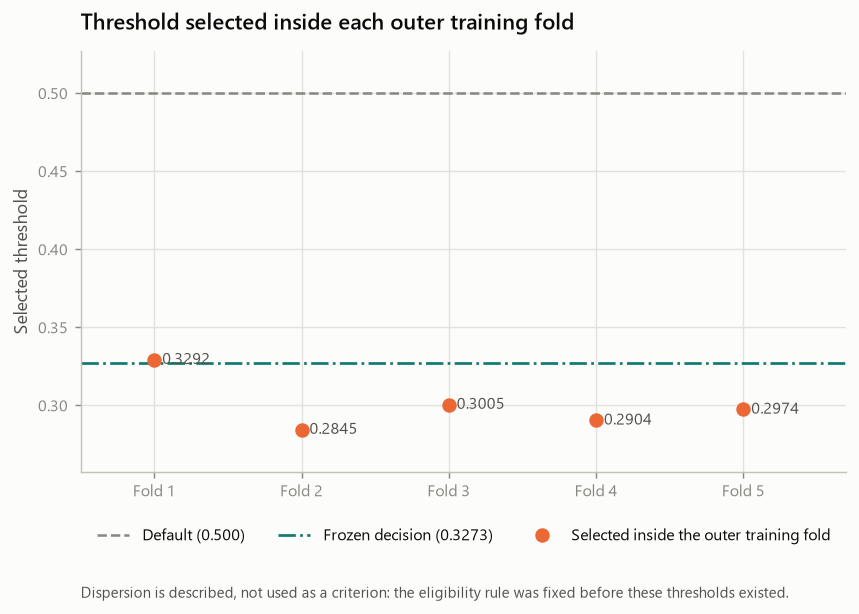
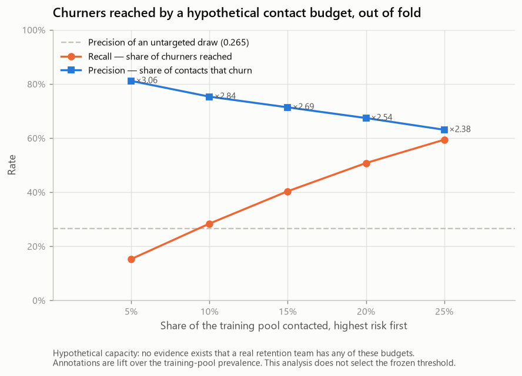

# Decision Threshold Policy — Telco Customer Churn (Phase 9B)

- Generated by: `scripts/run_threshold.py`
- Machine-readable record: `reports/experiments/threshold_results.json`
- Raw SHA-256: `88be4b93fbe0cc83421af1c503794c97c342eca914c1576db7c276e61d61358a`
- Training partition fingerprint: `a553196dd46b672f6344867707144fbf56a8abe14b338a225662c7208a1450dd`

> **This report carries no generation date.** It is a pure function of its
> inputs, so re-running the generator on an unchanged repository reproduces it
> byte for byte and any diff is a real change. Git records when it was produced.

> **Every number here is cross-validated on the training pool.** No holdout row
> was loaded, transformed, predicted, thresholded or counted. There is still no
> test result in this repository.

---

## 1. Objective

One question:

> **Which operating threshold do we freeze, so that the churn probability of the
> frozen model becomes a binary decision before the holdout is opened?**

The answer has to be fixed *now*, on the training pool, because a threshold
chosen after seeing holdout results would make the holdout part of the selection
and destroy the only untouched estimate this project has.

**The selection metric was pre-registered**: `POLICY_F1`, the threshold
maximising the F1 score of the positive class. Precision and recall both matter
in churn — a missed churner is a lost customer, a false alarm is a wasted contact
— and F1 weighs them symmetrically without requiring a cost ratio.

> **F1-max is a research operating point, not a business-optimal threshold.**

That sentence is the scope of what this phase can claim, and section 16 explains
why nothing stronger is available.

## 2. Frozen probability policy

| Property | Value |
| --- | --- |
| Estimator | `LogisticRegression` |
| Builder | `churn.modeling.tuning.build_modern_logistic` |
| Selected in | `phase8b-nested-hyperparameter-tuning` |
| Hyperparameters | `C=1.0`, `class_weight=None`, `l1_ratio=0.0`, `max_iter=100`, `solver=lbfgs` |
| Reopened here | False |
| Features | 19 original (3 numeric, 16 categorical) |
| Engineered | none |
| Preprocessing | prepare_features (contract validation and canonical column order) → TotalChargesCleaner → StandardScaler on the 3 numeric features → OneHotEncoder(handle_unknown='ignore') on the 16 categorical features |
| Transformed columns | 46 |
| `class_weight` | `None` |
| Calibration policy | **NONE** (decided in `phase9a-calibration-gate`) |
| Probability source | `build_modern_logistic_pipeline().predict_proba(X)[:, 1]` |
| Seed | 42 |
| scikit-learn | 1.9.0 |

Nothing in that table was chosen here. Phases 5 to 8B selected the estimator,
Phase 9A settled that its probabilities are used raw, and this phase changes
neither.

| Upstream artefact | SHA-256 |
| --- | --- |
| `reports/split_manifest.json` | `834eb1313536c49e…` |
| `reports/experiments/baseline_results.json` | `2bd6eb992a4ed235…` |
| `reports/experiments/feature_engineering_results.json` | `bd8a3f03df405f7b…` |
| `reports/experiments/model_comparison_results.json` | `648aca646146e6bc…` |
| `reports/experiments/hgb_representation_results.json` | `794bd1bde4a78240…` |
| `reports/experiments/tuning_results.json` | `d9d245e22fc89320…` |
| `reports/experiments/calibration_results.json` | `0119ca11c5c47190…` |

Digests of the artefacts this phase is anchored to. A reference by name says
which file was meant; a digest says which bytes were read.

## 3. Why the threshold is a separate decision from the fit

A threshold is applied **after** the model is fitted. Moving it changes which
customers are flagged; it does not change a single coefficient. That is precisely
why it can be chosen at this stage without reopening anything.

`class_weight` is the instructive contrast. It also trades precision against
recall, and it is therefore tempting to treat the two as interchangeable. They
are not: `class_weight` changes the objective the model is fitted on, so a
different value produces a different model, which would need its own tuning, its
own calibration gate and its own comparison — model selection, reopened.
`class_weight` stays `None` and stays closed. The threshold is
the knob that is legitimately still open here.

The order within Phase 9 follows the same logic and was fixed before any Phase 9
work began: **A** calibration gate, **B** threshold policy, **C** freeze, **D**
the first and only holdout evaluation, **E** post-hoc error analysis. Calibration
comes first because a calibrator rewrites the probabilities, and a threshold
chosen beforehand would belong to a score that stopped existing. Phase 9A
selected `NONE`, so the cut in this report acts directly
on `build_modern_logistic_pipeline().predict_proba(X)[:, 1]`.

## 4. Protected holdout

The 5,634 training rows are the entire universe of this
phase. `load_holdout()` is not called anywhere in the Phase 9B code, and an AST
audit fails the build if it appears. No holdout row took part in a fit, a
probability, a threshold search, a metric, a curve, a scenario or a count.

`holdout_touched` in the artefact is `False` and is asserted
by the tests rather than merely written.

## 5. Threshold-selection protocol

### The rule

1. Candidates are every distinct predicted probability in the vector being searched, plus the default 0.5, which is added unconditionally so the procedure can return 'the default was already best'.
2. The decision rule is: predict the positive class when probability >= threshold.
3. Each candidate is scored by the F1 score of the positive class, and by nothing else.
4. The candidate with the maximum F1 is selected.
5. Ties are resolved by the tie-breaking rule, not by argmax over an array order.
6. Probabilities are never rounded before the search: rounding would merge cuts that separate different customers.

**Why the candidate set is the distinct probabilities.** With the rule
`probability >= threshold`, sweeping the threshold upwards changes the
predicted-positive set **exactly** when it crosses one of the observed
probabilities: any value strictly between two observed scores selects the same
customers as the higher of the two. The distinct probabilities are therefore the
complete set of materially different cuts, and a denser grid would only add
duplicates. `0.5` is added unconditionally so the search
can return "the default was already best" rather than being structurally unable
to say it.

### Tie-breaking

- Two candidates count as tied when their F1 values are within 1e-12 of the maximum. 'Equal' is not a well-defined operation on floats, so the tolerance is explicit.
- Among the tied candidates, the threshold closest to 0.5 is selected. This is a PARSIMONY rule: when the evidence does not distinguish two operating points, the one that moves less from the default is taken. It is not a claim that 0.5 is correct and it is not a business conclusion.
- If two tied candidates are exactly equidistant from 0.5, the larger threshold is selected. This second tie-break exists only to make the answer unique and deterministic.

Preferring the candidate closest to `0.5` is a
**parsimony rule**, not a business conclusion: when the evidence does not
distinguish two operating points, the one that moves less from the default is
taken.

### Numeric precision

| Property | Value |
| --- | --- |
| Metrics rounded to | 6 decimals |
| Thresholds rounded | False |
| Probabilities rounded before the search | False |

A metric rounded in the seventh decimal is the same measurement; a threshold rounded in the sixth can move customers across the decision boundary.

### Not `TunedThresholdClassifierCV`

scikit-learn ships a threshold tuner. It was deliberately not used. The candidate
set, the decision rule, the objective and the tie-breaking all had to be visible
and testable rather than delegated to defaults that could change between
versions, and the eligibility rule needs the *procedure* under nested evaluation
rather than a fitted object. An AST audit fails the build if the class appears in
Phase 9B code.

## 6. D0 — the default policy

| Property | Value |
| --- | --- |
| Experiment | `D0` |
| Policy | `DEFAULT_0_5` |
| Threshold | 0.5 |
| Threshold source | fixed at 0.5; not optimised |

`0.5` is the conventional cut of a probabilistic
classifier and **has not been optimised for anything**. It is the baseline
against which the selection procedure has to prove itself: without it, "we tuned
the threshold and F1 improved" would be a claim with nothing behind it.

## 7. D1 — the nested F1-max policy

| Level | Splitter | Role |
| --- | --- | --- |
| Outer | `StratifiedKFold(n_splits=5, shuffle=True, random_state=42)` | evaluates the threshold-selection procedure; never takes part in choosing a threshold |
| Inner | `StratifiedKFold(n_splits=4, shuffle=True, random_state=42)` | produces out-of-sample probabilities for every outer-train row; POLICY_F1 reads those and nothing else |

The outer partition is the identical one used by Phases 5 to 9A, so every paired
delta here is a per-fold difference on the same folds every earlier number was
computed on.

**Choosing a threshold on a set of scores and then reporting the F1 it achieves
on those same scores measures nothing** — the threshold was fitted to them. So
the procedure is evaluated nested:

```text
for each outer fold (the frozen 5-fold partition):
    inside the outer TRAIN only:
        inner 4-fold -> an out-of-sample probability for every outer-train row
        POLICY_F1 on those inner-OOF probabilities -> this fold's threshold
        refit the frozen pipeline on the WHOLE outer train
    predict the outer VALIDATION once, cut it at that threshold
```

No outer-validation row takes part in a fit, in the probabilities the search
reads, or in the F1 the search maximises. What that estimates is **the
threshold-selection procedure**, not one threshold.

### Gate: the probability source has not drifted

The outer loop fits the frozen pipeline on each outer training fold and predicts
the outer validation fold, which is exactly what Phase 9A's C0 did. The
threshold-independent metrics must therefore come out identical, and the run
aborts if they do not.

| Check | Reproduces | Artefact | Tolerance | Largest difference | Reproduced |
| --- | --- | --- | --- | --- | --- |
| D0 | `policies[C0]` | `reports/experiments/calibration_results.json` | 1e-09 | 0.0e+00 | **True** |
| full_training_out_of_fold | `policies[D0].outer_out_of_fold_probability` | `in-run: nested outer out-of-fold probabilities` | 1e-12 | 0.0e+00 | **True** |

The second row is the identity check behind section 11: the training-pool
out-of-fold vector used to freeze the threshold was recomputed independently and
compared against the nested outer vector.

### Gate: D0 and D1 differ by the cut and by nothing else

Both arms read the **same** outer probability vector. Average Precision and
ROC-AUC are invariant to any threshold, so they must be *identical* — not close.

| Metric | Experiment | F1 | F2 | F3 | F4 | F5 | Mean |
| --- | --- | --- | --- | --- | --- | --- | --- |
| Average Precision | D0 | 0.643660 | 0.635452 | 0.685865 | 0.678188 | 0.664300 | 0.661493 |
| Average Precision | D1 | 0.643660 | 0.635452 | 0.685865 | 0.678188 | 0.664300 | 0.661493 |
| ROC-AUC | D0 | 0.847891 | 0.825128 | 0.841901 | 0.862874 | 0.852952 | 0.846149 |
| ROC-AUC | D1 | 0.847891 | 0.825128 | 0.841901 | 0.862874 | 0.852952 | 0.846149 |

Largest absolute difference across all folds and both metrics:
**0.0e+00** — and the run aborts if any outer fold disagrees.

## 8. Thresholds selected inside each outer fold

| Outer fold | Rows searched | Candidates | Tied at max | Selected threshold | Inner-OOF F1 | Inner-OOF precision | Inner-OOF recall |
| --- | --- | --- | --- | --- | --- | --- | --- |
| 1 | 4,507 | 4,503 | 1 | **0.329244** | 0.6322 | 0.5575 | 0.7299 |
| 2 | 4,507 | 4,504 | 1 | **0.284459** | 0.6460 | 0.5448 | 0.7935 |
| 3 | 4,507 | 4,507 | 1 | **0.300487** | 0.6403 | 0.5438 | 0.7784 |
| 4 | 4,507 | 4,505 | 1 | **0.290422** | 0.6313 | 0.5325 | 0.7751 |
| 5 | 4,508 | 4,505 | 1 | **0.297401** | 0.6355 | 0.5394 | 0.7734 |

The F1, precision and recall columns are **inner out-of-fold selection
metrics** — the value the search maximised on rows inside the outer training
fold. They are not performance, and the outer-fold results are in section 9.

## 9. Paired D1 vs D0 on the outer folds

### F1 — the selection metric

| Experiment | F1 | F2 | F3 | F4 | F5 | Mean ± SD |
| --- | --- | --- | --- | --- | --- | --- |
| D0 | 0.5850 | 0.5495 | 0.5889 | 0.6425 | 0.5962 | **0.5924** ± 0.0333 |
| D1 | 0.6534 | 0.6011 | 0.6209 | 0.6471 | 0.6441 | **0.6333** ± 0.0218 |

### Precision

| Experiment | F1 | F2 | F3 | F4 | F5 | Mean ± SD |
| --- | --- | --- | --- | --- | --- | --- |
| D0 | 0.6452 | 0.6073 | 0.6598 | 0.6643 | 0.6840 | **0.6521** ± 0.0286 |
| D1 | 0.5679 | 0.5081 | 0.5268 | 0.5376 | 0.5575 | **0.5396** ± 0.0239 |

### Recall

| Experiment | F1 | F2 | F3 | F4 | F5 | Mean ± SD |
| --- | --- | --- | --- | --- | --- | --- |
| D0 | 0.5351 | 0.5017 | 0.5318 | 0.6221 | 0.5284 | **0.5438** ± 0.0457 |
| D1 | 0.7692 | 0.7358 | 0.7559 | 0.8127 | 0.7625 | **0.7672** ± 0.0283 |

### Accuracy — auxiliary

| Experiment | F1 | F2 | F3 | F4 | F5 | Mean ± SD |
| --- | --- | --- | --- | --- | --- | --- |
| D0 | 0.7986 | 0.7817 | 0.8030 | 0.8163 | 0.8099 | **0.8019** ± 0.0132 |
| D1 | 0.7835 | 0.7409 | 0.7551 | 0.7649 | 0.7762 | **0.7641** ± 0.0169 |

At a 26.5% positive rate a rule that never
fires already reaches about 73.5%
accuracy. It cannot rank operating points and it decided nothing.

### Predicted positive rate

| Experiment | F1 | F2 | F3 | F4 | F5 | Mean ± SD |
| --- | --- | --- | --- | --- | --- | --- |
| D0 | 0.2201 | 0.2192 | 0.2138 | 0.2484 | 0.2052 | **0.2213** ± 0.0163 |
| D1 | 0.3594 | 0.3842 | 0.3807 | 0.4011 | 0.3632 | **0.3777** ± 0.0169 |

Neither direction of this row is good or bad on its own: it is how many customers
the rule would put on a contact list.

### Confusion matrices

| Experiment | Fold | Threshold | TN | FP | FN | TP | Predicted positive rate |
| --- | --- | --- | --- | --- | --- | --- | --- |
| D0 | 1 | 0.500000 | 740 | 88 | 139 | 160 | 0.2201 |
| D0 | 2 | 0.500000 | 731 | 97 | 149 | 150 | 0.2192 |
| D0 | 3 | 0.500000 | 746 | 82 | 140 | 159 | 0.2138 |
| D0 | 4 | 0.500000 | 734 | 94 | 113 | 186 | 0.2484 |
| D0 | 5 | 0.500000 | 754 | 73 | 141 | 158 | 0.2052 |
| D1 | 1 | 0.329244 | 653 | 175 | 69 | 230 | 0.3594 |
| D1 | 2 | 0.284459 | 615 | 213 | 79 | 220 | 0.3842 |
| D1 | 3 | 0.300487 | 625 | 203 | 73 | 226 | 0.3807 |
| D1 | 4 | 0.290422 | 619 | 209 | 56 | 243 | 0.4011 |
| D1 | 5 | 0.297401 | 646 | 181 | 71 | 228 | 0.3632 |

### Paired deltas, D1 − D0, on the same outer folds

| Metric | F1 | F2 | F3 | F4 | F5 | Mean | SD | Higher | Tied | Lower |
| --- | --- | --- | --- | --- | --- | --- | --- | --- | --- | --- |
| Precision | -0.0773 | -0.0992 | -0.1329 | -0.1267 | -0.1265 | **-0.1125** | 0.0236 | 0 | 0 | 5 |
| Recall | +0.2341 | +0.2341 | +0.2241 | +0.1906 | +0.2341 | **+0.2234** | 0.0188 | 5 | 0 | 0 |
| F1 | +0.0684 | +0.0516 | +0.0320 | +0.0046 | +0.0478 | **+0.0409** | 0.0240 | 5 | 0 | 0 |
| Accuracy | -0.0151 | -0.0408 | -0.0479 | -0.0515 | -0.0337 | **-0.0378** | 0.0144 | 0 | 0 | 5 |
| Predicted positive rate | +0.1393 | +0.1650 | +0.1668 | +0.1526 | +0.1581 | **+0.1564** | 0.0111 | 5 | 0 | 0 |

"Higher", "tied" and "lower" are three separate counts and do not have to sum the
way a two-way split would. They are named by **direction**, not by merit: for F1,
precision and recall a higher value is better; for the predicted positive rate it
is neither.

The between-fold standard deviation is **not** a bar these deltas must clear. It
describes how one policy varies across partitions, not the uncertainty of a
difference between two policies measured on the same partitions. Five folds
cannot support a significance test and none was run.

## 10. Eligibility decision

The rule, fixed before any Phase 9B number was read:

1. The F1-maximisation procedure (D1) is ELIGIBLE_THRESHOLD_POLICY to replace the default threshold when: (1) its mean paired delta F1 against D0 across the outer folds is > 0; and (2) F1 improves STRICTLY in at least 4 of the 5 outer folds.
2. A fold in which both arms scored identically is a TIE, never an improvement. A tie is exactly what happens when the search returns the default, and counting it as a win would let a procedure that changed nothing look like one that helped.
3. There is no minimum-gain cutoff. Magnitude is reported separately and weighed by a reader.
4. This is an engineering heuristic about direction and consistency, not a significance test. Five folds cannot support one and none was run.
5. If D1 is not eligible, the selected policy is DEFAULT_0_5 and the final threshold is 0.5.
6. If D1 is eligible, the selected policy is F1_MAXIMIZATION and the final threshold comes from applying the same POLICY_F1 once to the out-of-fold probabilities of the whole training pool. That application is a FREEZE, not a new performance estimate.

No minimum-gain cutoff exists anywhere in it (`minimum_gain_cutoff`:
None). Every branch is exercised by tests on synthetic
inputs, so the branch the real numbers took is not the only one anybody checked.

| Quantity | Value |
| --- | --- |
| Mean paired ΔF1 | +0.04090 |
| Folds F1 improved strictly | 5/5 |
| Folds tied | 0 |
| Folds worsened | 0 |
| Required | mean > 0 and ≥ 4/5 strict improvements |
| **Status** | **ELIGIBLE_THRESHOLD_POLICY** |

mean paired delta F1 = +0.04090 with 5 of 5 outer folds improving strictly (0 tied, 0 worse): the selection procedure beats the default consistently, on folds whose rows took no part in choosing their own threshold.

## 11. Final threshold selection

**Selected policy: F1_MAXIMIZATION.**

The nested comparison shows the F1-maximisation procedure beating the default consistently on rows that took no part in selecting their own threshold, so the procedure is applied once more to the whole training pool to fix the threshold that goes to the holdout.

| Property | Value |
| --- | --- |
| `final_threshold` | **0.3272694566222328** |
| Decision rule | `predict churn when predict_proba(X)[:, 1] >= final_threshold` |
| Optimised | True |
| F1-max on the full training-pool OOF | 0.3272694566222328 |
| F1-max adopted | True |

The threshold was fixed by applying POLICY_F1 once to the out-of-fold probabilities of the whole training pool. That application is a **freeze**, not a new performance estimate: the honest estimate of the procedure is the nested result in section 9.

### Full-training out-of-fold operating point

| Metric | Value |
| --- | --- |
| Threshold | 0.3272694566222328 |
| F1 | 0.6381 |
| Precision | 0.5591 |
| Recall | 0.7431 |
| Accuracy | 0.7764 |
| Predicted positive rate | 0.3527 |
| TN | 3,263 |
| FP | 876 |
| FN | 384 |
| TP | 1,111 |

> **These are full-training out-of-fold operating-point selection metrics. Computed on the training pool, on the same rows any threshold search read, and therefore optimistically biased. NOT final performance: no performance figure exists in this repository until the holdout is evaluated.**

They are computed on the training pool, on the same rows any threshold search
read, and they are optimistically biased by construction. Calling them "final
performance" would be exactly the error this whole phase structure exists to
avoid. **Performance will exist only after the holdout is evaluated in Phase 9D.**

## 12. Precision-recall operating curve



*Precision and recall against the threshold, out of fold*



*F1 against the threshold, out of fold*

Tabulated on the uniform reporting grid stored in the artefact
(101 points; every
0.05 shown here):

| Threshold | Precision | Recall | F1 | Predicted positive rate |
| --- | --- | --- | --- | --- |
| 0.00 | 0.2654 | 1.0000 | 0.4194 | 1.0000 |
| 0.05 | 0.3543 | 0.9739 | 0.5195 | 0.7295 |
| 0.10 | 0.4006 | 0.9418 | 0.5621 | 0.6239 |
| 0.15 | 0.4381 | 0.9130 | 0.5921 | 0.5531 |
| 0.20 | 0.4749 | 0.8542 | 0.6104 | 0.4773 |
| 0.25 | 0.5088 | 0.8167 | 0.6270 | 0.4260 |
| 0.30 | 0.5411 | 0.7666 | 0.6344 | 0.3759 |
| 0.35 | 0.5705 | 0.7171 | 0.6354 | 0.3335 |
| 0.40 | 0.5937 | 0.6635 | 0.6267 | 0.2966 |
| 0.45 | 0.6239 | 0.6013 | 0.6124 | 0.2558 |
| 0.50 | 0.6520 | 0.5438 | 0.5930 | 0.2213 |
| 0.55 | 0.6852 | 0.4863 | 0.5689 | 0.1883 |
| 0.60 | 0.7102 | 0.3967 | 0.5090 | 0.1482 |
| 0.65 | 0.7545 | 0.3064 | 0.4358 | 0.1077 |
| 0.70 | 0.7792 | 0.2100 | 0.3309 | 0.0715 |
| 0.75 | 0.8483 | 0.1010 | 0.1805 | 0.0316 |
| 0.80 | 0.9184 | 0.0301 | 0.0583 | 0.0087 |
| 0.85 | 1.0000 | 0.0013 | 0.0027 | 0.0004 |
| 0.90 | 0.0000 | 0.0000 | 0.0000 | 0.0000 |
| 0.95 | 0.0000 | 0.0000 | 0.0000 | 0.0000 |
| 1.00 | 0.0000 | 0.0000 | 0.0000 | 0.0000 |

The search read every distinct probability, not this grid. The grid exists so the curve can be tabulated at a fixed size.

Above roughly 0.85 no customer is predicted positive at all. Precision is
undefined there (0/0) and is reported as `0.0000` under `zero_division=0`, the
same convention every earlier phase used: a rule that never fires has no
precision to speak of.

## 13. Threshold stability

| Statistic | Value |
| --- | --- |
| Per fold | 0.329244, 0.284459, 0.300487, 0.290422, 0.297401 |
| Mean | 0.300403 |
| Median | 0.297401 |
| SD | 0.017282 |
| Min | 0.284459 |
| Max | 0.329244 |
| Spread | 0.044785 |
| Distinct values | 5 |



*Threshold selected inside each outer training fold*

Role: descriptive. Dispersion is reported and, where wide, documented as a limitation. It is NOT a post-hoc criterion: the eligibility rule was fixed before these thresholds existed and is not modified by them.

A spread of 0.0448 across five partitions of the same pool is a
statement about how much the chosen cut depends on which rows the search happened
to see. It is reported as a limitation in section 17, not converted into a new
criterion.

## 14. Hypothetical recall scenarios

| Target | Attainable | Threshold | Precision | Recall | F1 | Predicted positive rate |
| --- | --- | --- | --- | --- | --- | --- |
| Recall ≥ 0.60 | yes | 0.451058 | 0.6238 | 0.6000 | 0.6117 | 0.2552 |
| Recall ≥ 0.70 | yes | 0.363584 | 0.5772 | 0.7003 | 0.6328 | 0.3220 |
| Recall ≥ 0.80 | yes | 0.267213 | 0.5230 | 0.8000 | 0.6325 | 0.4059 |

> **Status: hypothetical operating scenarios.**
> `decisional: False`.

No stakeholder in this project has stated a recall target. These rows describe what the trade-off looks like elsewhere on the curve and cannot select the frozen threshold.

Rule: recall is non-increasing in the threshold, so the LARGEST threshold reaching the target is also the most precise one that does; that is the threshold reported.

## 15. Top-k capacity analysis

| Capacity | Customers contacted | Churners reached | Recall | Precision | Lift | Probability at the cut |
| --- | --- | --- | --- | --- | --- | --- |
| Top 5% | 281 | 228 | 0.1525 | 0.8114 | ×3.06 | 0.7287 |
| Top 10% | 563 | 424 | 0.2836 | 0.7531 | ×2.84 | 0.6608 |
| Top 15% | 845 | 603 | 0.4033 | 0.7136 | ×2.69 | 0.5986 |
| Top 20% | 1,126 | 759 | 0.5077 | 0.6741 | ×2.54 | 0.5339 |
| Top 25% | 1,408 | 888 | 0.5940 | 0.6307 | ×2.38 | 0.4577 |



*Churners reached by a hypothetical contact budget, out of fold*

> **Status: hypothetical capacity analysis.**
> `decisional: False`.

| Property | Value |
| --- | --- |
| Ordering | descending probability; ties broken by ascending row position |
| Customers contacted | `floor(fraction * n_training_rows), so a budget is never overspent` |
| Lift baseline | training-pool positive prevalence (0.2654) |

No evidence exists that a real retention team has any of these capacities. The probability at the cut is reported so the ranking view and the threshold view can be compared, never so one can be substituted for the other.

This is the **ranking** view of the same probabilities: it asks how many churners
a fixed budget reaches, not where to cut. A capacity constraint and a threshold
answer different questions, and this table did not select `final_threshold`.

## 16. Why no financial optimum is claimed

The cost-optimal threshold is the one minimising

```text
ExpectedCost(t) = cost_FN * FN(t) + cost_FP * FP(t)
```

and that function depends **entirely** on the ratio `cost_FN / cost_FP`. This
dataset contains neither quantity: it has no customer lifetime value, no
retention-campaign cost, no margin, no discount rate and no record of what a
retention offer would cost or whether it would work.

| Field | Value |
| --- | --- |
| `cost_false_negative` | None |
| `cost_false_positive` | None |
| `optimal_threshold_computed` | False |

Recorded to make the limitation precise, not to be evaluated. Choosing values for the two costs would produce a number that looks like an economic optimum and whose entire content is the assumption. No cost-optimal threshold is computed or claimed anywhere in this phase.

The conceptual conclusion is worth stating because it is the actionable one: **if
real cost figures existed, they — not F1 — would set the threshold**, and the
curve in section 12 is exactly the object a cost analysis would be applied to.
Producing a number here by assuming a ratio would give an economic-looking answer
whose entire content is the assumption.

## 17. Limitations

- **No holdout estimate.** Everything is training-pool cross-validation. Nothing
  in this report is test performance.
- **The full-training out-of-fold operating point is optimistically biased.** It
  is a selection artefact, reported as one.
- **F1 is a choice, not a discovery.** It weighs precision and recall equally
  because no evidence supports any other weighting here — not because equal
  weighting is correct for a real retention programme.
- **Five outer folds, no significance test.** The deltas and the eligibility
  label describe direction and consistency, not statistical significance.
- **The threshold moved across folds** (spread 0.0448). The
  procedure, not a specific value, is what the nested design evaluated.
- **The recall scenarios and the top-k table are hypothetical** and could not
  select anything here.
- **Ties in the top-k ranking are broken by row position**, which is arbitrary
  though deterministic; with a near-continuous score it affects few customers.
- **`class_weight` stays `None` and remains closed.** It changes
  the fit, so reopening it would reopen model selection.
- **Calibration stays `NONE`.** The threshold acts on the
  raw probability, and it would have to be reselected if that ever changed.
- **The analyst-exposure limitation from Phase 3 still applies.**
- **Snapshot classification, not forecasting.** The dataset has no time dimension,
  so "will churn" here means "resembles customers who had churned".

## 18. Frozen decision policy for the final holdout evaluation

| Property | Value |
| --- | --- |
| Estimator | `LogisticRegression` from `churn.modeling.tuning.build_modern_logistic` |
| Hyperparameters | `C=1.0`, `class_weight=None`, `l1_ratio=0.0`, `max_iter=100`, `solver=lbfgs` |
| `class_weight` | `None` |
| Calibration policy | **NONE** |
| Probability source | `build_modern_logistic_pipeline().predict_proba(X)[:, 1]` |
| Threshold policy | **F1_MAXIMIZATION** |
| `final_threshold` | **0.3272694566222328** |
| Decision rule | `predict churn when predict_proba(X)[:, 1] >= final_threshold` |

Phase 9C freezes the estimator, the calibration policy NONE and this threshold into one decision policy; Phase 9D then evaluates the untouched holdout exactly once.

Everything needed to turn a customer into a decision is now frozen. The holdout
stays untouched until Phase 9C has frozen this policy and Phase 9D evaluates it
exactly once.

## 19. Warnings

No warning was raised during the run.

Nothing was suppressed. The modern logistic builder does not raise the historical
`penalty` removal warning.
