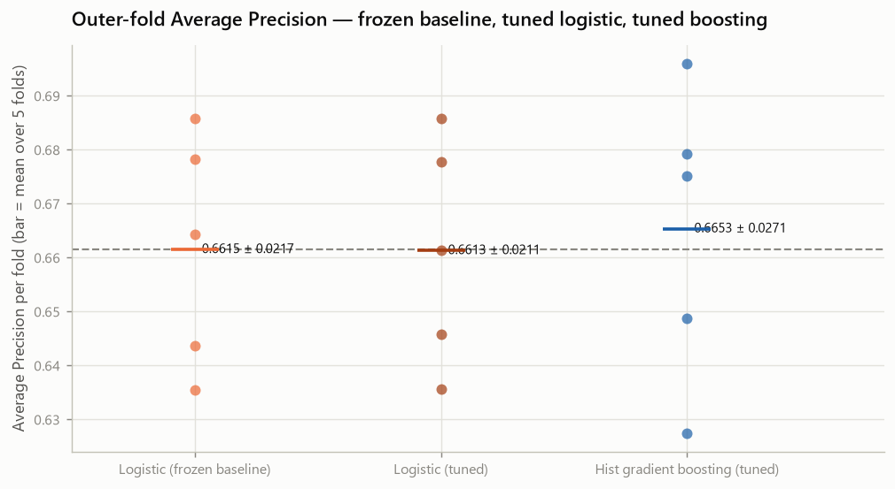
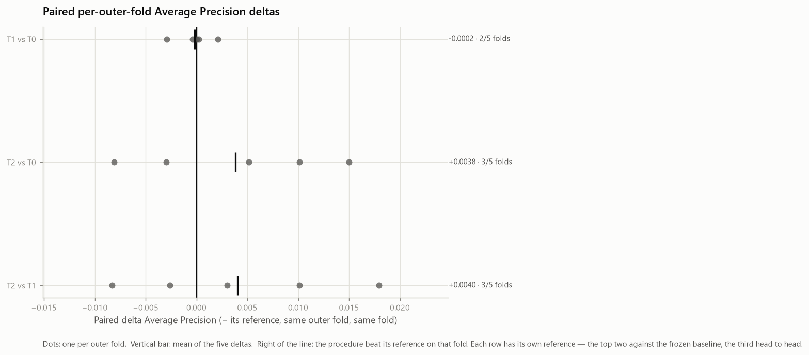
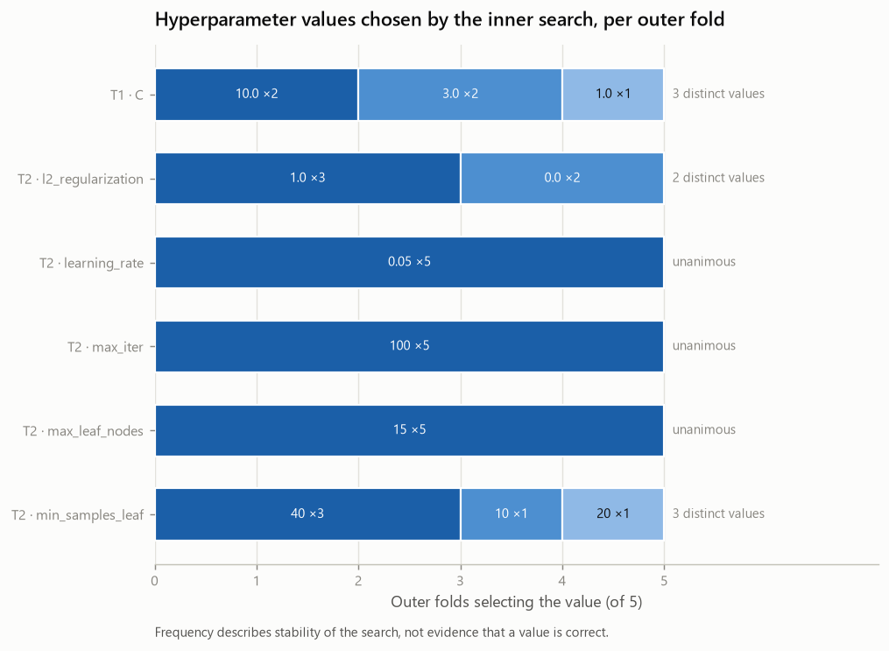
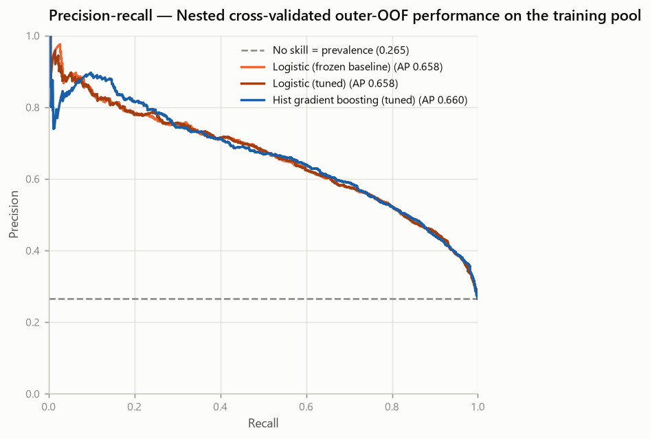

# Nested Hyperparameter Tuning — Telco Customer Churn (Phase 8B)

- Generated by: `scripts/run_tuning.py`
- Machine-readable record: `reports/experiments/tuning_results.json`
- Raw SHA-256: `88be4b93fbe0cc83421af1c503794c97c342eca914c1576db7c276e61d61358a`
- Training partition fingerprint: `a553196dd46b672f6344867707144fbf56a8abe14b338a225662c7208a1450dd`

> **This report carries no generation date.** It is a pure function of its
> inputs, so re-running the generator on an unchanged repository reproduces it
> byte for byte and any diff is a real change. Git records when it was produced.

> **Every number here is cross-validated on the training pool.** No holdout row
> was loaded, transformed, predicted or measured. There is no test result in
> this repository before Phase 9.

---

## 1. Objective

Three questions, answered in order:

1. can the frozen logistic regression be moved to the modern scikit-learn API
   without changing what it computes?
2. does tuning the logistic regression, or tuning histogram gradient boosting,
   improve on the frozen baseline when the tuning **procedure** is evaluated
   honestly?
3. which configuration should be frozen as the candidate carried into Phase 9?

The threshold is not optimised, `class_weight` is `None` everywhere, no
probability is calibrated, and no fitted estimator is persisted.

## 2. Why nested cross-validation

A grid search reports the score of the configuration it selected, on the folds
it used to select it. That number is chosen by maximisation and is therefore
optimistically biased — it answers "how well did the best candidate do on the
data used to pick it", which is not a question anybody needs answered.

Nested cross-validation asks the useful question instead:

```text
for each outer fold (the frozen 5-fold partition):
    run the entire search inside the outer TRAINING fold only
    refit the winning configuration on that outer training fold
    predict the outer VALIDATION fold exactly once
```

What this estimates is **the tuning procedure**, not a single configuration.
That distinction has a visible consequence: the search may choose different
hyperparameters in different outer folds, and that variation is part of the
thing being measured rather than a defect in it. Section 13 reports it.

The inner search performed
180 fits for T1 and 960 for T2 across the whole
study, none of which ever saw an outer validation row.

## 3. Protected holdout

The 5,634 training rows are the entire universe of this
phase. `load_holdout()` is not called anywhere in the Phase 8B code, and an AST
audit fails the build if it appears. No metric, distribution, transformation or
prediction involving the protected partition exists.

## 4. Frozen feature representation

| Element | Value |
| --- | --- |
| Features | 19 original (3 numeric, 16 categorical) |
| Engineered | none |
| Representation | `common_ohe` → 46 transformed columns |
| Positive prevalence | 0.2654 |
| `class_weight` | `None` for every candidate |
| Threshold | 0.5 (diagnostic only; optimised: False) |
| Calibration | False |
| Seed | 42 |
| scikit-learn | 1.9.0 |

`contract_tenure` is not used: mixing a feature effect into a hyperparameter
study would produce one number containing both. The native categorical
representation is not reopened — Phase 8A closed it as
`REPRESENTATION_NOT_SUPPORTED`.

## 5. Logistic compatibility migration

The frozen baseline passes `penalty="l2"`, deprecated in scikit-learn 1.8 and
scheduled for removal in 1.10. The modern spelling of the same penalty is
`l1_ratio=0.0`.

| | Value |
| --- | --- |
| Legacy | `C=1.0`, `penalty=l2`, `class_weight=None`, `solver=lbfgs`, `max_iter=100` |
| Modern | `C=1.0`, `class_weight=None`, `l1_ratio=0.0`, `max_iter=100`, `solver=lbfgs` |
| Tolerance | 1e-09 |
| Largest per-fold metric difference | **0.0e+00** |
| Largest out-of-fold probability difference | **0.0e+00** |
| Legacy emits the removal warning | True |
| Modern emits the removal warning | False |
| Classification | **COMPATIBILITY_MIGRATION** |

Both the per-fold metrics **and** the out-of-fold probability vectors are
compared. Metrics can agree while probabilities differ in a way that would
surface later, so the stronger check is the one that gates the run — and the run
aborts if either exceeds tolerance.

penalty='l2' and l1_ratio=0.0 describe the same L2 penalty. The legacy builder is preserved so the historical artefacts keep reproducing; the modern builder is used for the new experiments and no longer emits the removal warning.

**The legacy builder is preserved.** It is what reproduces the historical
artefacts, and those are not regenerated. The modern builder is used for the new
Phase 8B experiments only. This is a compatibility migration, not a model
change; the distinction matters because a model change would silently redefine
the reference every earlier number is measured against.

## 6. Candidate families

| Experiment | Procedure | Tuned |
| --- | --- | --- |
| T0 | Frozen logistic regression (C=1.0, untuned) | no — the floor tuning has to justify clearing |
| T1 | Tuned logistic regression (C searched) | yes |
| T2 | Tuned histogram gradient boosting | yes |

**Random forest is deliberately out of scope.** Phase 7 measured a mean paired
delta of about −0.0553 AP against the logistic regression with 0/5 folds
positive, and nothing since produced evidence to reopen it. That is a scoping
decision about where to spend a tuning budget, **not** a claim that the family is
universally inferior.

## 7. Search spaces

| Experiment | Estimator | Candidates | Grid |
| --- | --- | --- | --- |
| T1 | `LogisticRegression` | **9** | `C`: [0.01, 0.03, 0.1, 0.3, 1.0, 3.0, 10.0, 30.0, 100.0] |
| T2 | `HistGradientBoostingClassifier` | **48** | `learning_rate`: [0.05, 0.1]; `max_iter`: [100, 200]; `max_leaf_nodes`: [15, 31]; `min_samples_leaf`: [10, 20, 40]; `l2_regularization`: [0.0, 1.0] |

Both grids **contain the frozen configuration**
(T1: True, T2: True),
so each search is structurally able to answer "the untuned configuration was
already the best" rather than being forced to move away from it.

Fixed for every logistic candidate: `l1_ratio=0.0`, `solver='lbfgs'`,
`class_weight=None`, `max_iter=100`. Fixed for every boosting candidate:
`loss=log_loss`, `max_depth=None`, `max_features=1.0`, `early_stopping=False`, `class_weight=None`, `random_state=42`.

Neither grid was widened after seeing a score, and no adaptive second round was
run. A grid extended towards whichever edge won is a search over search spaces,
and its nested estimate no longer describes the procedure that was actually run.

## 8. Outer/inner CV protocol

| Level | Splitter | Role |
| --- | --- | --- |
| Outer | `StratifiedKFold(n_splits=5, shuffle=True, random_state=42)` | estimate of the procedure; never used for selection |
| Inner | `StratifiedKFold(n_splits=4, shuffle=True, random_state=42)` | hyperparameter selection, inside one outer training fold |

The outer partition is the identical one used by Phases 5 to 8A, so every paired
delta in this report is a per-fold difference on the same folds every earlier
number was computed on.

**Preprocessing is inside the search.** The estimator handed to `GridSearchCV`
is the complete pipeline — `TotalChargesCleaner` → `ColumnTransformer` →
classifier — so each inner fold refits the scaler and the encoder on its own
training part. Nothing is pre-fitted before the search, which is the leakage a
tuning study most commonly introduces: a scaler fitted once on the outer
training fold would leak inner-validation rows into every inner fit.

Selection is on **average_precision** alone.
No multi-metric objective was constructed; ROC-AUC and the 0.5 diagnostics
accompany the evaluation and select nothing.

## 9. Frozen baseline T0

T0 is the modern logistic regression at the frozen configuration, evaluated
through the same outer loop as the tuned procedures — so "same folds" is a
structural property of the code, not a claim.

| Experiment | Reproduces | Artefact | Tolerance | Largest difference | Reproduced |
| --- | --- | --- | --- | --- | --- |
| T0 | `models[logistic_regression]` | `reports/experiments/baseline_results.json` | 1e-09 | 0.0e+00 | **True** |

## 10-11. Outer-fold results

| Experiment | Procedure | Tuned | ROC-AUC (secondary) | Average Precision (primary) | Precision @0.5 | Recall @0.5 | F1 @0.5 | Accuracy @0.5 |
| --- | --- | --- | --- | --- | --- | --- | --- | --- |
| T0 | Frozen logistic regression (C=1.0, untuned) | False | 0.8461 ± 0.0140 | 0.6615 ± 0.0217 | 0.6521 ± 0.0286 | 0.5438 ± 0.0457 | 0.5924 ± 0.0333 | 0.8019 ± 0.0132 |
| T1 | Tuned logistic regression (C searched) | True | 0.8465 ± 0.0142 | 0.6613 ± 0.0211 | 0.6550 ± 0.0299 | 0.5485 ± 0.0461 | 0.5964 ± 0.0346 | 0.8035 ± 0.0139 |
| T2 | Tuned histogram gradient boosting | True | 0.8479 ± 0.0124 | 0.6653 ± 0.0271 | 0.6692 ± 0.0340 | 0.5271 ± 0.0260 | 0.5893 ± 0.0242 | 0.8051 ± 0.0120 |



*Outer-fold Average Precision for the three procedures*

Per-fold Average Precision:

| Experiment | F1 | F2 | F3 | F4 | F5 | Mean ± SD |
| --- | --- | --- | --- | --- | --- | --- |
| T0 | 0.6437 | 0.6355 | 0.6859 | 0.6782 | 0.6643 | **0.6615** ± 0.0217 |
| T1 | 0.6458 | 0.6357 | 0.6859 | 0.6778 | 0.6614 | **0.6613** ± 0.0211 |
| T2 | 0.6488 | 0.6274 | 0.6960 | 0.6752 | 0.6793 | **0.6653** ± 0.0271 |

What each inner search selected, fold by fold:

| Experiment | Outer fold | Best inner AP | Selected hyperparameters |
| --- | --- | --- | --- |
| T1 | 1 | 0.6617 | `C=10.0` |
| T1 | 2 | 0.6669 | `C=3.0` |
| T1 | 3 | 0.6547 | `C=1.0` |
| T1 | 4 | 0.6546 | `C=3.0` |
| T1 | 5 | 0.6644 | `C=10.0` |
| T2 | 1 | 0.6629 | `l2_regularization=0.0`, `learning_rate=0.05`, `max_iter=100`, `max_leaf_nodes=15`, `min_samples_leaf=20` |
| T2 | 2 | 0.6628 | `l2_regularization=1.0`, `learning_rate=0.05`, `max_iter=100`, `max_leaf_nodes=15`, `min_samples_leaf=40` |
| T2 | 3 | 0.6499 | `l2_regularization=1.0`, `learning_rate=0.05`, `max_iter=100`, `max_leaf_nodes=15`, `min_samples_leaf=10` |
| T2 | 4 | 0.6670 | `l2_regularization=1.0`, `learning_rate=0.05`, `max_iter=100`, `max_leaf_nodes=15`, `min_samples_leaf=40` |
| T2 | 5 | 0.6635 | `l2_regularization=0.0`, `learning_rate=0.05`, `max_iter=100`, `max_leaf_nodes=15`, `min_samples_leaf=40` |

The inner scores in that table are **selection scores**, not performance. They
are the mean inner-CV Average Precision of the winning candidate, computed on
the folds used to choose it, and they are systematically higher than the outer
numbers above for exactly that reason.

## 12. Paired outer-fold comparisons

| Comparison | Metric | F1 | F2 | F3 | F4 | F5 | Mean | SD | Improved | Tied | Worsened |
| --- | --- | --- | --- | --- | --- | --- | --- | --- | --- | --- | --- |
| T1 vs T0 | Average Precision (primary) | +0.0021 | +0.0002 | +0.0000 | -0.0004 | -0.0029 | **-0.0002** | 0.0018 | 2 | 1 | 2 |
| T1 vs T0 | ROC-AUC (secondary) | +0.0007 | +0.0001 | +0.0000 | +0.0004 | +0.0004 | **+0.0003** | 0.0003 | 4 | 1 | 0 |
| T2 vs T0 | Average Precision (primary) | +0.0051 | -0.0081 | +0.0101 | -0.0030 | +0.0150 | **+0.0038** | 0.0094 | 3 | 0 | 2 |
| T2 vs T0 | ROC-AUC (secondary) | -0.0038 | +0.0052 | +0.0038 | -0.0036 | +0.0074 | **+0.0018** | 0.0052 | 3 | 0 | 2 |
| T2 vs T1 | Average Precision (primary) | +0.0030 | -0.0083 | +0.0101 | -0.0026 | +0.0179 | **+0.0040** | 0.0103 | 3 | 0 | 2 |
| T2 vs T1 | ROC-AUC (secondary) | -0.0045 | +0.0051 | +0.0038 | -0.0040 | +0.0070 | **+0.0015** | 0.0054 | 3 | 0 | 2 |



*Paired per-outer-fold Average Precision deltas*

**Improved, tied and worsened are three separate counts, and they are reported
separately.** A tuned procedure whose search happens to select the baseline
configuration inside an outer fold fits the identical model there, and the delta
is exactly zero — neither an improvement nor a loss. Collapsing that into a
two-way split would let a tie read as a defeat and would misstate how consistent
a difference was, so the columns above do not have to sum the way a two-way
split would. The eligibility rule in section 15 counts **strictly positive**
deltas only, and a tie never counts towards it.

The between-fold standard deviation is **not** a bar these deltas must clear: it
describes how one procedure varies across partitions, not the uncertainty of a
difference between two procedures measured on the same partitions. Five folds
cannot support a significance test and none was run.

## 13. Hyperparameter stability

| Experiment | Parameter | Values chosen across the 5 outer folds |
| --- | --- | --- |
| T1 | `C` | `10.0` ×2, `3.0` ×2, `1.0` ×1 |
| T2 | `l2_regularization` | `0.0` ×2, `1.0` ×3 |
| T2 | `learning_rate` | `0.05` ×5 |
| T2 | `max_iter` | `100` ×5 |
| T2 | `max_leaf_nodes` | `15` ×5 |
| T2 | `min_samples_leaf` | `20` ×1, `40` ×3, `10` ×1 |



*Hyperparameter values chosen by the inner search, per outer fold*

A value chosen in all five outer folds means the search lands in the same region
regardless of the partition. A parameter that moves means the inner objective is
flat enough there that the partition decides — which is information about the
problem, not a defect in the search. **Frequency is not evidence**: five folds
cannot establish that a value is correct, only that the choice was or was not
stable.

## 14. Outer-OOF performance

Each of the 5,634 training rows received exactly one
prediction, from a procedure whose **entire selection process** — inner folds,
grid search, refit — ran without that row:

| Experiment | Procedure | ROC-AUC (secondary) | Average Precision (primary) | Precision @0.5 | Recall @0.5 | F1 @0.5 | Accuracy @0.5 |
| --- | --- | --- | --- | --- | --- | --- | --- |
| T0 | Frozen logistic regression (C=1.0, untuned) | 0.8456 | 0.6584 | 0.6520 | 0.5438 | 0.5930 | 0.8019 |
| T1 | Tuned logistic regression (C searched) | 0.8460 | 0.6583 | 0.6550 | 0.5485 | 0.5970 | 0.8035 |
| T2 | Tuned histogram gradient boosting | 0.8473 | 0.6604 | 0.6684 | 0.5271 | 0.5894 | 0.8051 |



*Precision-recall from outer out-of-fold predictions*

These are **nested cross-validated outer-OOF results on the training pool**.
They are not test performance and must never be relabelled as such. No
per-customer prediction was persisted.

## 15. Eligibility to replace the baseline

The rule, fixed before any Phase 8B number was read:

> A tuned procedure is `ELIGIBLE_TO_REPLACE_BASELINE` when its **mean paired
> delta AP against T0 is > 0** and AP improves in **at least
> 4 of the 5 outer
> folds**, where "improves" means a **strictly positive** delta.

No minimum-gain cutoff exists anywhere in it (`minimum_gain_cutoff`:
None). It is an engineering heuristic about direction
and consistency, not a significance test. A tied fold counts as neither an
improvement nor a loss, so it cannot help a procedure clear the rule — the same
rule that was fixed before any of these numbers existed, applied unchanged.

| Experiment | Mean ΔAP vs T0 | Improved | Tied | Worsened | Improved of 5 | Status |
| --- | --- | --- | --- | --- | --- | --- |
| T1 | -0.00019 | 2 | 1 | 2 | 2/5 | **NOT_ELIGIBLE_TO_REPLACE_BASELINE** |
| T2 | +0.00384 | 3 | 0 | 2 | 3/5 | **NOT_ELIGIBLE_TO_REPLACE_BASELINE** |

- **T1** — mean paired delta AP = -0.00020 with 2 of 5 outer folds improving (1 tied, 2 worse): it does not clear the pre-registered eligibility rule.
- **T2** — mean paired delta AP = +0.00384 with 3 of 5 outer folds improving (0 tied, 2 worse): it does not clear the pre-registered eligibility rule.

## 16. Candidate selection

The pre-registered rule, in full:

1. A tuned procedure is ELIGIBLE_TO_REPLACE_BASELINE when its mean paired delta AP against T0 is > 0 and AP improves in at least 4 of the 5 outer folds, where 'improves' means a strictly positive delta and a tied fold counts as neither.
2. If neither is eligible, the frozen baseline T0 is kept.
3. If exactly one is eligible, it is selected.
4. If both are eligible, compare T2 against T1 directly: a procedure with mean delta AP > 0 winning at least 4 of 5 outer folds is selected.
5. Otherwise prefer the logistic regression, for lower complexity and higher interpretability.

Every branch of it is exercised by tests on synthetic inputs, so the branch the
real numbers happened to take is not the only one anybody checked.

**Selected: T0 — Frozen logistic regression (C=1.0, untuned).**

Neither tuned procedure cleared the eligibility rule, so the frozen baseline stands. Tuning has to justify replacing it; the default when it does not is to keep the simpler model, not to adopt the best-scoring one.

Frozen hyperparameters carried forward:
`C=1.0`, `l1_ratio=0.0`, `solver=lbfgs`, `class_weight=None`, `max_iter=100`.

## 17. Final full-training parameter search

No final search was run. The frozen baseline was selected, so there is no hyperparameter to determine: `C` stays at 1.0.

**This is not a generalisation estimate, and its score must never be quoted as
one.** A search over the whole training pool scores each candidate on the same
rows it uses to rank them, so the winner's score is optimistically biased by
construction. Its only job is to answer "which values get frozen" using all
available training data. The honest estimate of what these procedures achieve is
the nested outer result in sections 10-14.

## 18. Complexity trade-offs

| Procedure | Fitted objects | Interpretability | Fitting cost | Parameters chosen by data |
| --- | --- | --- | --- | --- |
| T0 | 1 coefficient vector | direct, odds-ratio readable | one fit | none |
| T1 | 1 coefficient vector | direct, odds-ratio readable | 9 × inner folds per fit | 1 (`C`) |
| T2 | 100-200 boosted trees | indirect; importances, no signed effect | 48 × inner folds per fit | 5 |

Tuning is not free even when it helps. Each searched parameter is a degree of
freedom fitted to the training pool, and a procedure with five of them has more
opportunity to track the partition than one with a single regularisation
constant. That is a reason to require consistency across folds rather than a
higher mean — which is what the eligibility rule encodes.

## 19. Limitations

- **No holdout estimate.** Everything is training-pool cross-validation.
- **Five outer folds, no significance test.** The deltas and the eligibility
  labels describe direction and consistency, not statistical significance.
- **The nested estimate is of the procedure**, not of the single configuration
  that section 17 freezes. Those are different objects, and the frozen one has
  no unbiased estimate anywhere in this repository yet.
- **The grids are small and pre-declared.** A wider search might find more; it
  would also raise the multiplicity that makes a lucky configuration likelier.
- **`class_weight` was not explored, and is deferred rather than postponed to
  Phase 9.** It stays frozen at `None`. Class weights change the fit itself, so
  reopening them would reopen model selection and tuning — this phase's entire
  comparison would have to be rerun to stay valid. The threshold changes only the
  decision rule applied after training, which is why it can be settled on its own
  without invalidating anything here. Cost-sensitive training is explicitly out
  of scope for the main line of this project.
- **The threshold is untouched**, so the 0.5 diagnostics describe one operating
  point and selected nothing.
- **No calibration.** Ranking metrics say nothing about whether a 0.7 means 70%.
- **The analyst-exposure limitation from Phase 3 still applies.**
- **Snapshot classification, not forecasting.** The dataset has no time dimension.

## 20. Frozen candidate carried to Phase 9

| Property | Value |
| --- | --- |
| Experiment | **T0** |
| Procedure | Frozen logistic regression (C=1.0, untuned) |
| Hyperparameters | `C=1.0`, `l1_ratio=0.0`, `solver=lbfgs`, `class_weight=None`, `max_iter=100` |
| Feature set | 19 original features, `common_ohe` |
| `class_weight` | `None` — frozen and deferred |
| Threshold | not optimised; 0.5 is a diagnostic reference and is decided in Phase 9 |
| Calibration | not performed; calibration is a separate question for a later phase |
| Outer-OOF Average Precision | 0.6584 |
| Outer-OOF ROC-AUC | 0.8456 |

**The candidate is the modern implementation**, and Phase 9 must instantiate
exactly this:

```python
LogisticRegression(
    C=1.0,
    l1_ratio=0.0,
    solver="lbfgs",
    class_weight=None,
    max_iter=100,
)
```

`churn.modeling.tuning.build_modern_logistic` is that builder. Section 5 proved
it reproduces the legacy `penalty="l2"` configuration with a maximum per-fold
metric difference of **0.0** and a maximum
out-of-fold probability difference of
**0.0**, so adopting it changes
nothing about what is computed. The legacy builder `build_logistic_baseline` is
**preserved for reproducing the historical artefacts only** and must not be used
for any new experiment.

### The order Phase 9 has to run in

The holdout stays untouched until **every** development decision is frozen. That
is not a formality. A threshold chosen while looking at holdout performance, or a
calibration adopted because it improved a holdout number, turns the final
evaluation into a selection score — and this project would then have no unbiased
estimate anywhere.

**A.** Analyse and select the decision threshold using the training pool only, through cross-validation and outer out-of-fold predictions. The holdout takes no part in it.

**B.** Decide whether calibration is needed using the training pool only, under a leakage-safe protocol.

**C.** Freeze the estimator, the preprocessing, the calibration if any, and the threshold.

**D.** Only then run the first and only final evaluation on the holdout.

**E.** Error analysis on the holdout may follow the final evaluation as DESCRIPTIVE analysis only. It must not feed back into the model, the features, the hyperparameters, the calibration or the threshold.

Step E is the one that is easiest to violate by accident. Reading the holdout
errors and then adjusting a threshold, a feature, a hyperparameter or the
calibration would mean the reported holdout number no longer describes the model
that produced it.

## 21. Warnings

No warning was raised during the run.

The legacy logistic regression still raises the `penalty` removal warning, which
is why the migration in section 5 exists. The modern builder used by every
Phase 8B experiment does not raise it. Nothing was suppressed.
